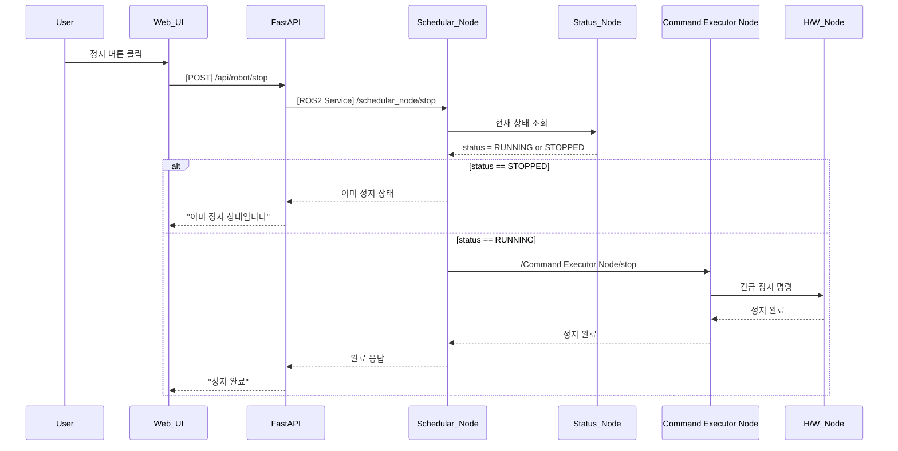

## UC01 - 로봇 정지 명령 (Stop Robot)

---

### 1. 기능 개요

| 항목 | 내용 |
|------|------|
| 목적 | 사용자가 Web UI를 통해 로봇의 모든 동작을 긴급 중단하거나 정지시키기 위함 |
| 트리거 | 사용자가 정지 버튼 클릭 |
| 주요 처리 노드 | `schedular_node`, `status_node`, `Command Executor Node`, `h/w_node` |
| 출력 | UI에 정지 완료 메시지 표시, 실제 동작 정지 수행 |

---

### 2. 전제 조건

- 로봇이 동작 중(`RUNNING`)이거나 대기 중(`IDLE`) 상태일 것
- 통신 상태 (`ROS2`, `H/W`) 양호해야 함

---

### 3. 기본 흐름 (Main Flow)

1. 사용자가 Web UI에서 "정지" 버튼을 클릭한다.
2. Web UI는 FastAPI 서버에 `/api/robot/stop` RESTful POST 요청을 보낸다.
3. FastAPI는 `schedular_node`의 `/schedular_node/stop` ROS2 서비스를 호출한다.
4. `schedular_node`는 현재 상태를 확인하기 위해 `status_node`에 요청을 보낸다.
5. 상태가 `RUNNING`이면:
   - `schedular_node`는 `Command Executor Node`에 정지 명령을 전달한다.
   - `Command Executor Node`는 실제로 `h/w_node`에 정지 명령을 실행시킨다.
   - 결과를 역방향으로 전파한다.
6. 상태가 `STOPPED`이면:
   - 별도 정지 명령 없이 "이미 정지 상태" 메시지를 반환한다.

---

### 4. 예외 흐름 (Alternative / Error Flow)

| 조건 | 처리 내용 |
|------|-----------|
| ROS2 통신 끊김 | FastAPI에서 500 오류 반환, UI에 "통신 오류" 표시 |
| 상태 수신 실패 | schedular_node → FastAPI로 "상태 확인 실패" 메시지 전송 |
| Command Executor Node 실행 실패 | 정지 실패 메시지와 함께 UI에 에러 알림 표시 |

---

### 5. 시퀀스 다이어그램 (Mermaid)

---

### 6. REST API 명세

| 항목 | 내용 |
|------|------|
| Method | POST |
| Endpoint | `/api/robot/stop` |
| Request Body | 없음 |
| Response (성공) | `{"success": true, "message": "정지 완료"}` |
| Response (실패) | `{"success": false, "message": "현재 상태에서 정지 불가"}` |
| FastAPI 핸들러 | `stop_handler(request)` |

---

### 7. ROS2 서비스 명세

| 항목 | 내용 |
|------|------|
| 서비스명 | `/schedular_node/stop` |
| 서비스 타입 | `std_srvs/srv/Trigger` |
| 호출 노드 | FastAPI |
| 응답 노드 | schedular_node |

#### Request

| 필드 | 타입 | 설명 |
|------|------|------|
| 없음 | - | - |

#### Response

| 필드 | 타입 | 설명 |
|------|------|------|
| success | bool | 성공 여부 |
| message | string | 상태 메시지 |

---

### 8. 상태 전이 및 후속 동작

- 실행 전 상태: `RUNNING` 또는 `IDLE`  
- 정지 후 상태: `STOPPED`  
- 이후 UI는 정지 상태로 버튼 비활성화, 재시작 명령 대기 가능
