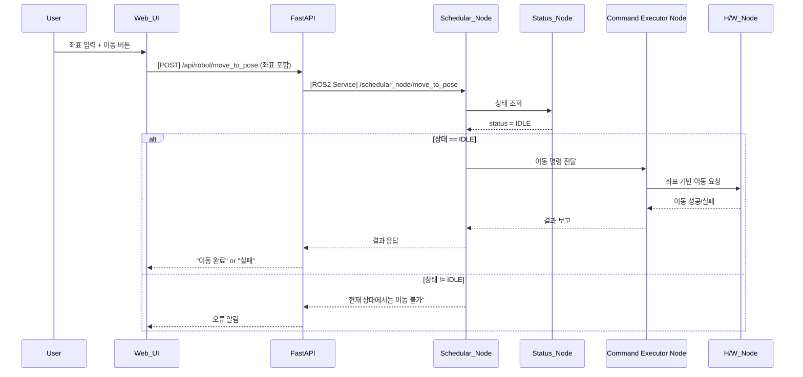

## UC02 - 입력 좌표 위치 이동 (Move to Input Pose)

---

### 1. 기능 개요

| 항목 | 내용 |
|------|------|
| 목적 | 사용자가 입력한 특정 pose(x, y, z, rx, ry, rz)로 로봇을 이동시킴 |
| 트리거 | Web UI에서 pose 좌표 입력 및 "이동" 버튼 클릭 |
| 주요 처리 노드 | `schedular_node`, `status_node`, `Command Executor Node`, `h/w_node` |
| 출력 | UI에 이동 결과 표시, 로봇 실제 이동 수행 |

---

### 2. 전제 조건

- 로봇 상태가 `IDLE` 또는 `READY` 상태일 것
- 충돌 예측 노드 상태가 `CLEAR`일 것 (추후 UC21 연계 고려)
- 입력 pose가 유효 범위 내여야 함

---

### 3. 기본 흐름 (Main Flow)

1. 사용자가 Web UI에서 pose 좌표를 입력하고 "이동" 버튼을 클릭한다.
2. Web UI는 FastAPI 서버에 `/api/robot/move_to_pose` POST 요청을 보낸다.
3. FastAPI는 `schedular_node`의 `/schedular_node/move_to_pose` ROS2 서비스를 호출한다.
4. `schedular_node`는 현재 상태를 확인하기 위해 `status_node`에 요청한다.
5. 상태가 `IDLE`이면, 입력 좌표 유효성 검증 후:
   - `Command Executor Node`에 이동 명령 전달
   - `Command Executor Node`는 실제 이동을 `h/w_node`에 실행 요청
6. 결과를 순차적으로 응답하고 UI에 성공 또는 실패 메시지를 표시

---

### 4. 예외 흐름 (Alternative / Error Flow)

| 조건 | 처리 내용 |
|------|-----------|
| 현재 상태가 IDLE가 아님 | 이동 불가, "작업 중에는 이동 불가" 메시지 |
| 좌표 값 오류 | FastAPI 단에서 Validation 후 400 오류 반환 |
| 하드웨어 명령 실패 | 이동 실패 메시지와 함께 UI 알림 |
| ROS 서비스 타임아웃 | FastAPI → UI에 "시스템 오류" 반환 |

---

### 5. 시퀀스 다이어그램 (Mermaid)



---

### 6. REST API 명세

| 항목 | 내용 |
|------|------|
| Method | POST |
| Endpoint | `/api/robot/move_to_pose` |
| Request Body | JSON 좌표 |
| Response | success, message 포함 JSON |
| FastAPI 핸들러 | `move_to_pose_handler(request)` |

#### Request Body 예시

```json
{
  "x": 0.52,
  "y": 0.12,
  "z": 0.31,
  "rx": 0.0,
  "ry": 90.0,
  "rz": 0.0
}
```

#### Response 예시

```json
{
  "success": true,
  "message": "이동 완료"
}
```

---

### 7. ROS2 서비스 명세

| 항목 | 내용 |
|------|------|
| 서비스명 | `/schedular_node/move_to_pose` |
| 서비스 타입 | `custom_interfaces/srv/MoveToPose` |
| 호출 노드 | FastAPI |
| 응답 노드 | schedular_node |

#### Request

| 필드 | 타입 | 설명 |
|------|------|------|
| x | float64 | X 위치 (m) |
| y | float64 | Y 위치 (m) |
| z | float64 | Z 위치 (m) |
| rx | float64 | Roll (deg) |
| ry | float64 | Pitch (deg) |
| rz | float64 | Yaw (deg) |

#### Response

| 필드 | 타입 | 설명 |
|------|------|------|
| success | bool | 성공 여부 |
| message | string | 상태 메시지 |

---

### 8. 상태 전이 및 후속 동작

- 실행 전 상태: `IDLE`
- 실행 중 상태: `MOVING`
- 완료 후 상태: 다시 `IDLE`로 전이됨
- `status_node`는 현재 pose를 `/status/pose`로 publish
- `current_task` 토픽에 `"MoveToPose"`가 publish됨 (UC05 연계)
