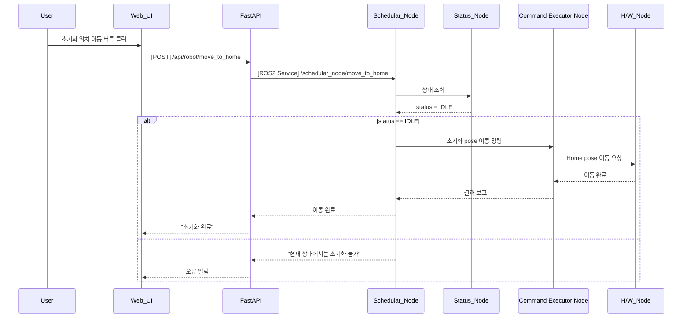

## UC03 - 초기화 위치 이동 (Move to Home Pose)

---

### 1. 기능 개요

| 항목 | 내용 |
|------|------|
| 목적 | 로봇을 사전 정의된 초기 위치(Home Pose)로 이동시켜 안전 대기 상태로 전환 |
| 트리거 | Web UI에서 "초기화 위치 이동" 버튼 클릭 |
| 주요 처리 노드 | `schedular_node`, `status_node`, `Command Executor Node`, `h/w_node` |
| 출력 | UI에 이동 완료 메시지 표시, 로봇이 지정된 Home pose로 이동 |

---

### 2. 전제 조건

- 로봇이 `IDLE` 또는 `READY` 상태여야 함
- 현재 실행 중인 시나리오 또는 명령이 없을 것
- 초기화 pose는 시스템에 미리 등록되어 있어야 함

---

### 3. 기본 흐름 (Main Flow)

1. 사용자가 Web UI에서 "초기화 위치 이동" 버튼을 클릭한다.
2. Web UI는 FastAPI에 `/api/robot/move_to_home` POST 요청을 보낸다.
3. FastAPI는 `schedular_node`의 `/schedular_node/move_to_home` ROS2 서비스를 호출한다.
4. `schedular_node`는 `status_node`에 현재 로봇 상태를 요청한다.
5. 상태가 `IDLE`이면:
   - `Command Executor Node`에 Home pose로 이동 명령을 전달
   - `Command Executor Node`는 `h/w_node`에 실제 pose 이동을 요청
6. 이동이 완료되면 FastAPI로 응답이 전송되고 UI에 결과를 표시한다.

---

### 4. 예외 흐름 (Alternative / Error Flow)

| 조건 | 처리 내용 |
|------|-----------|
| 로봇 상태가 WORKING, ERROR 등 | 이동 중단, “작업 중에는 초기화 불가” 메시지 |
| ROS 서비스 호출 실패 | “시스템 오류” 메시지 반환 |
| 이동 실패 | “초기화 위치 이동 실패” 메시지 및 로그 저장 |

---

### 5. 시퀀스 다이어그램 (Mermaid)



---

### 6. REST API 명세

| 항목 | 내용 |
|------|------|
| Method | POST |
| Endpoint | `/api/robot/move_to_home` |
| Request Body | 없음 |
| Response | JSON 결과 메시지 |
| FastAPI 핸들러 | `move_to_home_handler(request)` |

#### Response 예시

```json
{
  "success": true,
  "message": "초기화 위치로 이동 완료"
}
```

---

### 7. ROS2 서비스 명세

| 항목 | 내용 |
|------|------|
| 서비스명 | `/schedular_node/move_to_home` |
| 서비스 타입 | `std_srvs/srv/Trigger` |
| 호출 노드 | FastAPI |
| 응답 노드 | schedular_node |

#### Response

| 필드 | 타입 | 설명 |
|------|------|------|
| success | bool | 성공 여부 |
| message | string | 상태 메시지 |

---

### 8. 상태 전이 및 후속 동작

- 실행 전 상태: `IDLE`
- 완료 후 상태: 유지 (`IDLE`)
- 이후 동작 대기 가능, 시나리오 시작 준비 상태로 진입
- `status_node`는 현재 pose를 `/status/pose`로 주기적 publish
- `current_task`에는 `"MoveToHome"`이 publish됨 (UC05 연계)
