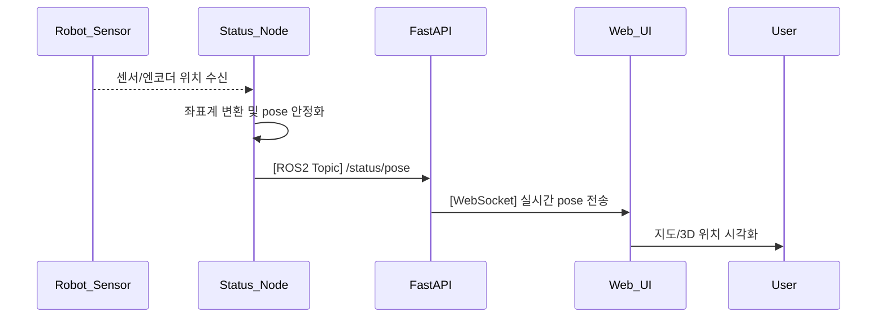

## UC04 - 로봇 위치 정보 표시 (Advanced Design)

---

### 1. 기능 개요

| 항목 | 내용 |
|------|------|
| 목적 | 로봇의 현재 pose(x, y, z, rx, ry, rz)를 사용자에게 실시간 제공하여 모니터링 및 판단을 지원함 |
| 트리거 | 로봇 위치가 갱신될 때마다 또는 일정 주기로 상태 노드에서 pose를 publish |
| 주요 처리 노드 | `status_node`, `fastapi`, `web_ui` |
| 출력 | 지도/좌표/3D 뷰 등 UI 구성 요소에 현재 위치 실시간 표시 |

---

### 2. 연관 유즈케이스

- UC21: 로봇 위치 시각화
- UC05: 현재 작업 표시
- UC11~15: 동작 명령과 연동되어 pose 변경 발생
- UC07: 통신 상태에 따라 pose 갱신 차단될 수 있음

---

### 3. 내부 흐름 요약

1. **status_node**는 로봇 센서/엔코더에서 실시간 pose 정보를 수신
2. 좌표계 변환 및 pose 안정화 (필터링) 수행
3. ROS2 토픽 `/status/pose`로 publish
4. **fastapi**는 해당 토픽을 구독하여 WebSocket을 통해 UI에 전송
5. **web_ui**는 pose 정보를 지도/3D뷰에 반영
6. 일정 이상 pose 변화 없으면 UI 표시 유지
7. 사용자는 현재 pose 기반으로 위치 상태를 인지

---

### 4. 상태 및 예외 흐름

| 조건 | 처리 내용 |
|------|-----------|
| ROS2 통신 불가 | Web UI에 "위치 수신 불가" 상태 표시 + UI 경고 색 |
| pose 데이터 NaN 또는 이상치 | fastapi에서 discard 처리 + warning 로그 |
| WebSocket 끊김 | 재연결 시도 + UI 디스플레이 “X” 아이콘 표시 |
| 정상 수신 중인데 변화 없음 | 3초 이상 변화 없으면 UI에 “위치 유지 중” 상태 표시

---

### 5. 시퀀스 다이어그램 (Mermaid)



---

### 6. ROS2 메시지 정의

| 항목 | 내용 |
|------|------|
| 토픽 이름 | `/status/pose` |
| 메시지 타입 | `geometry_msgs/msg/PoseStamped` |
| 발행 주체 | `status_node` |
| 주요 필드 변환 | orientation → 오일러 각 변환 후 전달 (rx, ry, rz) |

---

### 7. WebSocket 전송 정의

| 항목 | 내용 |
|------|------|
| 엔드포인트 | `/ws/robot/pose` |
| 전송 방식 | 실시간 push (1~5Hz) |
| FastAPI 함수명 | `pose_ws_endpoint(websocket)` |

#### JSON 구조 예시

```json
{
  "x": 1.024,
  "y": -0.533,
  "z": 0.115,
  "rx": 0.0,
  "ry": 0.0,
  "rz": 90.0,
  "timestamp": "2025-04-14T16:04:15Z"
}
```

---

### 8. 추가 고려 사항

- 좌표 안정화 알고리즘 (moving average or Kalman filter) 필요 시 설계에 포함
- 데이터 업데이트 주기 및 변위 threshold를 기준으로 갱신 조건 제어
- UC21에 연계되어 시각화 데이터 구성 포맷 통일 필요

---