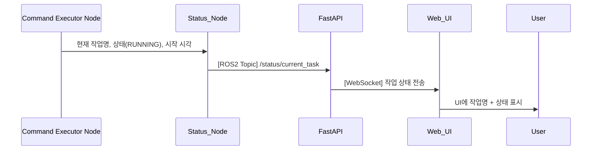

## UC05 - 현재 수행 작업 표시 (Display Current Task) - 고급 설계

---

### 1. 기능 개요

| 항목 | 내용 |
|------|------|
| 목적 | 로봇이 현재 수행 중인 작업(Task)을 사용자에게 실시간으로 제공함으로써 진행 상황 파악 및 오류 대응을 가능하게 함 |
| 트리거 | 작업 시작, 상태 변경, 완료 또는 실패 시마다 상태 노드에 변경 정보가 전달됨 |
| 주요 처리 노드 | `Command Executor Node`, `status_node`, `fastapi`, `web_ui` |
| 출력 | Web UI에 현재 작업명, 상태(RUNNING, COMPLETED 등), 시작 시각을 표시 |

---

### 2. 연관 유즈케이스

- UC01~UC03: 동작 실행 → Task 상태 변화 발생
- UC20: 작업 상태 시각화
- UC23: 오류 발생 시 상태와 연동하여 알림 처리

---

### 3. 내부 흐름 요약

1. `Command Executor Node`는 작업을 시작할 때 `status_node`로 작업명, 상태(RUNNING), 시작 시각을 전달
2. 작업 완료/실패 시 상태를 COMPLETED 또는 FAILED로 변경하여 다시 전달
3. `status_node`는 `/status/current_task`로 주기적으로 상태 publish
4. `fastapi`는 해당 토픽을 수신하고 WebSocket으로 UI에 전송
5. `web_ui`는 작업 상태를 실시간 반영하여 사용자에게 표시

---

### 4. 상태 및 예외 흐름

| 조건 | 처리 내용 |
|------|-----------|
| 상태가 RUNNING 3초 이상 유지 | UI 타이머 표시 시작 |
| COMPLETED 수신 시 | 상태 전환 + 완료 이펙트 표시 |
| FAILED 수신 시 | 에러 알림 + 상태 표시 색상 변경 |
| WebSocket 끊김 | UI에 상태 “수신 안됨” 표시 및 자동 재연결 시도 |
| 메시지 유효성 없음 | fastapi에서 discard 및 로그 기록 |

---

### 5. 시퀀스 다이어그램 (Mermaid)



---

### 6. ROS2 메시지 정의

| 항목 | 내용 |
|------|------|
| 토픽 이름 | `/status/current_task` |
| 메시지 타입 | `custom_interfaces/msg/TaskStatus` |
| 발행 주체 | `status_node` |
| 구독 주체 | `fastapi` |

#### 필드 예시

| 필드 | 타입 | 설명 |
|------|------|------|
| task_name | string | 예: "Pick", "Place", "MoveToPose" |
| status | string | RUNNING, COMPLETED, FAILED |
| timestamp | string | 시작 시간 (ISO 8601 형식) |

---

### 7. WebSocket 전송 구조

| 항목 | 내용 |
|------|------|
| WebSocket Endpoint | `/ws/robot/current_task` |
| FastAPI 함수 | `current_task_ws_endpoint(websocket)` |

#### 메시지 예시

```json
{
  "task_name": "Pick",
  "status": "RUNNING",
  "start_time": "2025-04-14T16:08:30Z"
}
```

---

### 8. 추가 고려 사항

- `status_node`는 상태가 변경되지 않더라도 일정 간격으로 최신 상태 재전송
- UI 측은 상태 지속시간을 바탕으로 타이머/진행률 바 표시 가능
- 상태 변화 감지 시 UI 애니메이션 또는 강조 효과 적용 가능

---