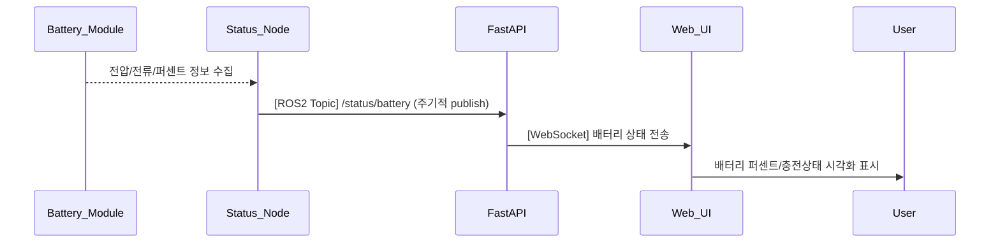

## UC06 - 배터리 상태 표시 (Display Battery Status) - 고급 설계

---

### 1. 기능 개요

| 항목 | 내용 |
|------|------|
| 목적 | 로봇의 배터리 잔량, 전압, 충전 여부 등의 상태를 실시간으로 사용자에게 표시하여 안정적 운용을 가능하게 함 |
| 트리거 | 배터리 상태가 변경되거나 일정 주기로 상태 노드에서 publish |
| 주요 처리 노드 | `status_node`, `fastapi`, `web_ui` |
| 출력 | UI에 퍼센트 게이지, 전압 수치, 충전 상태 아이콘 표시 및 저전력 경고 알림 제공 |

---

### 2. 연관 유즈케이스

- UC23: 배터리 부족 시 에러/알림 발생
- UC25: 배터리 상태에 따라 버튼 활성/비활성 제어 가능

---

### 3. 내부 흐름 요약

1. `status_node`가 내부 센서/배터리 모듈로부터 전압, 전류, 잔량 정보를 수집
2. 수집된 데이터에 따라 `/status/battery` ROS2 토픽으로 상태 publish
3. `fastapi`는 해당 토픽을 구독하여 WebSocket을 통해 UI에 전달
4. `web_ui`는 실시간 상태를 바탕으로 게이지, 숫자, 상태 표시 아이콘을 표시
5. 잔량이 설정 임계치(예: 20%) 이하일 경우 UI 경고 처리

---

### 4. 상태 및 예외 흐름

| 조건 | 처리 내용 |
|------|-----------|
| 배터리 20% 이하 | UI에 “LOW BATTERY” 경고 표시 및 배경 색 변화 |
| 충전 중 상태 | 충전 아이콘 애니메이션 표시 |
| 데이터 미수신 3초 이상 | “배터리 상태 수신 불가” 경고 아이콘 표시 |
| WebSocket 오류 | 자동 재연결 시도 또는 UI fallback 표시 |
| 값 이상치 (예: 120%) | fastapi에서 discard 또는 로깅 처리 |

---

### 5. 시퀀스 다이어그램 (Mermaid)



---

### 6. ROS2 메시지 정의

| 항목 | 내용 |
|------|------|
| 토픽 이름 | `/status/battery` |
| 메시지 타입 | `sensor_msgs/msg/BatteryState` |
| 발행 주체 | `status_node` |
| 구독 주체 | `fastapi` |

#### 주요 필드

| 필드 | 타입 | 설명 |
|------|------|------|
| percentage | float32 | 잔량 (%) |
| voltage | float32 | 전압 (V) |
| power_supply_status | uint8 | 충전 중(1), 완충(2), 사용 중(0) 등 |
| present | bool | 배터리 존재 여부 |

---

### 7. WebSocket 전송 구조

| 항목 | 내용 |
|------|------|
| WebSocket Endpoint | `/ws/robot/battery` |
| FastAPI 함수 | `battery_ws_endpoint(websocket)` |

#### 메시지 예시

```json
{
  "percentage": 17.3,
  "voltage": 24.9,
  "is_charging": false,
  "timestamp": "2025-04-14T16:11:50Z"
}
```

---

### 8. 추가 고려 사항

- 배터리 부족 시 자동으로 일부 기능(예: 고전력 동작) 제한 가능
- 배터리 잔량 변화량 기반 잔여 시간 예측 추가 설계 가능
- UC23과 연계 시 팝업 알림, 알람음 등 경고 확장 가능

---