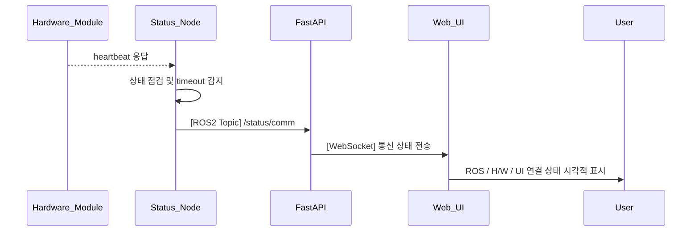

## UC07 - 통신 상태 표시 (Display Communication Status) - 고급 설계

---

### 1. 기능 개요

| 항목 | 내용 |
|------|------|
| 목적 | ROS2, 하드웨어, UI 간의 통신 상태를 실시간으로 모니터링하여 장애 여부를 사용자가 즉시 파악할 수 있도록 함 |
| 트리거 | status_node가 각 모듈의 heartbeat/상태 응답을 주기적으로 검사하여 통신 상태 publish |
| 주요 처리 노드 | `status_node`, `fastapi`, `web_ui` |
| 출력 | UI에 각 통신 모듈(Ros, H/W, UI)의 상태 표시 (정상, 끊김, 경고 등) |

---

### 2. 연관 유즈케이스

- UC04~06: 통신 이상 발생 시 표시 중단 경고 발생
- UC23: 끊김 감지 시 에러/알림 시스템과 연계

---

### 3. 내부 흐름 요약

1. `status_node`는 하드웨어 모듈 및 ROS2와의 통신 상태(heartbeat, 응답 시간 등)를 모니터링
2. UI 연결 상태는 FastAPI에서 직접 체크하여 상태노드에 주기적으로 전달
3. `status_node`는 `/status/comm` 토픽으로 상태를 publish
4. `fastapi`는 해당 토픽을 WebSocket으로 Web UI에 전달
5. Web UI는 각 항목별로 상태(OK/FAIL/경고)를 시각적으로 표시

---

### 4. 상태 및 예외 흐름

| 조건 | 처리 내용 |
|------|-----------|
| heartbeat 지연 ≥ 3초 | “DISCONNECTED” 상태로 표시 |
| ROS 응답 지연 | 상태를 `WARNING`으로 표시, 로그 기록 |
| WebSocket 연결 끊김 | UI에 “UI 연결 끊김” 메시지 및 빨간색 표시 |
| 상태 미도달 5초 이상 | "통신 상태 확인 불가" 표시 및 회색 비활성 처리 |

---

### 5. 시퀀스 다이어그램 (Mermaid)



---

### 6. ROS2 메시지 정의

| 항목 | 내용 |
|------|------|
| 토픽 이름 | `/status/comm` |
| 메시지 타입 | `custom_interfaces/msg/CommStatus` |
| 발행 주체 | `status_node` |
| 구독 주체 | `fastapi` |

#### 주요 필드

| 필드 | 타입 | 설명 |
|------|------|------|
| ros | string | “OK”, “WARNING”, “DISCONNECTED” |
| hardware | string | “OK”, “DISCONNECTED” |
| ui | string | “OK”, “DISCONNECTED” |
| timestamp | string | 상태 측정 시각 (ISO 8601) |

---

### 7. WebSocket 전송 구조

| 항목 | 내용 |
|------|------|
| WebSocket Endpoint | `/ws/robot/comm_status` |
| FastAPI 함수 | `comm_status_ws_endpoint(websocket)` |

#### 메시지 예시

```json
{
  "ros": "OK",
  "hardware": "DISCONNECTED",
  "ui": "OK",
  "timestamp": "2025-04-14T16:14:44Z"
}
```

---

### 8. 추가 고려 사항

- Web UI는 상태별 색상/아이콘/애니메이션을 활용한 직관적 표현 설계 필요
- 통신 이상 발생 시 UC23과 연계하여 알림 팝업 또는 로그 기록 가능
- FastAPI 자체 모니터링 기능 추가 시 UI 통신 상태 감지 신뢰도 향상

---
