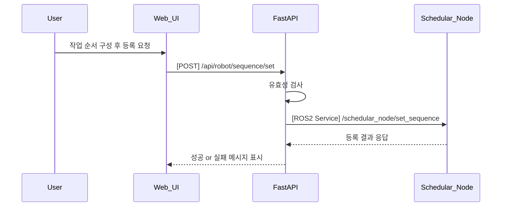

## UC08 - 작업 흐름 설정 (Set Task Sequence) - 고급 설계

---

### 1. 기능 개요

| 항목 | 내용 |
|------|------|
| 목적 | 사용자가 원하는 작업의 순서를 설정하여 로봇의 전체 작업 흐름(시나리오)을 구성 |
| 트리거 | Web UI에서 시나리오 구성 후 "등록" 버튼 클릭 |
| 주요 처리 노드 | `schedular_node`, `fastapi`, `web_ui` |
| 출력 | 등록된 작업 흐름 정보 UI에 반영 및 schedular_node 내부 상태 업데이트 |

---

### 2. 연관 유즈케이스

- UC09: 등록된 작업 순서를 실시간으로 변경
- UC10: 다른 시나리오로 전환 시 등록 내용 활용
- UC20: 작업 흐름 시각화

---

### 3. 내부 흐름 요약

1. 사용자가 Web UI에서 작업 ID 리스트를 구성하고 등록 요청
2. FastAPI는 `/api/robot/sequence/set`으로 요청을 받고, 유효성 검증 수행
3. schedular_node의 `/schedular_node/set_sequence` ROS2 서비스를 호출하여 작업 리스트 전달
4. schedular_node는 작업 간 유효성 검토 및 내부 시나리오로 저장
5. 등록 성공 여부를 FastAPI를 통해 UI로 전달
6. 성공 시 UC20을 통해 시각화, UC25에 명령 버튼 상태 반영

---

### 4. 상태 및 예외 흐름

| 조건 | 처리 내용 |
|------|-----------|
| 명령 중복 | 등록 거부 + UI 알림 (“작업이 중복되었습니다”) |
| 등록 불가능한 명령 포함 | 등록 거부 + 오류 메시지 반환 |
| schedular_node 비응답 | FastAPI timeout + "등록 실패" 반환 |
| 등록 성공 후에도 UI 오류 | UC20과 동기화 실패 시 재시도 메시지 표시

---

### 5. 시퀀스 다이어그램 (Mermaid)



---

### 6. REST API 명세

| 항목 | 내용 |
|------|------|
| Endpoint | `/api/robot/sequence/set` |
| Method | POST |
| Request Body | 작업 ID 리스트 |
| Response | 성공 여부 및 메시지 |
| FastAPI 핸들러 | `set_sequence_handler(request)` |

#### Request 예시

```json
{
  "sequence": ["Pick", "MoveToPose", "Place"]
}
```

#### Response 예시

```json
{
  "success": true,
  "message": "작업 흐름 등록 완료"
}
```

---

### 7. ROS2 서비스 정의

| 항목 | 내용 |
|------|------|
| 서비스명 | `/schedular_node/set_sequence` |
| 서비스 타입 | `custom_interfaces/srv/SetSequence` |
| 호출 주체 | FastAPI |
| 응답 주체 | schedular_node |

#### Request 필드

| 필드 | 타입 | 설명 |
|------|------|------|
| sequence | string[] | 명령 순서 리스트 |

#### Response 필드

| 필드 | 타입 | 설명 |
|------|------|------|
| success | bool | 등록 성공 여부 |
| message | string | 상태 메시지 |

---

### 8. 추가 고려 사항

- 등록 가능한 명령 목록은 UI에서 자동 필터링되어야 함
- 명령 간 논리 관계(예: Pick 없이 Place 금지)는 schedular_node에서 검증
- 등록 시 이전 시나리오 자동 삭제 여부는 정책에 따라 처리
- UC09, UC10과 데이터 포맷 일관성 유지 필요

---