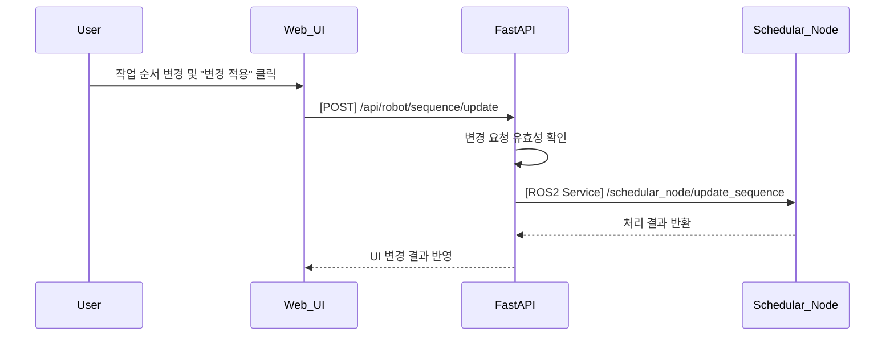

## UC09 - 작업 흐름 변경 (Update Task Sequence) - 고급 설계

---

### 1. 기능 개요

| 항목 | 내용 |
|------|------|
| 목적 | 현재 등록된 작업 흐름(시나리오)의 순서를 실시간으로 변경하여 유연한 작업 수행을 지원 |
| 트리거 | Web UI에서 사용자가 기존 작업 리스트 수정 후 "변경 적용" 클릭 |
| 주요 처리 노드 | `schedular_node`, `fastapi`, `web_ui` |
| 출력 | 수정된 작업 흐름 적용 결과 메시지 및 UI 시각화 업데이트 |

---

### 2. 연관 유즈케이스

- UC08: 등록된 작업 흐름 기반으로 동작
- UC10: 시나리오 전환 전 동작 흐름 정리 필요
- UC20: 시각화 갱신 필요

---

### 3. 내부 흐름 요약

1. 사용자가 Web UI에서 기존 등록된 작업 리스트를 편집(삭제, 순서 변경 등)
2. 변경된 리스트를 FastAPI의 `/api/robot/sequence/update`로 전송
3. FastAPI는 유효성 검증 후 `/schedular_node/update_sequence` 서비스 호출
4. schedular_node는 실행 중 작업 상태를 고려하여 수정 가능 여부 판단
5. 가능한 경우 기존 리스트 갱신 및 결과 반환
6. UI는 변경 결과를 반영하고 시각화를 갱신

---

### 4. 상태 및 예외 흐름

| 조건 | 처리 내용 |
|------|-----------|
| 현재 명령 실행 중 | 수정은 가능하나, 실행 중 작업 이후부터 반영됨 |
| 순서 변경이 논리 충돌 유발 | 예: Place가 Pick보다 먼저 → 등록 거부 및 메시지 반환 |
| 빈 리스트 | 등록 거부 + 오류 메시지 표시 |
| schedular_node 비응답 | 등록 실패 및 UI 재전송 권고 메시지 출력 |

---

### 5. 시퀀스 다이어그램 (Mermaid)



---

### 6. REST API 명세

| 항목 | 내용 |
|------|------|
| Endpoint | `/api/robot/sequence/update` |
| Method | POST |
| Request Body | 작업 ID 리스트 |
| Response | 성공 여부 및 메시지 |
| FastAPI 핸들러 | `update_sequence_handler(request)` |

#### Request 예시

```json
{
  "sequence": ["Scan", "Pick", "Place"]
}
```

#### Response 예시

```json
{
  "success": true,
  "message": "작업 흐름이 변경되었습니다."
}
```

---

### 7. ROS2 서비스 정의

| 항목 | 내용 |
|------|------|
| 서비스명 | `/schedular_node/update_sequence` |
| 서비스 타입 | `custom_interfaces/srv/UpdateSequence` |
| 호출 주체 | FastAPI |
| 응답 주체 | schedular_node |

#### Request 필드

| 필드 | 타입 | 설명 |
|------|------|------|
| sequence | string[] | 수정된 작업 리스트 |

#### Response 필드

| 필드 | 타입 | 설명 |
|------|------|------|
| success | bool | 등록 성공 여부 |
| message | string | 상태 메시지 |

---

### 8. 추가 고려 사항

- 변경 적용 시점은 현재 실행 명령 이후부터 반영됨
- 변경 이력 저장 및 롤백 기능은 추후 확장 가능
- UC20과의 연동 시 기존 시각화 → 변경된 흐름 반영 방식도 동기화 필요

---
