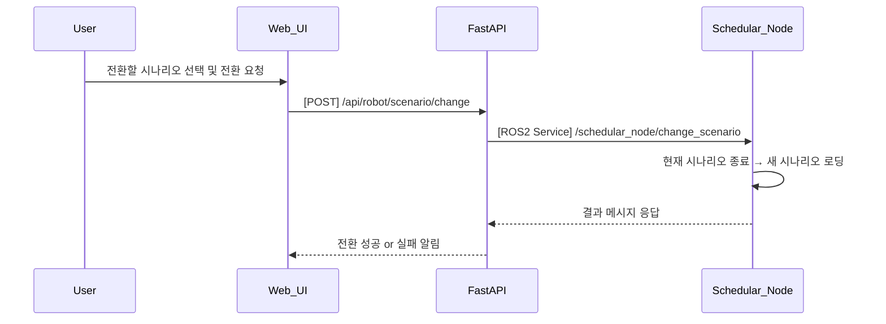

## UC10 - 시나리오 전환 (Change Scenario) - 고급 설계

---

### 1. 기능 개요

| 항목 | 내용 |
|------|------|
| 목적 | 현재 실행 중이거나 대기 중인 작업 시나리오를 중단하고, 새로운 시나리오로 전환하여 로봇의 작업 흐름을 변경 |
| 트리거 | Web UI에서 사용자가 다른 시나리오를 선택 후 "전환" 버튼 클릭 |
| 주요 처리 노드 | `schedular_node`, `fastapi`, `web_ui` |
| 출력 | 기존 시나리오 종료 및 새로운 시나리오 시작, UI 갱신 및 상태 보고 |

---

### 2. 연관 유즈케이스

- UC08/09: 등록 또는 변경된 작업 흐름을 기반으로 전환
- UC20/22: 시나리오 시각화 갱신 필요
- UC23: 전환 중 실패 발생 시 알림 처리

---

### 3. 내부 흐름 요약

1. 사용자가 Web UI에서 전환할 시나리오를 선택하고 전환 요청
2. FastAPI는 `/api/robot/scenario/change` API를 통해 요청을 수신
3. 현재 실행 중인 시나리오가 있을 경우 `schedular_node`는 상태 확인 후 정지 처리
4. 새로운 시나리오 ID를 `/schedular_node/change_scenario` 서비스로 전달
5. schedular_node는 해당 시나리오를 불러오고 내부 상태 초기화 및 실행 대기 상태로 설정
6. 결과를 FastAPI → Web UI로 반환하여 알림 및 시각화 반영

---

### 4. 상태 및 예외 흐름

| 조건 | 처리 내용 |
|------|-----------|
| 현재 시나리오가 실행 중 | 실행 중 작업 중단 후 전환 진행 |
| 동일 시나리오 선택 | “이미 실행 중인 시나리오입니다” 메시지 반환 |
| 전환 대상 시나리오 없음 | 등록 실패, “선택한 시나리오가 존재하지 않습니다” 알림 표시 |
| 서비스 실패 | 시스템 오류 표시 + 알림 로그 등록

---

### 5. 시퀀스 다이어그램 (Mermaid)



---

### 6. REST API 명세

| 항목 | 내용 |
|------|------|
| Endpoint | `/api/robot/scenario/change` |
| Method | POST |
| Request Body | 시나리오 ID |
| Response | 성공 여부 및 메시지 |
| FastAPI 핸들러 | `change_scenario_handler(request)` |

#### Request 예시

```json
{
  "scenario_id": "scenario_b"
}
```

#### Response 예시

```json
{
  "success": true,
  "message": "시나리오가 성공적으로 전환되었습니다."
}
```

---

### 7. ROS2 서비스 정의

| 항목 | 내용 |
|------|------|
| 서비스명 | `/schedular_node/change_scenario` |
| 서비스 타입 | `custom_interfaces/srv/ChangeScenario` |
| 호출 주체 | FastAPI |
| 응답 주체 | schedular_node |

#### Request 필드

| 필드 | 타입 | 설명 |
|------|------|------|
| scenario_id | string | 전환 대상 시나리오 ID |

#### Response 필드

| 필드 | 타입 | 설명 |
|------|------|------|
| success | bool | 성공 여부 |
| message | string | 결과 메시지 |

---

### 8. 추가 고려 사항

- 전환 중 로봇 동작은 즉시 정지 또는 안전 위치로 복귀 필요
- 시나리오 정의 파일(예: YAML, JSON) 불러오기 방식 정의 필요
- UC20/22와 연계 시 새로운 시나리오의 단계 시각화 동기화 필요
- 향후 이력 로그 저장, 자동 복구 기능 등과의 확장 고려

---