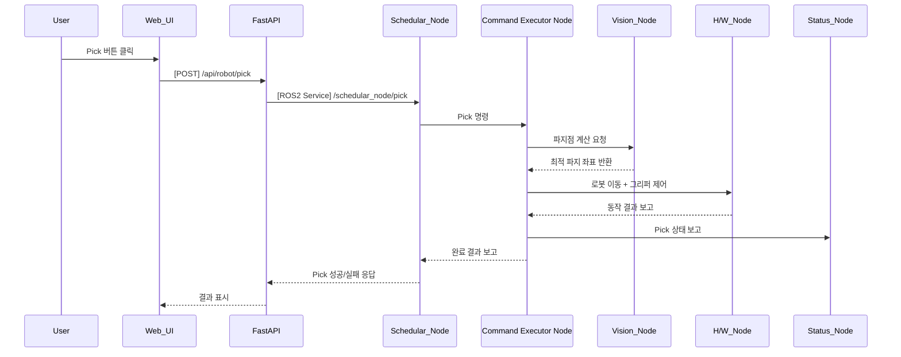

## UC11 - Pick 명령 (Execute Pick Command) - 고급 설계

---

### 1. 기능 개요

| 항목 | 내용 |
|------|------|
| 목적 | 로봇이 비전 기반 파지 위치로 이동 후 지정된 물체를 파지하는 동작을 수행 |
| 트리거 | Web UI에서 Pick 명령 버튼 클릭 또는 작업 흐름 내 Pick 단계 도달 |
| 주요 처리 노드 | `schedular_node`, `Command Executor Node`, `vision_node`, `h/w_node`, `status_node` |
| 출력 | UI에 작업 진행 및 완료 결과 표시, 실제 Pick 동작 수행 |

---

### 2. 연관 유즈케이스

- UC12: Pick 이후 Place 수행
- UC17~19: 파지점 추출, 후보 생성, 최적 좌표 계산과 밀접 연관
- UC05: 현재 작업 상태 표시
- UC25: 명령 버튼 활성/비활성 관리

---

### 3. 내부 흐름 요약

1. 사용자가 Web UI에서 Pick 명령 요청 또는 작업 흐름에 따라 자동 트리거
2. FastAPI는 `/api/robot/pick`으로 요청을 수신 후 `schedular_node`에 `/schedular_node/pick` 서비스 호출
3. schedular_node는 현재 상태 확인 후 `Command Executor Node`에 Pick 명령 전달
4. Command Executor Node는 `vision_node`에 파지점 추출 요청
5. vision_node는 이미지 처리 → 파지점 후보 생성 → 최적 좌표 계산 후 반환
6. Command Executor Node는 최종 좌표로 이동 및 그리퍼 제어 → Pick 동작 수행
7. 결과를 schedular_node 및 status_node에 보고, FastAPI → Web UI로 결과 알림

---

### 4. 상태 및 예외 흐름

| 조건 | 처리 내용 |
|------|-----------|
| 파지점 검출 실패 | Pick 실패 처리, 에러 메시지 전송 및 UC23 알림 연계 |
| 현재 상태가 IDLE 아님 | 명령 거절, "현재 명령 수행 중" 메시지 반환 |
| 그리퍼 제어 실패 | Pick 실패, UI 알림 및 재시도 유도 |
| vision_node 응답 지연 | timeout 후 Pick 중단 및 로그 기록

---

### 5. 시퀀스 다이어그램 (Mermaid)



---

### 6. REST API 명세

| 항목 | 내용 |
|------|------|
| Endpoint | `/api/robot/pick` |
| Method | POST |
| Request Body | 없음 |
| Response | 성공 여부, 메시지 |
| FastAPI 핸들러 | `pick_handler(request)` |

#### Response 예시

```json
{
  "success": true,
  "message": "Pick 완료"
}
```

---

### 7. ROS2 서비스 정의

| 항목 | 내용 |
|------|------|
| 서비스명 | `/schedular_node/pick` |
| 서비스 타입 | `std_srvs/srv/Trigger` |
| 호출 주체 | FastAPI |
| 실행 주체 | schedular_node → Command Executor Node 연계

---

### 8. 메시지 흐름 (예: Pick 좌표)

| 노드 간 | 타입 | 내용 |
|---------|------|------|
| vision_node → Command Executor Node | `custom_interfaces/msg/GraspPose` | 최적 파지 좌표 |
| Command Executor Node → h/w_node | 내부 명령 | 좌표 기반 이동 + 그리퍼 동작 |

---

### 9. 추가 고려 사항

- vision_node는 depth + RGB 기반 특징점 추출 알고리즘 포함
- 파지 실패 시 반복 횟수 제한 정책 필요
- UC19 연계 시 Grasp Score 기반으로 우선 순위 선택 로직 확장 가능

---