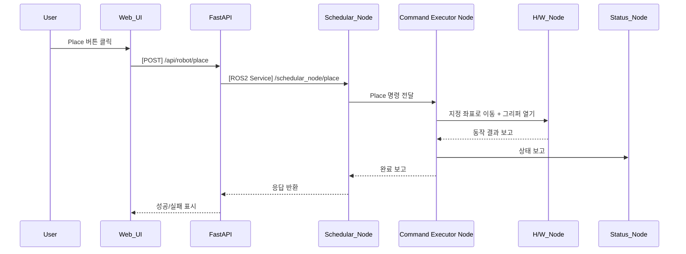

## UC12 - Place 명령 (Execute Place Command) - 고급 설계

---

### 1. 기능 개요

| 항목 | 내용 |
|------|------|
| 목적 | 로봇이 현재 파지하고 있는 물체를 지정된 좌표에 정확하게 내려놓는 동작을 수행 |
| 트리거 | Web UI에서 Place 명령 버튼 클릭 또는 작업 흐름 내 Place 단계 도달 |
| 주요 처리 노드 | `schedular_node`, `Command Executor Node`, `h/w_node`, `status_node` |
| 출력 | UI에 작업 진행 및 완료 결과 표시, 실제 Place 동작 수행 |

---

### 2. 연관 유즈케이스

- UC11: Pick 이후 Place로 이어지는 작업 흐름
- UC05: 현재 작업 상태 표시
- UC25: 명령 버튼 상태 반영
- UC19: 최적 파지점 정보가 기준이 될 수 있음

---

### 3. 내부 흐름 요약

1. 사용자가 Web UI에서 Place 요청 또는 시나리오 흐름 중 자동 실행
2. FastAPI는 `/api/robot/place` API 호출을 통해 요청 수신
3. schedular_node는 `/schedular_node/place` ROS2 서비스 호출
4. 현재 상태 확인 후 `Command Executor Node`로 Place 명령 전달
5. Command Executor Node는 사전에 지정된 Place 좌표로 이동 지시
6. h/w_node는 로봇 이동 → 그리퍼 열기 → 하중 센싱 → 완료 보고
7. 결과는 schedular_node 및 status_node를 통해 FastAPI로 전달됨

---

### 4. 상태 및 예외 흐름

| 조건 | 처리 내용 |
|------|-----------|
| Pick 상태 아님 (물체 없음) | Place 실행 거부, UI에 “파지 상태 아님” 표시 |
| Place 좌표 누락 | 기본 좌표 사용 또는 오류 처리 |
| 로봇 이동 실패 | 이동 중단, UI 알림, 오류 로그 생성 |
| 그리퍼 제어 실패 | Place 실패, 재시도 정책 여부 검토

---

### 5. 시퀀스 다이어그램 (Mermaid)



---

### 6. REST API 명세

| 항목 | 내용 |
|------|------|
| Endpoint | `/api/robot/place` |
| Method | POST |
| Request Body | (옵션) 좌표 정보 |
| Response | 성공 여부, 메시지 |
| FastAPI 핸들러 | `place_handler(request)` |

#### Response 예시

```json
{
  "success": true,
  "message": "Place 완료"
}
```

---

### 7. ROS2 서비스 정의

| 항목 | 내용 |
|------|------|
| 서비스명 | `/schedular_node/place` |
| 서비스 타입 | `std_srvs/srv/Trigger` |
| 호출 주체 | FastAPI |
| 실행 주체 | schedular_node → Command Executor Node 연계 |

---

### 8. 메시지 흐름 (예: Place 좌표 전달)

| 노드 간 | 타입 | 내용 |
|---------|------|------|
| Command Executor Node → h/w_node | 내부 명령 | 지정된 위치 이동 + 그리퍼 open |
| Command Executor Node → status_node | `custom_interfaces/msg/TaskStatus` | 현재 작업 상태 갱신 |

---

### 9. 추가 고려 사항

- 좌표는 고정 또는 사용자 설정 가능 (향후 확장 시 POST 요청 body로 전달)
- 하중 센서로 Place 성공 여부 확인 가능
- UC20과 연동하여 UI 시각화 갱신 필요

---