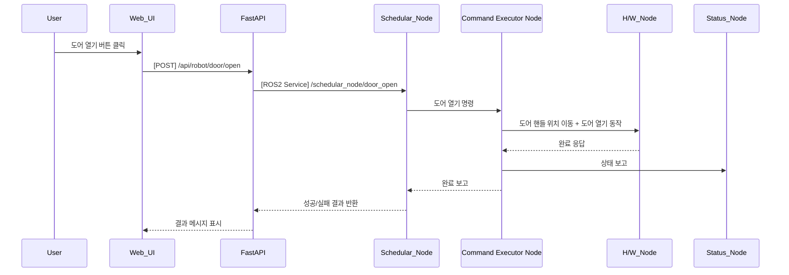

## UC13 - Door Open 명령 (Open Door Command) - 고급 설계

---

### 1. 기능 개요

| 항목 | 내용 |
|------|------|
| 목적 | 로봇 팔을 사용하여 장비의 도어를 열어 작업 시작 또는 접근 가능 상태로 전환 |
| 트리거 | Web UI에서 Door Open 버튼 클릭 또는 시나리오 흐름 중 자동 실행 |
| 주요 처리 노드 | `schedular_node`, `Command Executor Node`, `h/w_node`, `status_node` |
| 출력 | 도어 오픈 동작 실행 및 결과 보고, UI 피드백 표시 |

---

### 2. 연관 유즈케이스

- UC14: Door Close 명령
- UC11/12: Pick/Place 동작 전 준비 절차로 활용
- UC25: 명령 버튼 상태 연계

---

### 3. 내부 흐름 요약

1. 사용자가 Web UI에서 도어 열기 명령 클릭
2. FastAPI는 `/api/robot/door/open` REST 요청 수신
3. schedular_node는 `/schedular_node/door_open` 서비스 호출
4. schedular_node는 현재 상태를 확인한 뒤 Command Executor Node로 명령 전달
5. Command Executor Node는 도어 핸들 위치로 이동 후 도어 오픈 동작 실행
6. h/w_node는 모터 또는 기구 제어를 통해 도어 열기 동작 수행
7. 상태 결과를 schedular_node 및 FastAPI로 반환

---

### 4. 상태 및 예외 흐름

| 조건 | 처리 내용 |
|------|-----------|
| 도어 이미 열린 상태 | 중복 실행 방지, “이미 열린 상태입니다” 메시지 |
| 로봇 경로 충돌 예상 | 이동 중단 및 사용자 경고 표시 |
| 하드웨어 응답 없음 | timeout 처리, UI 알림 및 UC23과 연계된 에러 로그 생성 |

---

### 5. 시퀀스 다이어그램 (Mermaid)



---

### 6. REST API 명세

| 항목 | 내용 |
|------|------|
| Endpoint | `/api/robot/door/open` |
| Method | POST |
| Request Body | 없음 |
| Response | 성공 여부 및 메시지 |
| FastAPI 핸들러 | `door_open_handler(request)` |

#### Response 예시

```json
{
  "success": true,
  "message": "도어 열기 완료"
}
```

---

### 7. ROS2 서비스 정의

| 항목 | 내용 |
|------|------|
| 서비스명 | `/schedular_node/door_open` |
| 서비스 타입 | `std_srvs/srv/Trigger` |
| 호출 주체 | FastAPI |
| 실행 주체 | schedular_node → Command Executor Node 연계 |

---

### 8. 메시지 흐름 예시

| 노드 간 | 내용 |
|---------|------|
| Command Executor Node → h/w_node | 이동 명령 + 도어 열기 제어 신호 |
| h/w_node → Command Executor Node | 실제 제어 결과 피드백 |

---

### 9. 추가 고려 사항

- 도어 상태 센서가 있다면 상태 피드백을 통해 정확한 열림 여부 확인
- 충돌 가능성 있는 경로인지 pre-check 필요
- UC22(시나리오 시각화)와 연계하여 열린 상태 시각적 반영 가능

---
