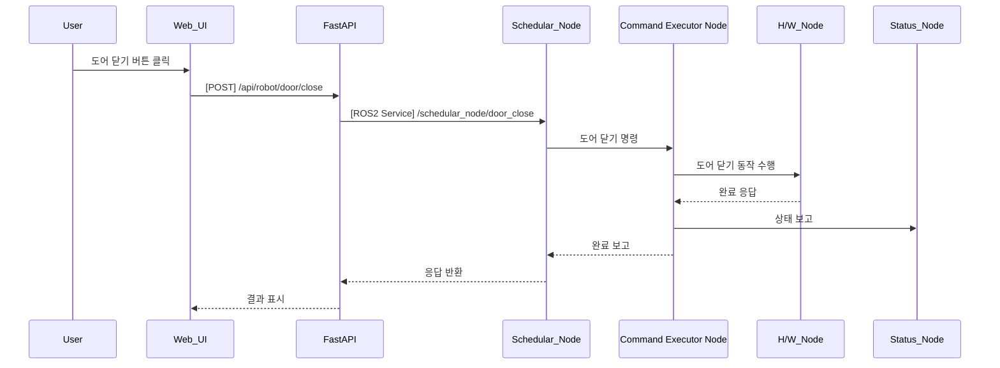

## UC14 - Door Close 명령 (Close Door Command) - 고급 설계

---

### 1. 기능 개요

| 항목 | 내용 |
|------|------|
| 목적 | 로봇 팔을 이용하여 장비의 도어를 닫아 내부 작업 공간을 안전하게 보호 |
| 트리거 | Web UI에서 Door Close 버튼 클릭 또는 시나리오 흐름 중 자동 실행 |
| 주요 처리 노드 | `schedular_node`, `Command Executor Node`, `h/w_node`, `status_node` |
| 출력 | 도어 닫기 동작 실행, 결과 보고 및 UI 피드백 표시 |

---

### 2. 연관 유즈케이스

- UC13: Door Open과 한 쌍의 명령으로 사용됨
- UC11~UC12: Pick/Place 이후 안전 확보를 위해 사용
- UC25: 명령 버튼 상태 반영

---

### 3. 내부 흐름 요약

1. 사용자가 Web UI에서 도어 닫기 명령 클릭
2. FastAPI는 `/api/robot/door/close` REST 요청 수신
3. FastAPI는 schedular_node의 `/schedular_node/door_close` 서비스 호출
4. schedular_node는 현재 시스템 상태 확인 후 Command Executor Node로 명령 전달
5. Command Executor Node는 도어 닫기 동작을 위한 경로 이동 및 그리퍼 또는 기구 제어 실행
6. h/w_node는 도어를 닫는 동작 수행
7. 결과는 schedular_node, status_node를 통해 FastAPI → UI로 전달됨

---

### 4. 상태 및 예외 흐름

| 조건 | 처리 내용 |
|------|-----------|
| 도어 이미 닫힌 상태 | 명령 무시, UI에 "이미 닫혀 있음" 표시 |
| 도어 닫기 중 장애물 감지 | 중단 및 알림 생성, 재시도 또는 사용자 확인 요청 |
| 제어 실패 | 실패 로그 기록 및 UC23 알림과 연계 |
| 기구 응답 지연 | timeout 후 실패 처리 및 재시도 권고

---

### 5. 시퀀스 다이어그램 (Mermaid)



---

### 6. REST API 명세

| 항목 | 내용 |
|------|------|
| Endpoint | `/api/robot/door/close` |
| Method | POST |
| Request Body | 없음 |
| Response | 성공 여부 및 메시지 |
| FastAPI 핸들러 | `door_close_handler(request)` |

#### Response 예시

```json
{
  "success": true,
  "message": "도어 닫기 완료"
}
```

---

### 7. ROS2 서비스 정의

| 항목 | 내용 |
|------|------|
| 서비스명 | `/schedular_node/door_close` |
| 서비스 타입 | `std_srvs/srv/Trigger` |
| 호출 주체 | FastAPI |
| 실행 주체 | schedular_node → Command Executor Node 연계 |

---

### 8. 메시지 흐름 예시

| 노드 간 | 내용 |
|---------|------|
| Command Executor Node → h/w_node | 닫기 위치 이동 → 도어 닫기 제어 신호 |
| h/w_node → Command Executor Node | 닫힘 완료 or 장애 감지 결과 |

---

### 9. 추가 고려 사항

- 닫기 전 도어 상태 확인(SENSOR) 포함 시 이중 확인 가능
- 로봇 팔 경로는 열린 상태에서 닫히는 위치까지 충돌 없이 이동 가능해야 함
- UC22 시나리오 흐름 UI 상에서 “닫힘 상태” 시각화 필요

---
