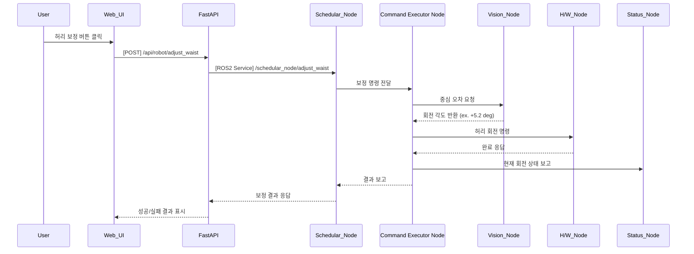

## UC15 - 허리 보정 명령 (Adjust Waist Rotation) - 고급 설계

---

### 1. 기능 개요

| 항목 | 내용 |
|------|------|
| 목적 | 비전 시스템으로 검출된 파지 위치의 오차를 보정하기 위해 로봇의 허리(회전축)를 미세 조정함 |
| 트리거 | Web UI에서 보정 명령 요청 또는 Pick/Place 전 자동 보정 수행 |
| 주요 처리 노드 | `schedular_node`, `Command Executor Node`, `vision_node`, `h/w_node`, `status_node` |
| 출력 | 허리 회전값 수정 및 보정 완료 결과 보고, UI 피드백 표시 |

---

### 2. 연관 유즈케이스

- UC11, UC12: Pick/Place 전 보정
- UC17~19: 특징점 추출 및 파지점 후보 생성 연계
- UC05, UC21: 현재 상태 및 위치 시각화에 반영 필요

---

### 3. 내부 흐름 요약

1. 사용자가 Web UI에서 보정 명령 요청 또는 Pick 직전에 자동 보정 트리거
2. FastAPI는 `/api/robot/adjust_waist` 요청 수신 후 schedular_node 호출
3. schedular_node는 `/schedular_node/adjust_waist` ROS2 서비스 호출
4. Command Executor Node는 vision_node에 보정 회전값 계산 요청
5. vision_node는 중심 오차 기반으로 허리 각도 조정값을 계산 후 반환
6. Command Executor Node는 해당 회전값만큼 h/w_node에 회전 명령 전달
7. 동작 결과를 schedular_node 및 FastAPI → UI에 전달

---

### 4. 상태 및 예외 흐름

| 조건 | 처리 내용 |
|------|-----------|
| 오차값이 임계치 이하 | 보정 생략, “허리 보정 불필요” 메시지 |
| vision_node 응답 없음 | timeout 처리, UI 경고 및 알림 생성 |
| 허리 회전 실패 | 실패 로그 기록, 보정 재시도 여부 판단 |
| 허리 각도 제한 초과 | 명령 중단, 사용자 확인 요청

---

### 5. 시퀀스 다이어그램 (Mermaid)



---

### 6. REST API 명세

| 항목 | 내용 |
|------|------|
| Endpoint | `/api/robot/adjust_waist` |
| Method | POST |
| Request Body | 없음 |
| Response | 성공 여부 및 메시지 |
| FastAPI 핸들러 | `adjust_waist_handler(request)` |

#### Response 예시

```json
{
  "success": true,
  "message": "허리 보정 완료: +5.2도 회전"
}
```

---

### 7. ROS2 서비스 정의

| 항목 | 내용 |
|------|------|
| 서비스명 | `/schedular_node/adjust_waist` |
| 서비스 타입 | `std_srvs/srv/Trigger` |
| 호출 주체 | FastAPI |
| 실행 주체 | schedular_node → Command Executor Node 연계 |

---

### 8. 메시지 흐름 예시

| 노드 간 | 타입 | 내용 |
|---------|------|------|
| vision_node → Command Executor Node | `custom_interfaces/msg/WaistOffset` | 보정 각도(deg) |
| Command Executor Node → h/w_node | 내부 제어 신호 | 허리 모터 회전 명령 |

---

### 9. 추가 고려 사항

- 회전 보정값은 최대/최소 허용 각도 안에서만 동작
- UC21과 연계해 보정 이후 pose 시각화 업데이트 필요
- 연속 보정 시 진동 방지를 위한 smoothing 또는 dead-zone 설정 가능

---
