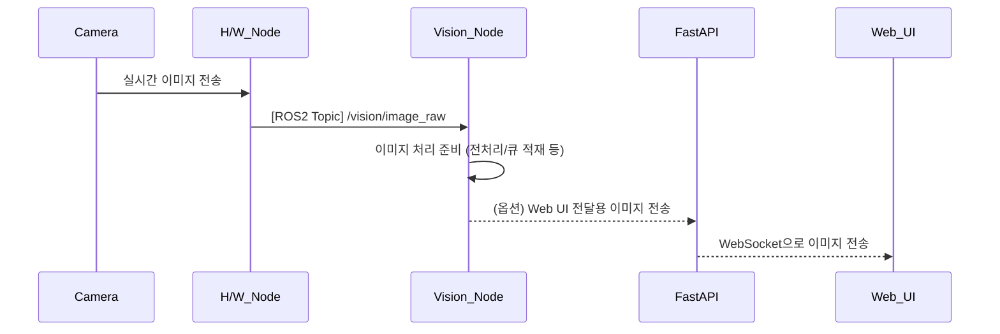

## UC16 - 이미지 수신 (Receive Image Stream) - 고급 설계

---

### 1. 기능 개요

| 항목 | 내용 |
|------|------|
| 목적 | 카메라에서 실시간으로 이미지 프레임을 수신하여 후속 비전 처리 노드(특징점 추출 등)에 제공 |
| 트리거 | 카메라 노드가 활성화되면 지속적으로 이미지 publish |
| 주요 처리 노드 | `h/w_node`, `vision_node` |
| 출력 | vision_node가 이미지 스트림을 구독하여 처리 시작, 필요 시 FastAPI를 통해 UI 전달 가능 |

---

### 2. 연관 유즈케이스

- UC17~UC19: 이미지 기반 비전 처리
- UC04: pose 계산 참고용
- UC23: 이미지 수신 실패 시 알람 표시

---

### 3. 내부 흐름 요약

1. 카메라가 H/W 노드를 통해 구동되며 실시간 이미지 프레임 publish 시작
2. 이미지 토픽은 `/camera/color/image_raw` 또는 `/vision/image_raw`로 전달됨
3. vision_node는 해당 토픽을 구독하여 이미지 처리 모듈에 전달
4. 필요 시 특정 프레임은 FastAPI를 통해 Web UI에 전송(WebSocket or JPEG Snap 방식)

---

### 4. 상태 및 예외 흐름

| 조건 | 처리 내용 |
|------|-----------|
| 카메라 연결 실패 | h/w_node에서 수신 오류 발생 → 알림 및 로그 출력 |
| 프레임 손실 발생 | vision_node에서 skip 처리, UI에 frame drop 경고 표시 |
| 이미지 포맷 오류 | vision_node에서 discard 후 log 기록 |
| vision_node가 미구동 | 이미지 처리 미수행 상태로 유지

---

### 5. 시퀀스 다이어그램 (Mermaid)

---

### 6. ROS2 토픽 정의

| 항목 | 내용 |
|------|------|
| 토픽명 | `/vision/image_raw` |
| 메시지 타입 | `sensor_msgs/msg/Image` |
| 발행 주체 | `h/w_node` |
| 구독 주체 | `vision_node`, (옵션) fastapi |

---

### 7. WebSocket 전달 명세 (옵션)

| 항목 | 내용 |
|------|------|
| Endpoint | `/ws/robot/image` |
| 전송 포맷 | base64 인코딩된 JPEG 또는 raw bytes |
| FastAPI 함수 | `image_ws_endpoint(websocket)` |

---

### 8. 메시지 필드 및 포맷

| 필드 | 설명 |
|------|------|
| height / width | 해상도 정보 |
| encoding | BGR8, RGB8 등 |
| data | 이미지 바이트 배열 |
| header.stamp | 수신 시각 정보 |

---

### 9. 추가 고려 사항

- 실시간 프레임 처리율 설정 (예: 30fps 제한, 15fps downsample)
- 프레임 큐 용량 초과 시 discard 전략 필요
- 추후 UC17과 연계된 전처리 필터 (blur, crop 등) 통합 가능

---