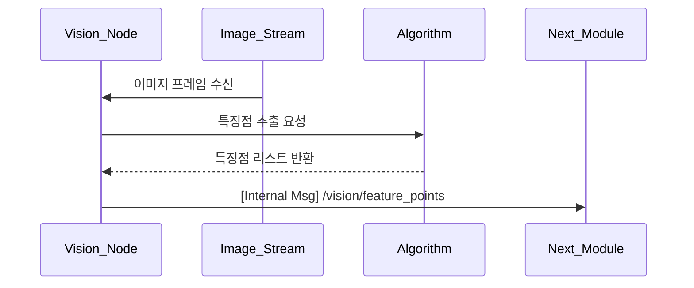

## UC17 - 특징점 추출 (Extract Feature Points) - 고급 설계

---

### 1. 기능 개요

| 항목 | 내용 |
|------|------|
| 목적 | 수신된 이미지에서 물체 인식 및 파지를 위한 특징점을 검출 |
| 트리거 | vision_node가 새로운 이미지 프레임을 수신했을 때 자동 실행 |
| 주요 처리 노드 | `vision_node` |
| 출력 | 특징점 좌표 리스트 또는 마스크 이미지, 후속 파지점 후보 생성 노드에 전달 |

---

### 2. 연관 유즈케이스

- UC16: 이미지 수신
- UC18: 파지점 후보 생성
- UC19: 최적 파지점 계산
- UC23: 특징점 검출 실패 시 알림

---

### 3. 내부 흐름 요약

1. vision_node는 `/vision/image_raw` 토픽에서 실시간 이미지 수신
2. 이미지가 수신되면 사전 정의된 알고리즘(SIFT, ORB 등) 또는 custom CNN 모델로 특징점 검출 수행
3. 필터링 기준(크기, 경계, 점수 등)을 적용하여 유효한 특징점만 추출
4. 결과를 내부 메시지(`FeaturePoints`) 형태로 다음 단계로 전달
5. 필요 시 검출 결과를 이미지 상에 시각화하여 로그 저장 또는 Web UI 전송 가능

---

### 4. 상태 및 예외 흐름

| 조건 | 처리 내용 |
|------|-----------|
| 특징점 수 < 최소 기준 | 처리 중단, 빈 결과 반환 또는 실패 메시지 publish |
| 이미지 포맷 오류 | 로그 기록 후 discard |
| 알고리즘 내부 오류 | 예외 처리 및 오류 알림 전송 (UC23 연계) |
| 이전 특징점 유지 여부 | 연속 프레임 간 추적 시 이전 frame context 사용 가능

---

### 5. 시퀀스 다이어그램 (Mermaid)

---

### 6. ROS2 메시지 정의

| 항목 | 내용 |
|------|------|
| 토픽명 | `/vision/feature_points` |
| 메시지 타입 | `custom_interfaces/msg/FeaturePoints` |
| 발행 주체 | `vision_node` |
| 구독 주체 | 내부 처리 또는 UC18 |

#### 메시지 필드 예시

| 필드 | 타입 | 설명 |
|------|------|------|
| points | geometry_msgs/Point[] | 특징점 좌표 리스트 |
| confidence | float32[] | 각 점의 신뢰도 |
| count | int | 총 검출 수 |

---

### 7. 시각화 전송 구조 (선택)

| 대상 | 방식 | 설명 |
|-------|-------|------|
| Web_UI | WebSocket or File | 이미지 위에 특징점 시각화 후 base64 전송 |
| 로그 저장 | PNG 파일 | `/log/vision/feat_<timestamp>.png` 형식 저장 가능 |

---

### 8. 알고리즘 구성 예시

| 단계 | 설명 |
|------|------|
| grayscale 변환 | 입력 이미지 전처리 |
| noise filtering | Gaussian blur 등 |
| edge/keypoint 검출 | ORB, FAST, SIFT 또는 딥러닝 기반 |
| thresholding | 낮은 신뢰도 필터링 |
| NMS (optional) | 중복 특징점 제거 |

---

### 9. 추가 고려 사항

- 특징점 수가 지나치게 많을 경우 상한값 제한 필요
- 추후 UC19 연계 시 특징점 분포를 기반으로 파지점 밀도 조절 가능
- 실시간 추적을 위한 프레임 간 대응 전략 포함 가능 (optical flow 등)

---