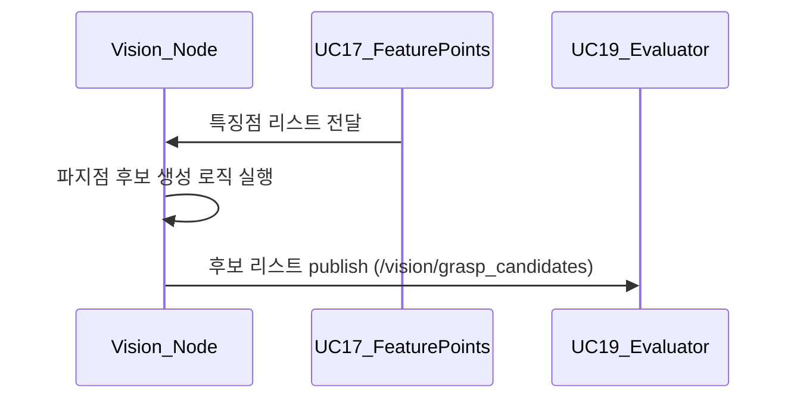

## UC18 - 파지점 후보 생성 (Generate Grasp Point Candidates) - 고급 설계

---

### 1. 기능 개요

| 항목 | 내용 |
|------|------|
| 목적 | 추출된 특징점을 기반으로 로봇이 물체를 파지할 수 있는 가능한 좌표 후보들을 생성 |
| 트리거 | UC17의 특징점 검출이 완료되면 자동 실행 |
| 주요 처리 노드 | `vision_node` |
| 출력 | 다수의 파지 가능 좌표 리스트, UC19의 최적 파지점 계산 단계로 전달됨 |

---

### 2. 연관 유즈케이스

- UC17: 특징점 추출 결과 입력
- UC19: 최적 파지점 선택
- UC11: 실제 Pick 명령에서 사용

---

### 3. 내부 흐름 요약

1. vision_node는 UC17에서 추출된 특징점 리스트 수신
2. 공간적 분포, 클러스터링, 평면 조건 등을 기준으로 파지 가능 후보 좌표를 생성
3. 각 후보에는 점수(score), 신뢰도, 방향 정보 등이 함께 부여됨
4. 후보 리스트는 내부 메시지(`GraspCandidateList`)로 UC19에 전달
5. 필요 시 디버깅용 후보 시각화 이미지 생성

---

### 4. 상태 및 예외 흐름

| 조건 | 처리 내용 |
|------|-----------|
| 특징점 수 부족 | 후보 생성 생략, 빈 리스트 반환 |
| 후보 수 > 최대 제한 | 상위 N개만 유지, 나머지 discard |
| 파지 기준 충족 실패 | 전체 실패 처리 후 알림 또는 경고 로그 생성 |
| 거리/충돌 조건 위반 | 후보 필터링 단계에서 제거

---

### 5. 시퀀스 다이어그램 (Mermaid)

---

### 6. ROS2 메시지 정의

| 항목 | 내용 |
|------|------|
| 토픽명 | `/vision/grasp_candidates` |
| 메시지 타입 | `custom_interfaces/msg/GraspCandidateList` |
| 발행 주체 | `vision_node` |
| 구독 주체 | UC19 or Command Executor Node |

#### 메시지 필드 예시

| 필드 | 타입 | 설명 |
|------|------|------|
| poses | geometry_msgs/Pose[] | 후보 좌표 리스트 |
| score | float32[] | 각 후보의 신뢰도 |
| normal | geometry_msgs/Vector3[] | 파지 방향 벡터 |

---

### 7. 알고리즘 구성 예시

| 단계 | 설명 |
|------|------|
| clustering | 특징점 밀집 영역 중심 추출 |
| normal estimation | surface normal 벡터 계산 |
| score 계산 | 평면 정렬도, 중심성, 접근성 등 고려 |
| collision check | 주변 geometry와 간섭 여부 확인 |

---

### 8. 시각화 및 디버깅

- 후보들을 이미지에 overlay하여 PNG 저장 (e.g., `/log/vision/candidates_001.png`)
- 후보마다 ID/점수를 시각화하여 분석에 활용

---

### 9. 추가 고려 사항

- 카메라 depth 정보 이용 시 3D 후보 생성 가능
- 향후 grasp pose refinement 기능과 연계 가능
- 후보 수 및 score 분포 기준 threshold 조정 가능

---