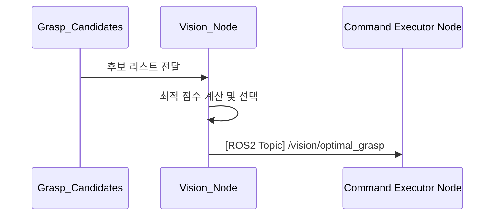

## UC19 - 최적 파지점 계산 (Select Optimal Grasp Point) - 고급 설계

---

### 1. 기능 개요

| 항목 | 내용 |
|------|------|
| 목적 | 파지점 후보 중에서 가장 안정적이고 효과적인 하나의 최적 좌표를 선택 |
| 트리거 | UC18의 파지점 후보 리스트가 생성되면 자동 실행 |
| 주요 처리 노드 | `vision_node` |
| 출력 | 최종 파지 좌표 1개 (pose), UC11의 Pick 명령에서 사용됨 |

---

### 2. 연관 유즈케이스

- UC18: 파지점 후보 입력
- UC11: Pick 명령 실행 시 최적 좌표 사용
- UC05: 현재 작업 상태와 연계 가능

---

### 3. 내부 흐름 요약

1. UC18에서 전달된 후보 리스트(`/vision/grasp_candidates`) 수신
2. 각 후보에 대해 평가 기준을 적용하여 최종 score 계산
3. 가장 높은 score를 가진 후보를 선택하여 `/vision/optimal_grasp`에 publish
4. 필요 시 후보 리스트 중 상위 N개를 함께 publish
5. Command Executor Node는 해당 최적 좌표를 기반으로 Pick 명령 수행

---

### 4. 상태 및 예외 흐름

| 조건 | 처리 내용 |
|------|-----------|
| 후보 리스트 비어 있음 | 실패 처리 → Pick 명령에 오류 응답 |
| 점수 동률 다수 발생 | 보정 알고리즘 또는 무작위 선택 적용 |
| 선택된 후보가 충돌 예상 | 차순위 후보로 재선택 또는 실패 처리 |
| 정상 완료 후 Pick 진행 | UC11로 좌표 전달 후 시퀀스 진행

---

### 5. 시퀀스 다이어그램 (Mermaid)

---

### 6. ROS2 메시지 정의

| 항목 | 내용 |
|------|------|
| 토픽명 | `/vision/optimal_grasp` |
| 메시지 타입 | `geometry_msgs/msg/PoseStamped` |
| 발행 주체 | `vision_node` |
| 구독 주체 | `Command Executor Node` |

#### 메시지 필드

| 필드 | 설명 |
|------|------|
| pose.position | 파지할 위치 (x, y, z) |
| pose.orientation | 파지 방향 (quaternion) |
| header.stamp | 계산 시각 |
| header.frame_id | 좌표 기준 프레임 (e.g., camera_link)

---

### 7. 알고리즘 평가 기준 예시

| 기준 항목 | 설명 |
|-----------|------|
| 중심성과 안정성 | 물체 중심에 가까운가? 기울기 적은가? |
| 접근성 | 로봇이 무리 없이 접근 가능한 위치인가? |
| 시야 확실성 | 특징점 밀도가 높은 영역인가? |
| 충돌 회피 | 주변 장애물과 간섭 없는가? |

---

### 8. 후보 비교 및 선택 방식

- 각 후보에 대해 score 계산:
  - `score = α * 중심성 + β * 접근성 + γ * 안정성 - δ * 충돌위험`
- 최고 점수 후보를 1차 선택
- 주변 환경에 따라 동적 조정 (예: 회피 반경 적용)

---

### 9. 추가 고려 사항

- 딥러닝 기반 Grasp Quality Estimation 모델 추가 가능
- 보정값이 큰 경우 UC15 허리 보정 자동 연계 가능
- UC11 수행 시 재사용 가능한 캐시 저장 옵션 고려

---
