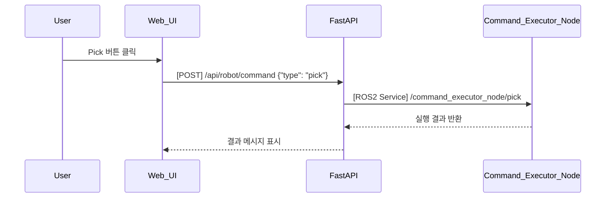

## UC20 - 웹 UI를 통한 로봇 제어 명령 전송 (Send Robot Commands via Web UI) - 고급 설계

---

### 1. 기능 개요

| 항목 | 내용 |
|------|------|
| 목적 | 사용자가 Web UI를 통해 로봇 제어 명령(Pick, Place, Stop 등)을 선택하여 전송하고, 이를 FastAPI → ROS2로 전달하여 로봇에 실행되도록 함 |
| 트리거 | 사용자가 UI에서 명령 버튼 클릭 |
| 주요 처리 노드 | `web_ui`, `fastapi`, `command_executor_node`, `schedular_node` |
| 출력 | 명령 실행 결과 알림 (성공/실패), UI 상태 반영

---

### 2. 연관 유즈케이스

- UC01~UC15: 각 명령의 실행 단위
- UC25: ACS 명령 수신과 UI 명령의 우선순위 설정
- UC26: 명령 결과 알림

---

### 3. 내부 흐름 요약

1. 사용자가 Web UI에서 버튼(Pick, Place, Stop 등)을 클릭
2. FastAPI는 해당 버튼에 따라 `/api/robot/command`에 대한 POST 요청을 처리
3. 요청된 명령은 schedular_node 또는 command_executor_node에 전달됨
4. 실행 결과(success/fail)는 다시 FastAPI → Web UI로 전송되어 알림 표시

---

### 4. 상태 및 예외 흐름

| 조건 | 처리 내용 |
|------|-----------|
| 명령 전송 성공 | UI에 성공 알림 및 버튼 상태 갱신 |
| 명령 실행 실패 | UI 팝업 또는 경고 표시 |
| 중복 명령 | 무시되거나 대기열에 등록 |
| 연결 실패 | 네트워크 오류 팝업 및 로그 기록

---

### 5. 시퀀스 다이어그램 (Mermaid)



---

### 6. REST API 명세

| 항목 | 내용 |
|------|------|
| Endpoint | `/api/robot/command` |
| Method | POST |
| Request Body | {"type": "pick", "target": "좌표정보"} |
| Response | 성공 여부, 메시지 |
| FastAPI 함수 | `robot_command_handler(request)` |

---

### 7. ROS2 서비스 정의

| Pick 예시 서비스명 | `/command_executor_node/pick` |
| 타입 | `custom_interfaces/srv/ExecuteCommand` |

#### Request

| 필드 | 타입 | 설명 |
|------|------|------|
| command_type | string | "pick", "place", "stop" 등 |
| pose | geometry_msgs/Pose | 대상 좌표 (필요 시) |

#### Response

| 필드 | 타입 | 설명 |
|------|------|------|
| success | bool | 성공 여부 |
| message | string | 상태 메시지 |

---

### 8. 메시지 예시

```json
{
  "type": "place",
  "target": {
    "x": 0.5,
    "y": 0.2,
    "z": 0.0
  }
}
```

---

### 9. 추가 고려 사항

- 버튼 상태 UI와 연동하여 실행 가능/불가능 상태 표시 (UC25 참조)
- 동일 명령 연속 방지: debounce 또는 명령 큐 처리 필요
- 긴급 명령(Stop 등)은 우선순위 분리 처리