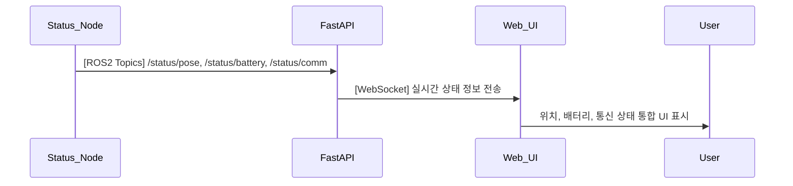

## UC21 - 실시간 정보 상태 시각화 (Real-Time Status Visualization) - 고급 설계

---

### 1. 기능 개요

| 항목 | 내용 |
|------|------|
| 목적 | 로봇의 위치, 배터리, 통신 상태 등 핵심 정보를 한 화면에 통합하여 UI에서 실시간 시각적으로 확인할 수 있도록 제공 |
| 트리거 | 상태가 갱신될 때마다 또는 주기적으로 |
| 주요 처리 노드 | `status_node`, `fastapi`, `web_ui` |
| 출력 | Web UI 상에 위치 좌표, 배터리 %, 통신 상태 등의 상태 정보 표시

---

### 2. 연관 유즈케이스

- UC04: 위치 정보 표시
- UC06: 배터리 상태
- UC07: 통신 상태
- UC23: 알람과 함께 표시될 수 있음

---

### 3. 내부 흐름 요약

1. `status_node`는 `/status/pose`, `/status/battery`, `/status/comm` 등의 상태를 publish
2. `fastapi`는 해당 토픽들을 구독하고 WebSocket으로 Web UI에 통합 전달
3. Web UI는 “상태 보드” 화면 또는 컴포넌트를 통해 실시간 상태를 시각적으로 보여줌
4. 각 정보는 숫자, 아이콘, 색상 등으로 표현됨

---

### 4. 상태 및 예외 흐름

| 조건 | 처리 내용 |
|------|-----------|
| 값 미수신 > 2초 | “연결 끊김” 또는 회색 표시로 상태 전환 |
| 값 범위 이상 | 배터리 5% 이하 → 경고 색상으로 강조 |
| 다중 상태 오류 | 복합 알람 생성 또는 통합 경고창 표출

---

### 5. 시퀀스 다이어그램 (Mermaid)



---

### 6. ROS2 메시지 정의

| 항목 | 토픽명 | 메시지 타입 |
|------|--------|--------------|
| 위치 | `/status/pose` | `geometry_msgs/msg/PoseStamped` |
| 배터리 | `/status/battery` | `std_msgs/msg/Float32` |
| 통신 | `/status/comm` | `std_msgs/msg/String` |

---

### 7. WebSocket 구조

| 항목 | 내용 |
|------|------|
| Endpoint | `/ws/robot/status_dashboard` |
| FastAPI 함수 | `status_dashboard_ws(websocket)` |
| 메시지 포맷 | JSON (통합 상태) |

#### 예시 메시지

```json
{
  "pose": {"x": 1.0, "y": -0.5, "z": 0.0},
  "battery": 42.3,
  "comm": "OK",
  "timestamp": "2025-04-15T12:00:01Z"
}
```

---

### 8. UI 시각화 구성

| 항목 | 표현 방식 |
|------|------------|
| 위치 좌표 | 숫자 텍스트 + 단위 (m) |
| 배터리 | 막대 그래프 + % 수치 + 색상 |
| 통신 상태 | 아이콘 + 상태 텍스트 (OK/LOST 등) |
| 상태 색상 | OK: 녹색, 경고: 주황, 위험: 빨강 |

---

### 9. 추가 고려 사항

- 모바일 대응 UI 또는 요약 버전 위젯 형태 제공 가능
- 이전 상태와 변화 시점 기록하여 히스토리 보드 연계 가능
- UC23과 연계해 알람 발생 시 UI에서 강조 가능