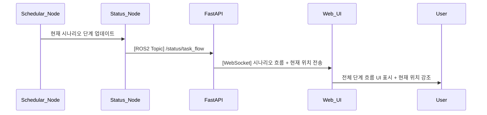

## UC22 - 시나리오 흐름 시각화 (Visualize Scenario Flow) - 고급 설계

---

### 1. 기능 개요

| 항목 | 내용 |
|------|------|
| 목적 | 등록된 시나리오의 전체 작업 단계와 현재 진행 위치를 UI 상에서 시각적으로 표현 |
| 트리거 | 시나리오 등록, 작업 흐름 시작/변경, 작업 상태 변경 시 |
| 주요 처리 노드 | `schedular_node`, `status_node`, `fastapi`, `web_ui` |
| 출력 | 전체 작업 단계 리스트, 현재 진행 단계 강조, 진행률 표시 등 UI 업데이트

---

### 2. 연관 유즈케이스

- UC08~10: 작업 흐름 설정/변경/전환 시 자동 갱신
- UC20: 현재 작업과 연동
- UC25: 버튼 상태 반영

---

### 3. 내부 흐름 요약

1. schedular_node는 등록된 시나리오 구조(단계 리스트)를 관리
2. status_node는 현재 진행 중인 단계 정보를 `/status/task_flow`로 publish
3. fastapi는 시나리오 구조와 현재 진행 단계를 Web UI로 전달
4. Web UI는 전체 시나리오 흐름 그래프를 구성하고 현재 위치를 강조

---

### 4. 상태 및 예외 흐름

| 조건 | 처리 내용 |
|------|-----------|
| 등록된 시나리오 없음 | “시나리오 없음” 메시지 + 빈 UI 표시 |
| 단계 수 = 0 | 등록 오류 또는 시스템 문제 경고 표시 |
| 현재 단계 인덱스 초과 | 강제 초기화 또는 오류 표시 |
| 흐름 변경됨 | 자동 재요청 후 갱신 수행

---

### 5. 시퀀스 다이어그램 (Mermaid)



---

### 6. ROS2 메시지 정의

| 항목 | 내용 |
|------|------|
| 토픽명 | `/status/task_flow` |
| 메시지 타입 | `custom_interfaces/msg/TaskFlowStatus` |
| 발행 주체 | `status_node` |
| 구독 주체 | `fastapi` |

#### 주요 필드

| 필드 | 타입 | 설명 |
|------|------|------|
| steps | string[] | 등록된 전체 작업 단계 |
| current_index | int | 현재 진행 중인 단계 번호 |
| status | string | RUNNING, COMPLETED, FAILED 등 |

---

### 7. WebSocket 전송 구조

| 항목 | 내용 |
|------|------|
| Endpoint | `/ws/robot/scenario_flow` |
| FastAPI 함수 | `scenario_flow_ws_endpoint(websocket)` |
| 메시지 포맷 | JSON |

#### 예시 메시지

```json
{
  "steps": ["Pick", "Place", "Inspect", "Return"],
  "current_index": 1,
  "status": "RUNNING"
}
```

---

### 8. UI 시각화 구성 요소

| 요소 | 설명 |
|------|------|
| 단계 리스트 | 모든 작업 순서를 수평 or 수직 UI 블록으로 표시 |
| 강조 표시 | 현재 단계에만 강조 애니메이션 적용 |
| 색상 표시 | 완료: 녹색, 진행중: 파랑, 실패: 빨강 |
| 흐름 방향 | 화살표 또는 라인으로 연결

---

### 9. 추가 고려 사항

- 다중 시나리오 등록 시 드롭다운 또는 탭 UI 제공
- UC10에서 시나리오 전환 시 즉시 흐름 변경 반영
- 향후 시나리오 내 병렬 단계, 조건 분기 표현 확장 가능

---