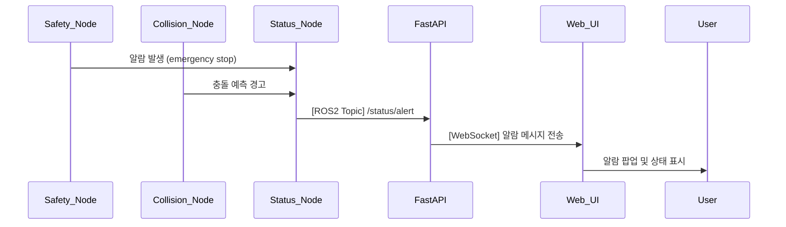

## UC23 - 알람 및 에러 상태 알림 표시 (Alarm and Error Notification) - 고급 설계

---

### 1. 기능 개요

| 항목 | 내용 |
|------|------|
| 목적 | 로봇 시스템에서 발생하는 비상 정지, 충돌, 센서 오류 등의 상태를 사용자에게 실시간 알림 형태로 전달 |
| 트리거 | 각 노드에서 비정상 상태 발생 시 status_node 또는 schedular_node로 상태 보고 |
| 주요 처리 노드 | `status_node`, `safety_interlock_node`, `collision_detection_node`, `fastapi`, `web_ui` |
| 출력 | UI 알림 팝업, 경고 아이콘, 알람음 등 시각/청각 알림 제공

---

### 2. 연관 유즈케이스

- UC06~07: 배터리/통신 상태 경고
- UC11~15: 동작 실패 시 알림 연계
- UC24: 알람 이력 저장 및 표시

---

### 3. 내부 흐름 요약

1. safety_interlock_node, collision_detection_node, Command Executor Node 등에서 상태 이상 발생
2. status_node로 알람 정보 `/status/alert` 토픽으로 전달
3. FastAPI는 해당 알람 정보를 WebSocket으로 Web UI에 전송
4. Web UI는 알림 팝업, 아이콘 강조, 로그 저장 등을 수행

---

### 4. 상태 및 예외 흐름

| 조건 | 처리 내용 |
|------|-----------|
| 알람 수신 시 | UI에 실시간 팝업 표시 및 상단 경고 바 활성화 |
| 동일 알람 반복 발생 | 기존 항목에 중첩 카운트 표시 |
| 알람 해제됨 | UI에서 항목 제거 또는 상태 복귀 처리 |
| 알람 수신 실패 | FastAPI가 fallback 로그 저장 또는 UI 경고 표시

---

### 5. 시퀀스 다이어그램 (Mermaid)



---

### 6. ROS2 메시지 정의

| 항목 | 내용 |
|------|------|
| 토픽명 | `/status/alert` |
| 메시지 타입 | `custom_interfaces/msg/AlertStatus` |
| 발행 주체 | `status_node` |
| 구독 주체 | `fastapi` |

#### 메시지 필드 예시

| 필드 | 타입 | 설명 |
|------|------|------|
| code | string | 오류 코드 (e.g., "COLLISION_DETECTED") |
| message | string | 사용자 표시용 메시지 |
| level | string | INFO, WARNING, ERROR, CRITICAL |
| timestamp | string | 발생 시각 |

---

### 7. WebSocket 전송 구조

| 항목 | 내용 |
|------|------|
| Endpoint | `/ws/robot/alert` |
| FastAPI 함수 | `alert_ws_endpoint(websocket)` |
| 메시지 포맷 | JSON |

#### 예시 메시지

```json
{
  "code": "COLLISION_WARNING",
  "message": "로봇 경로 상 충돌 예상",
  "level": "WARNING",
  "timestamp": "2025-04-14T16:33:12Z"
}
```

---

### 8. UI 구성 요소 예시

| 요소 | 설명 |
|------|------|
| 팝업 메시지 | 화면 오른쪽 상단 알림 카드 표시 |
| 경고 배너 | 상단에 전체 경고 표시 (CRITICAL일 경우) |
| 색상 표시 | INFO: 회색, WARNING: 노랑, ERROR: 주황, CRITICAL: 빨강 |
| 알람음 (옵션) | CRITICAL 등급 발생 시 시스템 경고음 재생

---

### 9. 추가 고려 사항

- 동일 코드 중복 알람의 처리 방식 정의 필요 (덮어쓰기 or 누적)
- UC24와 연계하여 알람 수신 → 저장 → 히스토리화 가능
- Web UI 사용자 설정으로 알람 표시 방식 커스터마이징 가능

---