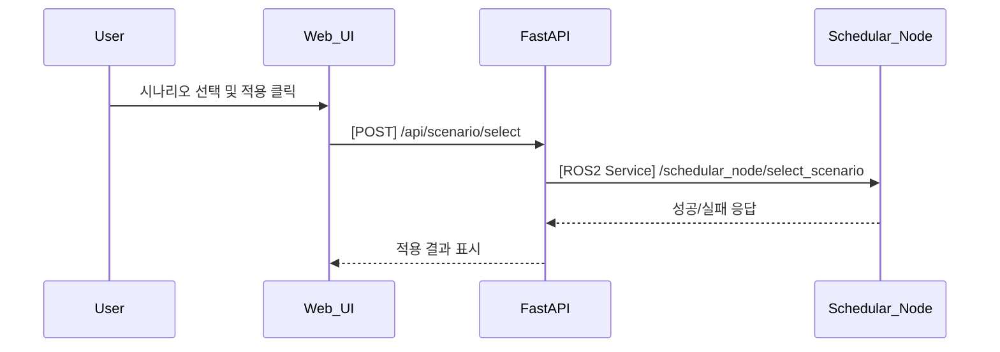

## UC24 - 시나리오 선택 및 적용 (Select and Apply Scenario) - 고급 설계

---

### 1. 기능 개요

| 항목 | 내용 |
|------|------|
| 목적 | 사용자가 UI를 통해 실행할 시나리오를 선택하고 이를 시스템에 적용하여 실행 준비 |
| 트리거 | 사용자가 Web UI에서 시나리오를 선택하고 “적용” 버튼을 클릭할 때 |
| 주요 처리 노드 | `schedular_node`, `fastapi`, `web_ui` |
| 출력 | 선택된 시나리오 ID가 schedular_node에 적용되고 실행 준비 상태로 전환

---

### 2. 연관 유즈케이스

- UC10: 시나리오 전환
- UC22: 시나리오 흐름 시각화 갱신
- UC20: 작업 상태 UI 초기화

---

### 3. 내부 흐름 요약

1. 사용자가 Web UI에서 실행할 시나리오를 선택
2. FastAPI는 `/api/scenario/select`로 REST 요청을 수신
3. schedular_node는 `/schedular_node/select_scenario` ROS2 서비스를 통해 시나리오 ID를 수신
4. 내부적으로 해당 시나리오 정의 파일을 불러오고 실행 가능한 상태로 준비
5. 성공 응답을 FastAPI → Web UI로 반환하고 UC22를 통해 흐름 시각화 갱신

---

### 4. 상태 및 예외 흐름

| 조건 | 처리 내용 |
|------|-----------|
| 유효하지 않은 시나리오 ID | 실패 처리, 오류 메시지 반환 |
| 이미 실행 중인 시나리오 선택 | “이미 실행 중입니다” 메시지 표시 |
| 로딩 실패 | 설정 파일 누락 또는 파싱 오류 → 알람 전송 (UC23)

---

### 5. 시퀀스 다이어그램 (Mermaid)

---

### 6. REST API 명세

| Endpoint | `/api/scenario/select` |
|----------|-------------------------|
| Method | POST |
| Request Body | 시나리오 ID |
| Response | 성공 여부, 메시지 |
| FastAPI 함수 | `select_scenario_handler(request)` |

---

### 7. ROS2 서비스 정의

| 서비스명 | `/schedular_node/select_scenario` |
| 서비스 타입 | `custom_interfaces/srv/SelectScenario` |

---