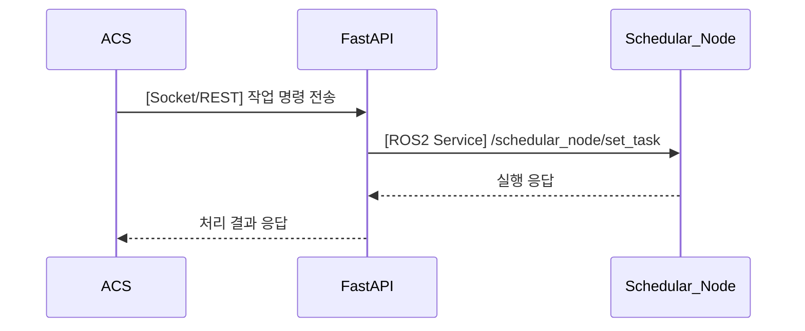

## UC25 - ACS로부터 작업 명령 수신 (Receive Task Command from ACS) - 고급 설계

---

### 1. 기능 개요

| 항목 | 내용 |
|------|------|
| 목적 | 외부 ACS(상위 시스템)로부터 작업 명령을 수신하고 이를 ROS2 시스템 내부로 전달 |
| 트리거 | ACS가 소켓 또는 REST 방식으로 명령을 전송할 때 |
| 주요 처리 노드 | `fastapi` 또는 `acs_adapter_node`, `schedular_node` |
| 출력 | 명령이 ROS2 서비스 또는 토픽 형태로 schedular_node에 전달되고 실행됨

---

### 2. 연관 유즈케이스

- UC24: 선택된 시나리오에 명령이 적용됨
- UC10: 시나리오 전환 가능
- UC20/22: 실행 상태 시각화

---

### 3. 내부 흐름 요약

1. ACS는 로봇에게 JSON 형식의 명령을 전송
2. FastAPI 또는 acs_adapter_node가 명령을 수신하여 유효성 검증
3. 유효한 명령이면 `/schedular_node/set_task` ROS2 서비스 호출
4. schedular_node는 명령을 내부 작업 흐름에 적용하거나 바로 실행
5. 결과를 ACS에 응답 또는 ACK로 전달

---

### 4. 상태 및 예외 흐름

| 조건 | 처리 내용 |
|------|-----------|
| 명령 포맷 오류 | 명령 무시, “Invalid command format” 반환 |
| 잘못된 시나리오 상태 | 현재 상태에서 실행 불가 시 “Busy” 응답 |
| schedular_node 비응답 | FastAPI timeout → ACS에 실패 응답 전송 |

---

### 5. 시퀀스 다이어그램 (Mermaid)



---

### 6. 외부 통신 명세

| 항목 | 내용 |
|------|------|
| 방식 | TCP 소켓 또는 REST POST |
| 포맷 | JSON |
| 예시 | `{"command": "start", "scenario_id": "scenario_01"}` |

---

### 7. ROS2 서비스 정의

| 서비스명 | `/schedular_node/set_task` |
| 타입 | `custom_interfaces/srv/SetTaskCommand` |

#### Request

| 필드 | 타입 | 설명 |
|------|------|------|
| command | string | 명령어 (start, stop 등) |
| scenario_id | string | 선택된 시나리오 ID |

#### Response

| 필드 | 타입 | 설명 |
|------|------|------|
| success | bool | 실행 성공 여부 |
| message | string | 상태 메시지 |

---

### 8. 메시지 예시

```json
{
  "command": "start",
  "scenario_id": "scenario_02"
}
```

---

### 9. 추가 고려 사항

- 메시지 인증 토큰 또는 IP 화이트리스트 적용 고려
- ROS2 서비스 실패 시 재시도 전략 포함 가능
- ACS 시스템과의 연결 상태 모니터링 및 알람 연계 가능

---