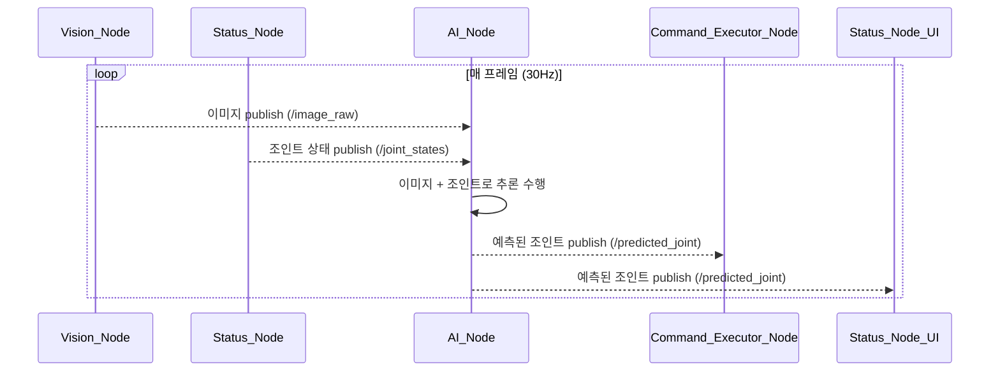

# UC27 - 실시간 로봇 조인트 예측 요청 (Real-Time Joint Prediction)

---

### 1. 기능 개요

| 항목 | 내용 |
|------|------|
| 목적 | 실시간 이미지와 현재 조인트 상태를 AI PC로 전송하여 다음 조인트 상태를 예측 받고, 이후 제어 판단 또는 상태 표시 등에 활용 |
| 트리거 | Vision_Node 및 Status_Node의 데이터 주기적 수신 (30Hz) |
| 주요 처리 노드 | `vision_node`, `status_node`, `ai_node`, `command_executor_node`, `status_node` |
| 출력 | 예측된 조인트 상태가 `/predicted_joint` 토픽으로 publish |

---

### 2. 연관 유즈케이스

- UC28: 예측 결과를 이용한 실행 판단
- UC04: 현재 위치 표시와 병렬 상태로 표시 가능
- UC17: 특징점 추출 결과와 병렬 처리 가능

---

### 3. 내부 흐름 요약

1. `vision_node`가 `/image_raw` 토픽으로 실시간 이미지 퍼블리시
2. `status_node`가 `/joint_states` 토픽으로 현재 로봇 상태 퍼블리시
3. `ai_node`는 두 토픽을 구독하여 실시간 추론 수행
4. 예측된 조인트 벡터를 `/predicted_joint` 토픽에 publish
5. `command_executor_node` 또는 `status_node`가 해당 예측값을 구독
6. 시스템 판단 또는 시각화에 사용됨

---

### 4. 상태 및 예외 흐름

| 조건 | 처리 내용 |
|------|-----------|
| AI 노드 미작동 | 예측값 미도착 → fallback 또는 이전 조인트 유지 |
| 이미지 또는 조인트 상태 누락 | 예측 skip 또는 예외 로그 기록 |
| 예측 지연 | timeout 이상 시 해당 예측 무시 |
| confidence 수치 기준 이하 | 시스템 반영 제외, 내부 기록 또는 “예측 불확실”로 표시 |

---

### 5. 시퀀스 다이어그램 (Mermaid)

---

### 6. ROS2 인터페이스 정의

| 항목 | 내용 |
|------|------|
| 입력 토픽 | `/image_raw`, `/joint_states` |
| 출력 토픽 | `/predicted_joint` |
| 출력 메시지 타입 | `sensor_msgs/msg/JointState` 또는 커스텀 메시지 |
| QoS 고려사항 | 이미지: sensor_data / 조인트: default / 예측: reliable, queue=10 |

---

### 7. 메시지 흐름 예시

| 노드 간 | 내용 |
|---------|------|
| vision_node → ai_node | 이미지 프레임 (sensor_msgs/Image 또는 CompressedImage) |
| status_node → ai_node | 현재 조인트 상태 (sensor_msgs/JointState) |
| ai_node → command_executor_node | 예측된 조인트 상태 (JointState 또는 예측 벡터) |

---

### 8. FastAPI 및 UI 연계 여부

- 기본적으로 ROS2 내부 데이터 흐름에서 완결
- 필요 시 FastAPI에서 `/predicted_joint`를 구독하여 WebSocket 전송 가능
- Web UI는 상태 시각화 목적일 경우에만 사용

---

### 9. 추가 고려 사항

- 실시간 추론 30Hz 유지를 위한 스레드 처리 및 이미지 버퍼 관리 필요
- AI PC와 ROS2 통신을 위한 네트워크 QoS 및 latency 설정 필수
- 추후 `/predicted_joint`를 이용한 실제 동작 제어로 확장 시 안전성 로직 필요
- ROS2 Foxy 이상, CompressedImage QoS 정책 설정 권장