## UC01 - 로봇 정지 명령 (Stop Robot)

---

### 1. 기능 개요

| 항목 | 내용 |
|------|------|
| 목적 | 사용자가 Web UI를 통해 로봇의 모든 동작을 긴급 중단하거나 정지시키기 위함 |
| 트리거 | 사용자가 정지 버튼 클릭 |
| 주요 처리 노드 | `schedular_node`, `status_node`, `Command Executor Node`, `h/w_node` |
| 출력 | UI에 정지 완료 메시지 표시, 실제 동작 정지 수행 |

---

### 2. 전제 조건

- 로봇이 동작 중(`RUNNING`)이거나 대기 중(`IDLE`) 상태일 것
- 통신 상태 (`ROS2`, `H/W`) 양호해야 함

---

### 3. 기본 흐름 (Main Flow)

1. 사용자가 Web UI에서 "정지" 버튼을 클릭한다.
2. Web UI는 FastAPI 서버에 `/api/robot/stop` RESTful POST 요청을 보낸다.
3. FastAPI는 `schedular_node`의 `/schedular_node/stop` ROS2 서비스를 호출한다.
4. `schedular_node`는 현재 상태를 확인하기 위해 `status_node`에 요청을 보낸다.
5. 상태가 `RUNNING`이면:
   - `schedular_node`는 `Command Executor Node`에 정지 명령을 전달한다.
   - `Command Executor Node`는 실제로 `h/w_node`에 정지 명령을 실행시킨다.
   - 결과를 역방향으로 전파한다.
6. 상태가 `STOPPED`이면:
   - 별도 정지 명령 없이 "이미 정지 상태" 메시지를 반환한다.

---

### 4. 예외 흐름 (Alternative / Error Flow)

| 조건 | 처리 내용 |
|------|-----------|
| ROS2 통신 끊김 | FastAPI에서 500 오류 반환, UI에 "통신 오류" 표시 |
| 상태 수신 실패 | schedular_node → FastAPI로 "상태 확인 실패" 메시지 전송 |
| Command Executor Node 실행 실패 | 정지 실패 메시지와 함께 UI에 에러 알림 표시 |

---

### 5. 시퀀스 다이어그램 (Mermaid)

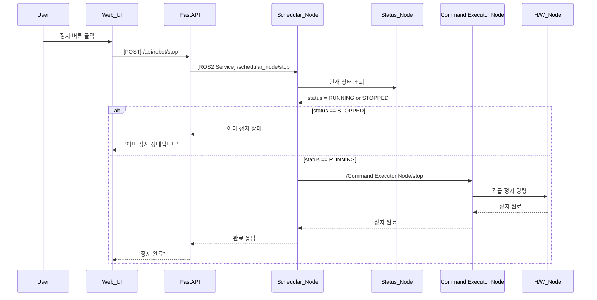

---

### 6. REST API 명세

| 항목 | 내용 |
|------|------|
| Method | POST |
| Endpoint | `/api/robot/stop` |
| Request Body | 없음 |
| Response (성공) | `{"success": true, "message": "정지 완료"}` |
| Response (실패) | `{"success": false, "message": "현재 상태에서 정지 불가"}` |
| FastAPI 핸들러 | `stop_handler(request)` |

---

### 7. ROS2 서비스 명세

| 항목 | 내용 |
|------|------|
| 서비스명 | `/schedular_node/stop` |
| 서비스 타입 | `std_srvs/srv/Trigger` |
| 호출 노드 | FastAPI |
| 응답 노드 | schedular_node |

#### Request

| 필드 | 타입 | 설명 |
|------|------|------|
| 없음 | - | - |

#### Response

| 필드 | 타입 | 설명 |
|------|------|------|
| success | bool | 성공 여부 |
| message | string | 상태 메시지 |

---

### 8. 상태 전이 및 후속 동작

- 실행 전 상태: `RUNNING` 또는 `IDLE`  
- 정지 후 상태: `STOPPED`  
- 이후 UI는 정지 상태로 버튼 비활성화, 재시작 명령 대기 가능


## UC02 - 입력 좌표 위치 이동 (Move to Input Pose)

---

### 1. 기능 개요

| 항목 | 내용 |
|------|------|
| 목적 | 사용자가 입력한 특정 pose(x, y, z, rx, ry, rz)로 로봇을 이동시킴 |
| 트리거 | Web UI에서 pose 좌표 입력 및 "이동" 버튼 클릭 |
| 주요 처리 노드 | `schedular_node`, `status_node`, `Command Executor Node`, `h/w_node` |
| 출력 | UI에 이동 결과 표시, 로봇 실제 이동 수행 |

---

### 2. 전제 조건

- 로봇 상태가 `IDLE` 또는 `READY` 상태일 것
- 충돌 예측 노드 상태가 `CLEAR`일 것 (추후 UC21 연계 고려)
- 입력 pose가 유효 범위 내여야 함

---

### 3. 기본 흐름 (Main Flow)

1. 사용자가 Web UI에서 pose 좌표를 입력하고 "이동" 버튼을 클릭한다.
2. Web UI는 FastAPI 서버에 `/api/robot/move_to_pose` POST 요청을 보낸다.
3. FastAPI는 `schedular_node`의 `/schedular_node/move_to_pose` ROS2 서비스를 호출한다.
4. `schedular_node`는 현재 상태를 확인하기 위해 `status_node`에 요청한다.
5. 상태가 `IDLE`이면, 입력 좌표 유효성 검증 후:
   - `Command Executor Node`에 이동 명령 전달
   - `Command Executor Node`는 실제 이동을 `h/w_node`에 실행 요청
6. 결과를 순차적으로 응답하고 UI에 성공 또는 실패 메시지를 표시

---

### 4. 예외 흐름 (Alternative / Error Flow)

| 조건 | 처리 내용 |
|------|-----------|
| 현재 상태가 IDLE가 아님 | 이동 불가, "작업 중에는 이동 불가" 메시지 |
| 좌표 값 오류 | FastAPI 단에서 Validation 후 400 오류 반환 |
| 하드웨어 명령 실패 | 이동 실패 메시지와 함께 UI 알림 |
| ROS 서비스 타임아웃 | FastAPI → UI에 "시스템 오류" 반환 |

---

### 5. 시퀀스 다이어그램 (Mermaid)

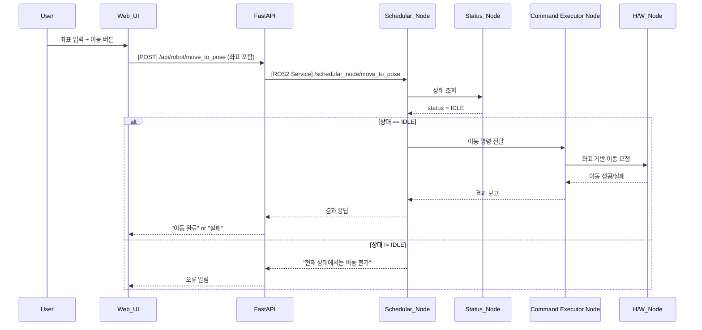

---

### 6. REST API 명세

| 항목 | 내용 |
|------|------|
| Method | POST |
| Endpoint | `/api/robot/move_to_pose` |
| Request Body | JSON 좌표 |
| Response | success, message 포함 JSON |
| FastAPI 핸들러 | `move_to_pose_handler(request)` |

#### Request Body 예시

```json
{
  "x": 0.52,
  "y": 0.12,
  "z": 0.31,
  "rx": 0.0,
  "ry": 90.0,
  "rz": 0.0
}
```

#### Response 예시

```json
{
  "success": true,
  "message": "이동 완료"
}
```

---

### 7. ROS2 서비스 명세

| 항목 | 내용 |
|------|------|
| 서비스명 | `/schedular_node/move_to_pose` |
| 서비스 타입 | `custom_interfaces/srv/MoveToPose` |
| 호출 노드 | FastAPI |
| 응답 노드 | schedular_node |

#### Request

| 필드 | 타입 | 설명 |
|------|------|------|
| x | float64 | X 위치 (m) |
| y | float64 | Y 위치 (m) |
| z | float64 | Z 위치 (m) |
| rx | float64 | Roll (deg) |
| ry | float64 | Pitch (deg) |
| rz | float64 | Yaw (deg) |

#### Response

| 필드 | 타입 | 설명 |
|------|------|------|
| success | bool | 성공 여부 |
| message | string | 상태 메시지 |

---

### 8. 상태 전이 및 후속 동작

- 실행 전 상태: `IDLE`
- 실행 중 상태: `MOVING`
- 완료 후 상태: 다시 `IDLE`로 전이됨
- `status_node`는 현재 pose를 `/status/pose`로 publish
- `current_task` 토픽에 `"MoveToPose"`가 publish됨 (UC05 연계)

## UC03 - 초기화 위치 이동 (Move to Home Pose)

---

### 1. 기능 개요

| 항목 | 내용 |
|------|------|
| 목적 | 로봇을 사전 정의된 초기 위치(Home Pose)로 이동시켜 안전 대기 상태로 전환 |
| 트리거 | Web UI에서 "초기화 위치 이동" 버튼 클릭 |
| 주요 처리 노드 | `schedular_node`, `status_node`, `Command Executor Node`, `h/w_node` |
| 출력 | UI에 이동 완료 메시지 표시, 로봇이 지정된 Home pose로 이동 |

---

### 2. 전제 조건

- 로봇이 `IDLE` 또는 `READY` 상태여야 함
- 현재 실행 중인 시나리오 또는 명령이 없을 것
- 초기화 pose는 시스템에 미리 등록되어 있어야 함

---

### 3. 기본 흐름 (Main Flow)

1. 사용자가 Web UI에서 "초기화 위치 이동" 버튼을 클릭한다.
2. Web UI는 FastAPI에 `/api/robot/move_to_home` POST 요청을 보낸다.
3. FastAPI는 `schedular_node`의 `/schedular_node/move_to_home` ROS2 서비스를 호출한다.
4. `schedular_node`는 `status_node`에 현재 로봇 상태를 요청한다.
5. 상태가 `IDLE`이면:
   - `Command Executor Node`에 Home pose로 이동 명령을 전달
   - `Command Executor Node`는 `h/w_node`에 실제 pose 이동을 요청
6. 이동이 완료되면 FastAPI로 응답이 전송되고 UI에 결과를 표시한다.

---

### 4. 예외 흐름 (Alternative / Error Flow)

| 조건 | 처리 내용 |
|------|-----------|
| 로봇 상태가 WORKING, ERROR 등 | 이동 중단, “작업 중에는 초기화 불가” 메시지 |
| ROS 서비스 호출 실패 | “시스템 오류” 메시지 반환 |
| 이동 실패 | “초기화 위치 이동 실패” 메시지 및 로그 저장 |

---

### 5. 시퀀스 다이어그램 (Mermaid)

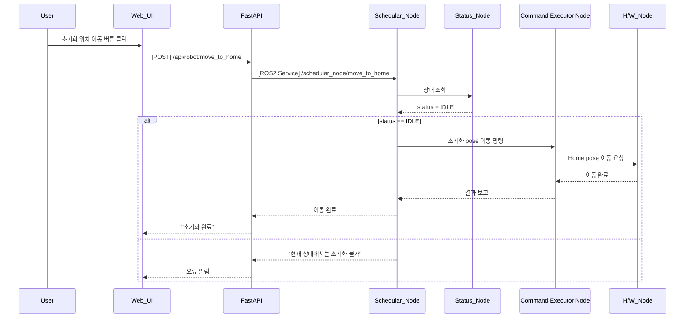

---

### 6. REST API 명세

| 항목 | 내용 |
|------|------|
| Method | POST |
| Endpoint | `/api/robot/move_to_home` |
| Request Body | 없음 |
| Response | JSON 결과 메시지 |
| FastAPI 핸들러 | `move_to_home_handler(request)` |

#### Response 예시

```json
{
  "success": true,
  "message": "초기화 위치로 이동 완료"
}
```

---

### 7. ROS2 서비스 명세

| 항목 | 내용 |
|------|------|
| 서비스명 | `/schedular_node/move_to_home` |
| 서비스 타입 | `std_srvs/srv/Trigger` |
| 호출 노드 | FastAPI |
| 응답 노드 | schedular_node |

#### Response

| 필드 | 타입 | 설명 |
|------|------|------|
| success | bool | 성공 여부 |
| message | string | 상태 메시지 |

---

### 8. 상태 전이 및 후속 동작

- 실행 전 상태: `IDLE`
- 완료 후 상태: 유지 (`IDLE`)
- 이후 동작 대기 가능, 시나리오 시작 준비 상태로 진입
- `status_node`는 현재 pose를 `/status/pose`로 주기적 publish
- `current_task`에는 `"MoveToHome"`이 publish됨 (UC05 연계)

## UC04 - 로봇 위치 정보 표시 (Advanced Design)

---

### 1. 기능 개요

| 항목 | 내용 |
|------|------|
| 목적 | 로봇의 현재 pose(x, y, z, rx, ry, rz)를 사용자에게 실시간 제공하여 모니터링 및 판단을 지원함 |
| 트리거 | 로봇 위치가 갱신될 때마다 또는 일정 주기로 상태 노드에서 pose를 publish |
| 주요 처리 노드 | `status_node`, `fastapi`, `web_ui` |
| 출력 | 지도/좌표/3D 뷰 등 UI 구성 요소에 현재 위치 실시간 표시 |

---

### 2. 연관 유즈케이스

- UC21: 로봇 위치 시각화
- UC05: 현재 작업 표시
- UC11~15: 동작 명령과 연동되어 pose 변경 발생
- UC07: 통신 상태에 따라 pose 갱신 차단될 수 있음

---

### 3. 내부 흐름 요약

1. **status_node**는 로봇 센서/엔코더에서 실시간 pose 정보를 수신
2. 좌표계 변환 및 pose 안정화 (필터링) 수행
3. ROS2 토픽 `/status/pose`로 publish
4. **fastapi**는 해당 토픽을 구독하여 WebSocket을 통해 UI에 전송
5. **web_ui**는 pose 정보를 지도/3D뷰에 반영
6. 일정 이상 pose 변화 없으면 UI 표시 유지
7. 사용자는 현재 pose 기반으로 위치 상태를 인지

---

### 4. 상태 및 예외 흐름

| 조건 | 처리 내용 |
|------|-----------|
| ROS2 통신 불가 | Web UI에 "위치 수신 불가" 상태 표시 + UI 경고 색 |
| pose 데이터 NaN 또는 이상치 | fastapi에서 discard 처리 + warning 로그 |
| WebSocket 끊김 | 재연결 시도 + UI 디스플레이 “X” 아이콘 표시 |
| 정상 수신 중인데 변화 없음 | 3초 이상 변화 없으면 UI에 “위치 유지 중” 상태 표시

---

### 5. 시퀀스 다이어그램 (Mermaid)

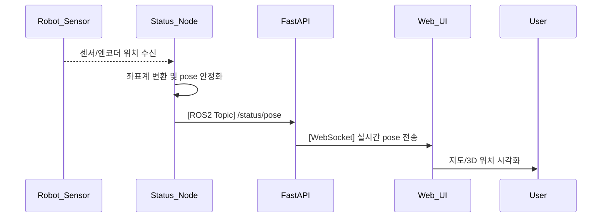

---

### 6. ROS2 메시지 정의

| 항목 | 내용 |
|------|------|
| 토픽 이름 | `/status/pose` |
| 메시지 타입 | `geometry_msgs/msg/PoseStamped` |
| 발행 주체 | `status_node` |
| 주요 필드 변환 | orientation → 오일러 각 변환 후 전달 (rx, ry, rz) |

---

### 7. WebSocket 전송 정의

| 항목 | 내용 |
|------|------|
| 엔드포인트 | `/ws/robot/pose` |
| 전송 방식 | 실시간 push (1~5Hz) |
| FastAPI 함수명 | `pose_ws_endpoint(websocket)` |

#### JSON 구조 예시

```json
{
  "x": 1.024,
  "y": -0.533,
  "z": 0.115,
  "rx": 0.0,
  "ry": 0.0,
  "rz": 90.0,
  "timestamp": "2025-04-14T16:04:15Z"
}
```

---

### 8. 추가 고려 사항

- 좌표 안정화 알고리즘 (moving average or Kalman filter) 필요 시 설계에 포함
- 데이터 업데이트 주기 및 변위 threshold를 기준으로 갱신 조건 제어
- UC21에 연계되어 시각화 데이터 구성 포맷 통일 필요

---
## UC05 - 현재 수행 작업 표시 (Display Current Task) - 고급 설계

---

### 1. 기능 개요

| 항목 | 내용 |
|------|------|
| 목적 | 로봇이 현재 수행 중인 작업(Task)을 사용자에게 실시간으로 제공함으로써 진행 상황 파악 및 오류 대응을 가능하게 함 |
| 트리거 | 작업 시작, 상태 변경, 완료 또는 실패 시마다 상태 노드에 변경 정보가 전달됨 |
| 주요 처리 노드 | `Command Executor Node`, `status_node`, `fastapi`, `web_ui` |
| 출력 | Web UI에 현재 작업명, 상태(RUNNING, COMPLETED 등), 시작 시각을 표시 |

---

### 2. 연관 유즈케이스

- UC01~UC03: 동작 실행 → Task 상태 변화 발생
- UC20: 작업 상태 시각화
- UC23: 오류 발생 시 상태와 연동하여 알림 처리

---

### 3. 내부 흐름 요약

1. `Command Executor Node`는 작업을 시작할 때 `status_node`로 작업명, 상태(RUNNING), 시작 시각을 전달
2. 작업 완료/실패 시 상태를 COMPLETED 또는 FAILED로 변경하여 다시 전달
3. `status_node`는 `/status/current_task`로 주기적으로 상태 publish
4. `fastapi`는 해당 토픽을 수신하고 WebSocket으로 UI에 전송
5. `web_ui`는 작업 상태를 실시간 반영하여 사용자에게 표시

---

### 4. 상태 및 예외 흐름

| 조건 | 처리 내용 |
|------|-----------|
| 상태가 RUNNING 3초 이상 유지 | UI 타이머 표시 시작 |
| COMPLETED 수신 시 | 상태 전환 + 완료 이펙트 표시 |
| FAILED 수신 시 | 에러 알림 + 상태 표시 색상 변경 |
| WebSocket 끊김 | UI에 상태 “수신 안됨” 표시 및 자동 재연결 시도 |
| 메시지 유효성 없음 | fastapi에서 discard 및 로그 기록 |

---

### 5. 시퀀스 다이어그램 (Mermaid)

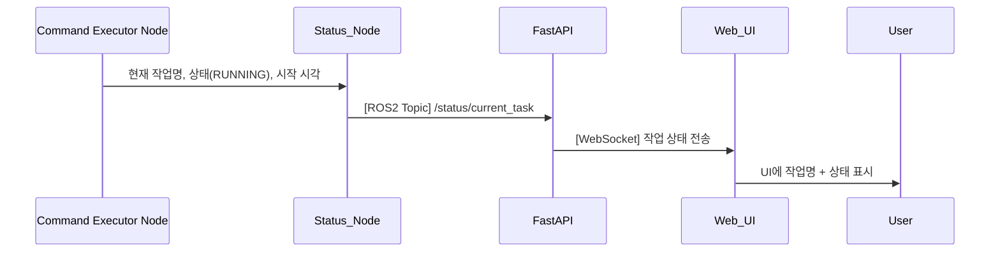

---

### 6. ROS2 메시지 정의

| 항목 | 내용 |
|------|------|
| 토픽 이름 | `/status/current_task` |
| 메시지 타입 | `custom_interfaces/msg/TaskStatus` |
| 발행 주체 | `status_node` |
| 구독 주체 | `fastapi` |

#### 필드 예시

| 필드 | 타입 | 설명 |
|------|------|------|
| task_name | string | 예: "Pick", "Place", "MoveToPose" |
| status | string | RUNNING, COMPLETED, FAILED |
| timestamp | string | 시작 시간 (ISO 8601 형식) |

---

### 7. WebSocket 전송 구조

| 항목 | 내용 |
|------|------|
| WebSocket Endpoint | `/ws/robot/current_task` |
| FastAPI 함수 | `current_task_ws_endpoint(websocket)` |

#### 메시지 예시

```json
{
  "task_name": "Pick",
  "status": "RUNNING",
  "start_time": "2025-04-14T16:08:30Z"
}
```

---

### 8. 추가 고려 사항

- `status_node`는 상태가 변경되지 않더라도 일정 간격으로 최신 상태 재전송
- UI 측은 상태 지속시간을 바탕으로 타이머/진행률 바 표시 가능
- 상태 변화 감지 시 UI 애니메이션 또는 강조 효과 적용 가능

---
## UC06 - 배터리 상태 표시 (Display Battery Status) - 고급 설계

---

### 1. 기능 개요

| 항목 | 내용 |
|------|------|
| 목적 | 로봇의 배터리 잔량, 전압, 충전 여부 등의 상태를 실시간으로 사용자에게 표시하여 안정적 운용을 가능하게 함 |
| 트리거 | 배터리 상태가 변경되거나 일정 주기로 상태 노드에서 publish |
| 주요 처리 노드 | `status_node`, `fastapi`, `web_ui` |
| 출력 | UI에 퍼센트 게이지, 전압 수치, 충전 상태 아이콘 표시 및 저전력 경고 알림 제공 |

---

### 2. 연관 유즈케이스

- UC23: 배터리 부족 시 에러/알림 발생
- UC25: 배터리 상태에 따라 버튼 활성/비활성 제어 가능

---

### 3. 내부 흐름 요약

1. `status_node`가 내부 센서/배터리 모듈로부터 전압, 전류, 잔량 정보를 수집
2. 수집된 데이터에 따라 `/status/battery` ROS2 토픽으로 상태 publish
3. `fastapi`는 해당 토픽을 구독하여 WebSocket을 통해 UI에 전달
4. `web_ui`는 실시간 상태를 바탕으로 게이지, 숫자, 상태 표시 아이콘을 표시
5. 잔량이 설정 임계치(예: 20%) 이하일 경우 UI 경고 처리

---

### 4. 상태 및 예외 흐름

| 조건 | 처리 내용 |
|------|-----------|
| 배터리 20% 이하 | UI에 “LOW BATTERY” 경고 표시 및 배경 색 변화 |
| 충전 중 상태 | 충전 아이콘 애니메이션 표시 |
| 데이터 미수신 3초 이상 | “배터리 상태 수신 불가” 경고 아이콘 표시 |
| WebSocket 오류 | 자동 재연결 시도 또는 UI fallback 표시 |
| 값 이상치 (예: 120%) | fastapi에서 discard 또는 로깅 처리 |

---

### 5. 시퀀스 다이어그램 (Mermaid)

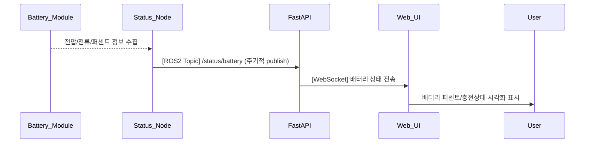

---

### 6. ROS2 메시지 정의

| 항목 | 내용 |
|------|------|
| 토픽 이름 | `/status/battery` |
| 메시지 타입 | `sensor_msgs/msg/BatteryState` |
| 발행 주체 | `status_node` |
| 구독 주체 | `fastapi` |

#### 주요 필드

| 필드 | 타입 | 설명 |
|------|------|------|
| percentage | float32 | 잔량 (%) |
| voltage | float32 | 전압 (V) |
| power_supply_status | uint8 | 충전 중(1), 완충(2), 사용 중(0) 등 |
| present | bool | 배터리 존재 여부 |

---

### 7. WebSocket 전송 구조

| 항목 | 내용 |
|------|------|
| WebSocket Endpoint | `/ws/robot/battery` |
| FastAPI 함수 | `battery_ws_endpoint(websocket)` |

#### 메시지 예시

```json
{
  "percentage": 17.3,
  "voltage": 24.9,
  "is_charging": false,
  "timestamp": "2025-04-14T16:11:50Z"
}
```

---

### 8. 추가 고려 사항

- 배터리 부족 시 자동으로 일부 기능(예: 고전력 동작) 제한 가능
- 배터리 잔량 변화량 기반 잔여 시간 예측 추가 설계 가능
- UC23과 연계 시 팝업 알림, 알람음 등 경고 확장 가능

---
## UC07 - 통신 상태 표시 (Display Communication Status) - 고급 설계

---

### 1. 기능 개요

| 항목 | 내용 |
|------|------|
| 목적 | ROS2, 하드웨어, UI 간의 통신 상태를 실시간으로 모니터링하여 장애 여부를 사용자가 즉시 파악할 수 있도록 함 |
| 트리거 | status_node가 각 모듈의 heartbeat/상태 응답을 주기적으로 검사하여 통신 상태 publish |
| 주요 처리 노드 | `status_node`, `fastapi`, `web_ui` |
| 출력 | UI에 각 통신 모듈(Ros, H/W, UI)의 상태 표시 (정상, 끊김, 경고 등) |

---

### 2. 연관 유즈케이스

- UC04~06: 통신 이상 발생 시 표시 중단 경고 발생
- UC23: 끊김 감지 시 에러/알림 시스템과 연계

---

### 3. 내부 흐름 요약

1. `status_node`는 하드웨어 모듈 및 ROS2와의 통신 상태(heartbeat, 응답 시간 등)를 모니터링
2. UI 연결 상태는 FastAPI에서 직접 체크하여 상태노드에 주기적으로 전달
3. `status_node`는 `/status/comm` 토픽으로 상태를 publish
4. `fastapi`는 해당 토픽을 WebSocket으로 Web UI에 전달
5. Web UI는 각 항목별로 상태(OK/FAIL/경고)를 시각적으로 표시

---

### 4. 상태 및 예외 흐름

| 조건 | 처리 내용 |
|------|-----------|
| heartbeat 지연 ≥ 3초 | “DISCONNECTED” 상태로 표시 |
| ROS 응답 지연 | 상태를 `WARNING`으로 표시, 로그 기록 |
| WebSocket 연결 끊김 | UI에 “UI 연결 끊김” 메시지 및 빨간색 표시 |
| 상태 미도달 5초 이상 | "통신 상태 확인 불가" 표시 및 회색 비활성 처리 |

---

### 5. 시퀀스 다이어그램 (Mermaid)

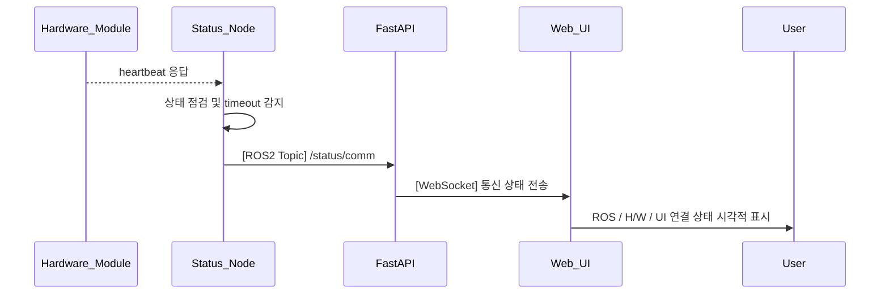

---

### 6. ROS2 메시지 정의

| 항목 | 내용 |
|------|------|
| 토픽 이름 | `/status/comm` |
| 메시지 타입 | `custom_interfaces/msg/CommStatus` |
| 발행 주체 | `status_node` |
| 구독 주체 | `fastapi` |

#### 주요 필드

| 필드 | 타입 | 설명 |
|------|------|------|
| ros | string | “OK”, “WARNING”, “DISCONNECTED” |
| hardware | string | “OK”, “DISCONNECTED” |
| ui | string | “OK”, “DISCONNECTED” |
| timestamp | string | 상태 측정 시각 (ISO 8601) |

---

### 7. WebSocket 전송 구조

| 항목 | 내용 |
|------|------|
| WebSocket Endpoint | `/ws/robot/comm_status` |
| FastAPI 함수 | `comm_status_ws_endpoint(websocket)` |

#### 메시지 예시

```json
{
  "ros": "OK",
  "hardware": "DISCONNECTED",
  "ui": "OK",
  "timestamp": "2025-04-14T16:14:44Z"
}
```

---

### 8. 추가 고려 사항

- Web UI는 상태별 색상/아이콘/애니메이션을 활용한 직관적 표현 설계 필요
- 통신 이상 발생 시 UC23과 연계하여 알림 팝업 또는 로그 기록 가능
- FastAPI 자체 모니터링 기능 추가 시 UI 통신 상태 감지 신뢰도 향상

---


## UC08 - 작업 흐름 설정 (Set Task Sequence) - 고급 설계

---

### 1. 기능 개요

| 항목 | 내용 |
|------|------|
| 목적 | 사용자가 원하는 작업의 순서를 설정하여 로봇의 전체 작업 흐름(시나리오)을 구성 |
| 트리거 | Web UI에서 시나리오 구성 후 "등록" 버튼 클릭 |
| 주요 처리 노드 | `schedular_node`, `fastapi`, `web_ui` |
| 출력 | 등록된 작업 흐름 정보 UI에 반영 및 schedular_node 내부 상태 업데이트 |

---

### 2. 연관 유즈케이스

- UC09: 등록된 작업 순서를 실시간으로 변경
- UC10: 다른 시나리오로 전환 시 등록 내용 활용
- UC20: 작업 흐름 시각화

---

### 3. 내부 흐름 요약

1. 사용자가 Web UI에서 작업 ID 리스트를 구성하고 등록 요청
2. FastAPI는 `/api/robot/sequence/set`으로 요청을 받고, 유효성 검증 수행
3. schedular_node의 `/schedular_node/set_sequence` ROS2 서비스를 호출하여 작업 리스트 전달
4. schedular_node는 작업 간 유효성 검토 및 내부 시나리오로 저장
5. 등록 성공 여부를 FastAPI를 통해 UI로 전달
6. 성공 시 UC20을 통해 시각화, UC25에 명령 버튼 상태 반영

---

### 4. 상태 및 예외 흐름

| 조건 | 처리 내용 |
|------|-----------|
| 명령 중복 | 등록 거부 + UI 알림 (“작업이 중복되었습니다”) |
| 등록 불가능한 명령 포함 | 등록 거부 + 오류 메시지 반환 |
| schedular_node 비응답 | FastAPI timeout + "등록 실패" 반환 |
| 등록 성공 후에도 UI 오류 | UC20과 동기화 실패 시 재시도 메시지 표시

---

### 5. 시퀀스 다이어그램 (Mermaid)

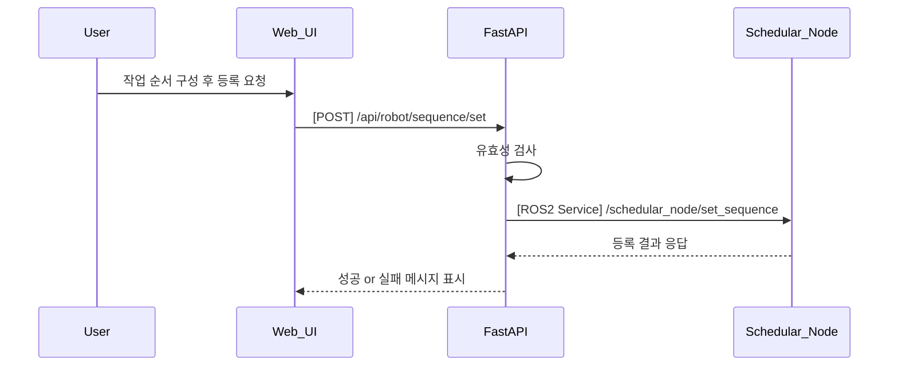

---

### 6. REST API 명세

| 항목 | 내용 |
|------|------|
| Endpoint | `/api/robot/sequence/set` |
| Method | POST |
| Request Body | 작업 ID 리스트 |
| Response | 성공 여부 및 메시지 |
| FastAPI 핸들러 | `set_sequence_handler(request)` |

#### Request 예시

```json
{
  "sequence": ["Pick", "MoveToPose", "Place"]
}
```

#### Response 예시

```json
{
  "success": true,
  "message": "작업 흐름 등록 완료"
}
```

---

### 7. ROS2 서비스 정의

| 항목 | 내용 |
|------|------|
| 서비스명 | `/schedular_node/set_sequence` |
| 서비스 타입 | `custom_interfaces/srv/SetSequence` |
| 호출 주체 | FastAPI |
| 응답 주체 | schedular_node |

#### Request 필드

| 필드 | 타입 | 설명 |
|------|------|------|
| sequence | string[] | 명령 순서 리스트 |

#### Response 필드

| 필드 | 타입 | 설명 |
|------|------|------|
| success | bool | 등록 성공 여부 |
| message | string | 상태 메시지 |

---

### 8. 추가 고려 사항

- 등록 가능한 명령 목록은 UI에서 자동 필터링되어야 함
- 명령 간 논리 관계(예: Pick 없이 Place 금지)는 schedular_node에서 검증
- 등록 시 이전 시나리오 자동 삭제 여부는 정책에 따라 처리
- UC09, UC10과 데이터 포맷 일관성 유지 필요

---

## UC09 - 작업 흐름 변경 (Update Task Sequence) - 고급 설계

---

### 1. 기능 개요

| 항목 | 내용 |
|------|------|
| 목적 | 현재 등록된 작업 흐름(시나리오)의 순서를 실시간으로 변경하여 유연한 작업 수행을 지원 |
| 트리거 | Web UI에서 사용자가 기존 작업 리스트 수정 후 "변경 적용" 클릭 |
| 주요 처리 노드 | `schedular_node`, `fastapi`, `web_ui` |
| 출력 | 수정된 작업 흐름 적용 결과 메시지 및 UI 시각화 업데이트 |

---

### 2. 연관 유즈케이스

- UC08: 등록된 작업 흐름 기반으로 동작
- UC10: 시나리오 전환 전 동작 흐름 정리 필요
- UC20: 시각화 갱신 필요

---

### 3. 내부 흐름 요약

1. 사용자가 Web UI에서 기존 등록된 작업 리스트를 편집(삭제, 순서 변경 등)
2. 변경된 리스트를 FastAPI의 `/api/robot/sequence/update`로 전송
3. FastAPI는 유효성 검증 후 `/schedular_node/update_sequence` 서비스 호출
4. schedular_node는 실행 중 작업 상태를 고려하여 수정 가능 여부 판단
5. 가능한 경우 기존 리스트 갱신 및 결과 반환
6. UI는 변경 결과를 반영하고 시각화를 갱신

---

### 4. 상태 및 예외 흐름

| 조건 | 처리 내용 |
|------|-----------|
| 현재 명령 실행 중 | 수정은 가능하나, 실행 중 작업 이후부터 반영됨 |
| 순서 변경이 논리 충돌 유발 | 예: Place가 Pick보다 먼저 → 등록 거부 및 메시지 반환 |
| 빈 리스트 | 등록 거부 + 오류 메시지 표시 |
| schedular_node 비응답 | 등록 실패 및 UI 재전송 권고 메시지 출력 |

---

### 5. 시퀀스 다이어그램 (Mermaid)

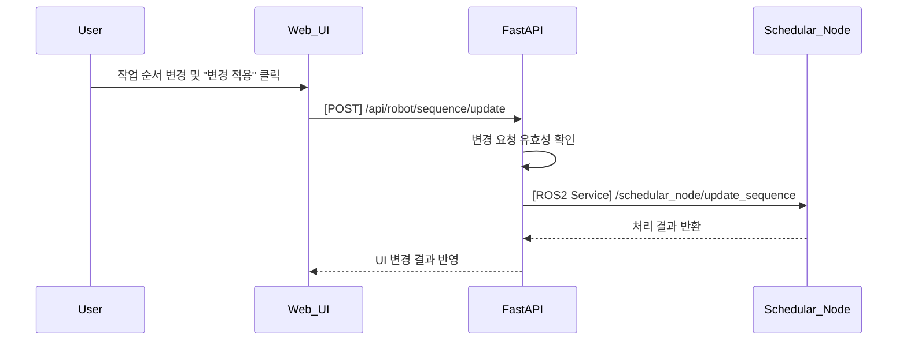

---

### 6. REST API 명세

| 항목 | 내용 |
|------|------|
| Endpoint | `/api/robot/sequence/update` |
| Method | POST |
| Request Body | 작업 ID 리스트 |
| Response | 성공 여부 및 메시지 |
| FastAPI 핸들러 | `update_sequence_handler(request)` |

#### Request 예시

```json
{
  "sequence": ["Scan", "Pick", "Place"]
}
```

#### Response 예시

```json
{
  "success": true,
  "message": "작업 흐름이 변경되었습니다."
}
```

---

### 7. ROS2 서비스 정의

| 항목 | 내용 |
|------|------|
| 서비스명 | `/schedular_node/update_sequence` |
| 서비스 타입 | `custom_interfaces/srv/UpdateSequence` |
| 호출 주체 | FastAPI |
| 응답 주체 | schedular_node |

#### Request 필드

| 필드 | 타입 | 설명 |
|------|------|------|
| sequence | string[] | 수정된 작업 리스트 |

#### Response 필드

| 필드 | 타입 | 설명 |
|------|------|------|
| success | bool | 등록 성공 여부 |
| message | string | 상태 메시지 |

---

### 8. 추가 고려 사항

- 변경 적용 시점은 현재 실행 명령 이후부터 반영됨
- 변경 이력 저장 및 롤백 기능은 추후 확장 가능
- UC20과의 연동 시 기존 시각화 → 변경된 흐름 반영 방식도 동기화 필요

---

## UC10 - 시나리오 전환 (Change Scenario) - 고급 설계

---

### 1. 기능 개요

| 항목 | 내용 |
|------|------|
| 목적 | 현재 실행 중이거나 대기 중인 작업 시나리오를 중단하고, 새로운 시나리오로 전환하여 로봇의 작업 흐름을 변경 |
| 트리거 | Web UI에서 사용자가 다른 시나리오를 선택 후 "전환" 버튼 클릭 |
| 주요 처리 노드 | `schedular_node`, `fastapi`, `web_ui` |
| 출력 | 기존 시나리오 종료 및 새로운 시나리오 시작, UI 갱신 및 상태 보고 |

---

### 2. 연관 유즈케이스

- UC08/09: 등록 또는 변경된 작업 흐름을 기반으로 전환
- UC20/22: 시나리오 시각화 갱신 필요
- UC23: 전환 중 실패 발생 시 알림 처리

---

### 3. 내부 흐름 요약

1. 사용자가 Web UI에서 전환할 시나리오를 선택하고 전환 요청
2. FastAPI는 `/api/robot/scenario/change` API를 통해 요청을 수신
3. 현재 실행 중인 시나리오가 있을 경우 `schedular_node`는 상태 확인 후 정지 처리
4. 새로운 시나리오 ID를 `/schedular_node/change_scenario` 서비스로 전달
5. schedular_node는 해당 시나리오를 불러오고 내부 상태 초기화 및 실행 대기 상태로 설정
6. 결과를 FastAPI → Web UI로 반환하여 알림 및 시각화 반영

---

### 4. 상태 및 예외 흐름

| 조건 | 처리 내용 |
|------|-----------|
| 현재 시나리오가 실행 중 | 실행 중 작업 중단 후 전환 진행 |
| 동일 시나리오 선택 | “이미 실행 중인 시나리오입니다” 메시지 반환 |
| 전환 대상 시나리오 없음 | 등록 실패, “선택한 시나리오가 존재하지 않습니다” 알림 표시 |
| 서비스 실패 | 시스템 오류 표시 + 알림 로그 등록

---

### 5. 시퀀스 다이어그램 (Mermaid)

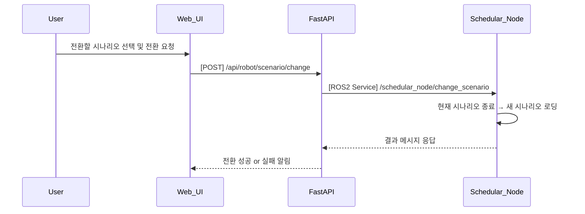

---

### 6. REST API 명세

| 항목 | 내용 |
|------|------|
| Endpoint | `/api/robot/scenario/change` |
| Method | POST |
| Request Body | 시나리오 ID |
| Response | 성공 여부 및 메시지 |
| FastAPI 핸들러 | `change_scenario_handler(request)` |

#### Request 예시

```json
{
  "scenario_id": "scenario_b"
}
```

#### Response 예시

```json
{
  "success": true,
  "message": "시나리오가 성공적으로 전환되었습니다."
}
```

---

### 7. ROS2 서비스 정의

| 항목 | 내용 |
|------|------|
| 서비스명 | `/schedular_node/change_scenario` |
| 서비스 타입 | `custom_interfaces/srv/ChangeScenario` |
| 호출 주체 | FastAPI |
| 응답 주체 | schedular_node |

#### Request 필드

| 필드 | 타입 | 설명 |
|------|------|------|
| scenario_id | string | 전환 대상 시나리오 ID |

#### Response 필드

| 필드 | 타입 | 설명 |
|------|------|------|
| success | bool | 성공 여부 |
| message | string | 결과 메시지 |

---

### 8. 추가 고려 사항

- 전환 중 로봇 동작은 즉시 정지 또는 안전 위치로 복귀 필요
- 시나리오 정의 파일(예: YAML, JSON) 불러오기 방식 정의 필요
- UC20/22와 연계 시 새로운 시나리오의 단계 시각화 동기화 필요
- 향후 이력 로그 저장, 자동 복구 기능 등과의 확장 고려

---


## UC11 - Pick 명령 (Execute Pick Command) - 고급 설계

---

### 1. 기능 개요

| 항목 | 내용 |
|------|------|
| 목적 | 로봇이 비전 기반 파지 위치로 이동 후 지정된 물체를 파지하는 동작을 수행 |
| 트리거 | Web UI에서 Pick 명령 버튼 클릭 또는 작업 흐름 내 Pick 단계 도달 |
| 주요 처리 노드 | `schedular_node`, `Command Executor Node`, `vision_node`, `h/w_node`, `status_node` |
| 출력 | UI에 작업 진행 및 완료 결과 표시, 실제 Pick 동작 수행 |

---

### 2. 연관 유즈케이스

- UC12: Pick 이후 Place 수행
- UC17~19: 파지점 추출, 후보 생성, 최적 좌표 계산과 밀접 연관
- UC05: 현재 작업 상태 표시
- UC25: 명령 버튼 활성/비활성 관리

---

### 3. 내부 흐름 요약

1. 사용자가 Web UI에서 Pick 명령 요청 또는 작업 흐름에 따라 자동 트리거
2. FastAPI는 `/api/robot/pick`으로 요청을 수신 후 `schedular_node`에 `/schedular_node/pick` 서비스 호출
3. schedular_node는 현재 상태 확인 후 `Command Executor Node`에 Pick 명령 전달
4. Command Executor Node는 `vision_node`에 파지점 추출 요청
5. vision_node는 이미지 처리 → 파지점 후보 생성 → 최적 좌표 계산 후 반환
6. Command Executor Node는 최종 좌표로 이동 및 그리퍼 제어 → Pick 동작 수행
7. 결과를 schedular_node 및 status_node에 보고, FastAPI → Web UI로 결과 알림

---

### 4. 상태 및 예외 흐름

| 조건 | 처리 내용 |
|------|-----------|
| 파지점 검출 실패 | Pick 실패 처리, 에러 메시지 전송 및 UC23 알림 연계 |
| 현재 상태가 IDLE 아님 | 명령 거절, "현재 명령 수행 중" 메시지 반환 |
| 그리퍼 제어 실패 | Pick 실패, UI 알림 및 재시도 유도 |
| vision_node 응답 지연 | timeout 후 Pick 중단 및 로그 기록

---

### 5. 시퀀스 다이어그램 (Mermaid)

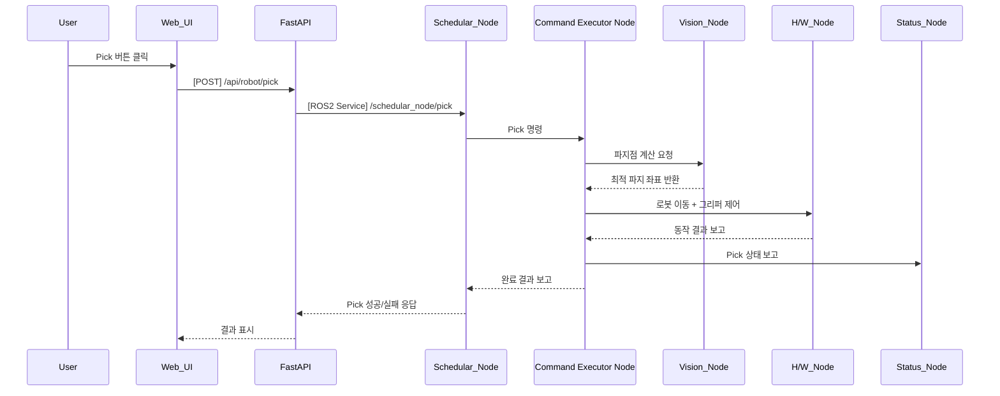

---

### 6. REST API 명세

| 항목 | 내용 |
|------|------|
| Endpoint | `/api/robot/pick` |
| Method | POST |
| Request Body | 없음 |
| Response | 성공 여부, 메시지 |
| FastAPI 핸들러 | `pick_handler(request)` |

#### Response 예시

```json
{
  "success": true,
  "message": "Pick 완료"
}
```

---

### 7. ROS2 서비스 정의

| 항목 | 내용 |
|------|------|
| 서비스명 | `/schedular_node/pick` |
| 서비스 타입 | `std_srvs/srv/Trigger` |
| 호출 주체 | FastAPI |
| 실행 주체 | schedular_node → Command Executor Node 연계

---

### 8. 메시지 흐름 (예: Pick 좌표)

| 노드 간 | 타입 | 내용 |
|---------|------|------|
| vision_node → Command Executor Node | `custom_interfaces/msg/GraspPose` | 최적 파지 좌표 |
| Command Executor Node → h/w_node | 내부 명령 | 좌표 기반 이동 + 그리퍼 동작 |

---

### 9. 추가 고려 사항

- vision_node는 depth + RGB 기반 특징점 추출 알고리즘 포함
- 파지 실패 시 반복 횟수 제한 정책 필요
- UC19 연계 시 Grasp Score 기반으로 우선 순위 선택 로직 확장 가능

---


## UC12 - Place 명령 (Execute Place Command) - 고급 설계

---

### 1. 기능 개요

| 항목 | 내용 |
|------|------|
| 목적 | 로봇이 현재 파지하고 있는 물체를 지정된 좌표에 정확하게 내려놓는 동작을 수행 |
| 트리거 | Web UI에서 Place 명령 버튼 클릭 또는 작업 흐름 내 Place 단계 도달 |
| 주요 처리 노드 | `schedular_node`, `Command Executor Node`, `h/w_node`, `status_node` |
| 출력 | UI에 작업 진행 및 완료 결과 표시, 실제 Place 동작 수행 |

---

### 2. 연관 유즈케이스

- UC11: Pick 이후 Place로 이어지는 작업 흐름
- UC05: 현재 작업 상태 표시
- UC25: 명령 버튼 상태 반영
- UC19: 최적 파지점 정보가 기준이 될 수 있음

---

### 3. 내부 흐름 요약

1. 사용자가 Web UI에서 Place 요청 또는 시나리오 흐름 중 자동 실행
2. FastAPI는 `/api/robot/place` API 호출을 통해 요청 수신
3. schedular_node는 `/schedular_node/place` ROS2 서비스 호출
4. 현재 상태 확인 후 `Command Executor Node`로 Place 명령 전달
5. Command Executor Node는 사전에 지정된 Place 좌표로 이동 지시
6. h/w_node는 로봇 이동 → 그리퍼 열기 → 하중 센싱 → 완료 보고
7. 결과는 schedular_node 및 status_node를 통해 FastAPI로 전달됨

---

### 4. 상태 및 예외 흐름

| 조건 | 처리 내용 |
|------|-----------|
| Pick 상태 아님 (물체 없음) | Place 실행 거부, UI에 “파지 상태 아님” 표시 |
| Place 좌표 누락 | 기본 좌표 사용 또는 오류 처리 |
| 로봇 이동 실패 | 이동 중단, UI 알림, 오류 로그 생성 |
| 그리퍼 제어 실패 | Place 실패, 재시도 정책 여부 검토

---

### 5. 시퀀스 다이어그램 (Mermaid)

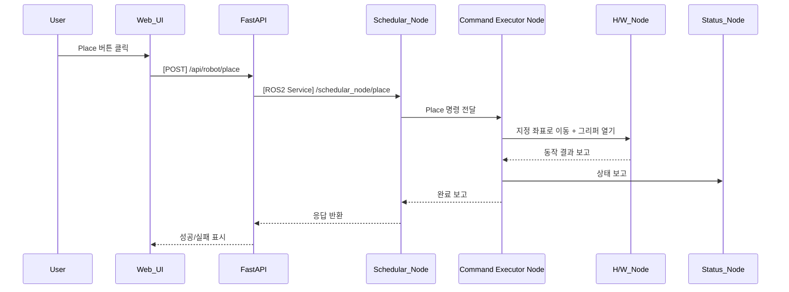

---

### 6. REST API 명세

| 항목 | 내용 |
|------|------|
| Endpoint | `/api/robot/place` |
| Method | POST |
| Request Body | (옵션) 좌표 정보 |
| Response | 성공 여부, 메시지 |
| FastAPI 핸들러 | `place_handler(request)` |

#### Response 예시

```json
{
  "success": true,
  "message": "Place 완료"
}
```

---

### 7. ROS2 서비스 정의

| 항목 | 내용 |
|------|------|
| 서비스명 | `/schedular_node/place` |
| 서비스 타입 | `std_srvs/srv/Trigger` |
| 호출 주체 | FastAPI |
| 실행 주체 | schedular_node → Command Executor Node 연계 |

---

### 8. 메시지 흐름 (예: Place 좌표 전달)

| 노드 간 | 타입 | 내용 |
|---------|------|------|
| Command Executor Node → h/w_node | 내부 명령 | 지정된 위치 이동 + 그리퍼 open |
| Command Executor Node → status_node | `custom_interfaces/msg/TaskStatus` | 현재 작업 상태 갱신 |

---

### 9. 추가 고려 사항

- 좌표는 고정 또는 사용자 설정 가능 (향후 확장 시 POST 요청 body로 전달)
- 하중 센서로 Place 성공 여부 확인 가능
- UC20과 연동하여 UI 시각화 갱신 필요

---

## UC13 - Door Open 명령 (Open Door Command) - 고급 설계

---

### 1. 기능 개요

| 항목 | 내용 |
|------|------|
| 목적 | 로봇 팔을 사용하여 장비의 도어를 열어 작업 시작 또는 접근 가능 상태로 전환 |
| 트리거 | Web UI에서 Door Open 버튼 클릭 또는 시나리오 흐름 중 자동 실행 |
| 주요 처리 노드 | `schedular_node`, `Command Executor Node`, `h/w_node`, `status_node` |
| 출력 | 도어 오픈 동작 실행 및 결과 보고, UI 피드백 표시 |

---

### 2. 연관 유즈케이스

- UC14: Door Close 명령
- UC11/12: Pick/Place 동작 전 준비 절차로 활용
- UC25: 명령 버튼 상태 연계

---

### 3. 내부 흐름 요약

1. 사용자가 Web UI에서 도어 열기 명령 클릭
2. FastAPI는 `/api/robot/door/open` REST 요청 수신
3. schedular_node는 `/schedular_node/door_open` 서비스 호출
4. schedular_node는 현재 상태를 확인한 뒤 Command Executor Node로 명령 전달
5. Command Executor Node는 도어 핸들 위치로 이동 후 도어 오픈 동작 실행
6. h/w_node는 모터 또는 기구 제어를 통해 도어 열기 동작 수행
7. 상태 결과를 schedular_node 및 FastAPI로 반환

---

### 4. 상태 및 예외 흐름

| 조건 | 처리 내용 |
|------|-----------|
| 도어 이미 열린 상태 | 중복 실행 방지, “이미 열린 상태입니다” 메시지 |
| 로봇 경로 충돌 예상 | 이동 중단 및 사용자 경고 표시 |
| 하드웨어 응답 없음 | timeout 처리, UI 알림 및 UC23과 연계된 에러 로그 생성 |

---

### 5. 시퀀스 다이어그램 (Mermaid)

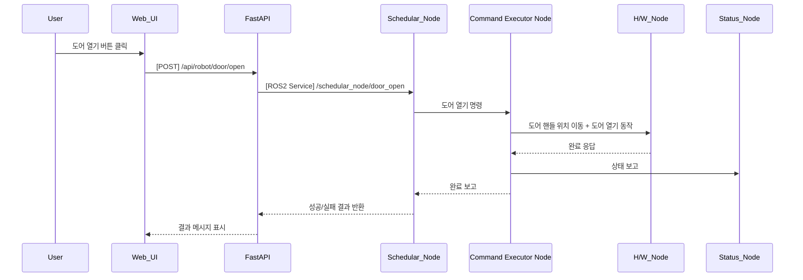

---

### 6. REST API 명세

| 항목 | 내용 |
|------|------|
| Endpoint | `/api/robot/door/open` |
| Method | POST |
| Request Body | 없음 |
| Response | 성공 여부 및 메시지 |
| FastAPI 핸들러 | `door_open_handler(request)` |

#### Response 예시

```json
{
  "success": true,
  "message": "도어 열기 완료"
}
```

---

### 7. ROS2 서비스 정의

| 항목 | 내용 |
|------|------|
| 서비스명 | `/schedular_node/door_open` |
| 서비스 타입 | `std_srvs/srv/Trigger` |
| 호출 주체 | FastAPI |
| 실행 주체 | schedular_node → Command Executor Node 연계 |

---

### 8. 메시지 흐름 예시

| 노드 간 | 내용 |
|---------|------|
| Command Executor Node → h/w_node | 이동 명령 + 도어 열기 제어 신호 |
| h/w_node → Command Executor Node | 실제 제어 결과 피드백 |

---

### 9. 추가 고려 사항

- 도어 상태 센서가 있다면 상태 피드백을 통해 정확한 열림 여부 확인
- 충돌 가능성 있는 경로인지 pre-check 필요
- UC22(시나리오 시각화)와 연계하여 열린 상태 시각적 반영 가능

---


## UC14 - Door Close 명령 (Close Door Command) - 고급 설계

---

### 1. 기능 개요

| 항목 | 내용 |
|------|------|
| 목적 | 로봇 팔을 이용하여 장비의 도어를 닫아 내부 작업 공간을 안전하게 보호 |
| 트리거 | Web UI에서 Door Close 버튼 클릭 또는 시나리오 흐름 중 자동 실행 |
| 주요 처리 노드 | `schedular_node`, `Command Executor Node`, `h/w_node`, `status_node` |
| 출력 | 도어 닫기 동작 실행, 결과 보고 및 UI 피드백 표시 |

---

### 2. 연관 유즈케이스

- UC13: Door Open과 한 쌍의 명령으로 사용됨
- UC11~UC12: Pick/Place 이후 안전 확보를 위해 사용
- UC25: 명령 버튼 상태 반영

---

### 3. 내부 흐름 요약

1. 사용자가 Web UI에서 도어 닫기 명령 클릭
2. FastAPI는 `/api/robot/door/close` REST 요청 수신
3. FastAPI는 schedular_node의 `/schedular_node/door_close` 서비스 호출
4. schedular_node는 현재 시스템 상태 확인 후 Command Executor Node로 명령 전달
5. Command Executor Node는 도어 닫기 동작을 위한 경로 이동 및 그리퍼 또는 기구 제어 실행
6. h/w_node는 도어를 닫는 동작 수행
7. 결과는 schedular_node, status_node를 통해 FastAPI → UI로 전달됨

---

### 4. 상태 및 예외 흐름

| 조건 | 처리 내용 |
|------|-----------|
| 도어 이미 닫힌 상태 | 명령 무시, UI에 "이미 닫혀 있음" 표시 |
| 도어 닫기 중 장애물 감지 | 중단 및 알림 생성, 재시도 또는 사용자 확인 요청 |
| 제어 실패 | 실패 로그 기록 및 UC23 알림과 연계 |
| 기구 응답 지연 | timeout 후 실패 처리 및 재시도 권고

---

### 5. 시퀀스 다이어그램 (Mermaid)

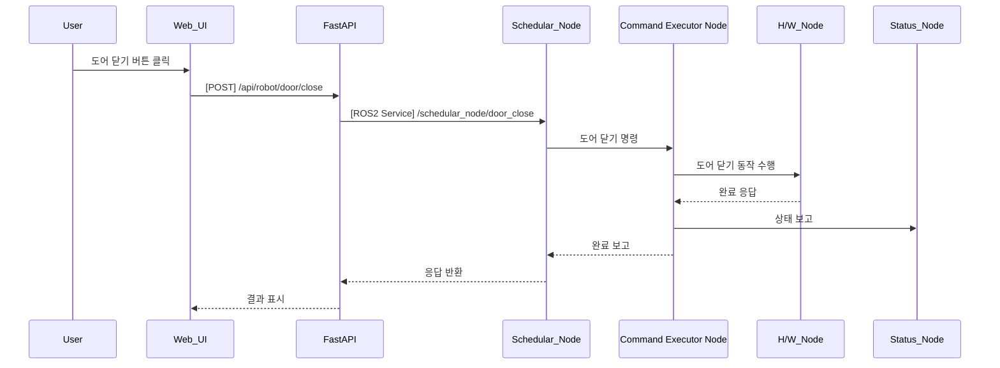

---

### 6. REST API 명세

| 항목 | 내용 |
|------|------|
| Endpoint | `/api/robot/door/close` |
| Method | POST |
| Request Body | 없음 |
| Response | 성공 여부 및 메시지 |
| FastAPI 핸들러 | `door_close_handler(request)` |

#### Response 예시

```json
{
  "success": true,
  "message": "도어 닫기 완료"
}
```

---

### 7. ROS2 서비스 정의

| 항목 | 내용 |
|------|------|
| 서비스명 | `/schedular_node/door_close` |
| 서비스 타입 | `std_srvs/srv/Trigger` |
| 호출 주체 | FastAPI |
| 실행 주체 | schedular_node → Command Executor Node 연계 |

---

### 8. 메시지 흐름 예시

| 노드 간 | 내용 |
|---------|------|
| Command Executor Node → h/w_node | 닫기 위치 이동 → 도어 닫기 제어 신호 |
| h/w_node → Command Executor Node | 닫힘 완료 or 장애 감지 결과 |

---

### 9. 추가 고려 사항

- 닫기 전 도어 상태 확인(SENSOR) 포함 시 이중 확인 가능
- 로봇 팔 경로는 열린 상태에서 닫히는 위치까지 충돌 없이 이동 가능해야 함
- UC22 시나리오 흐름 UI 상에서 “닫힘 상태” 시각화 필요

---

## UC15 - 허리 보정 명령 (Adjust Waist Rotation) - 고급 설계

---

### 1. 기능 개요

| 항목 | 내용 |
|------|------|
| 목적 | 비전 시스템으로 검출된 파지 위치의 오차를 보정하기 위해 로봇의 허리(회전축)를 미세 조정함 |
| 트리거 | Web UI에서 보정 명령 요청 또는 Pick/Place 전 자동 보정 수행 |
| 주요 처리 노드 | `schedular_node`, `Command Executor Node`, `vision_node`, `h/w_node`, `status_node` |
| 출력 | 허리 회전값 수정 및 보정 완료 결과 보고, UI 피드백 표시 |

---

### 2. 연관 유즈케이스

- UC11, UC12: Pick/Place 전 보정
- UC17~19: 특징점 추출 및 파지점 후보 생성 연계
- UC05, UC21: 현재 상태 및 위치 시각화에 반영 필요

---

### 3. 내부 흐름 요약

1. 사용자가 Web UI에서 보정 명령 요청 또는 Pick 직전에 자동 보정 트리거
2. FastAPI는 `/api/robot/adjust_waist` 요청 수신 후 schedular_node 호출
3. schedular_node는 `/schedular_node/adjust_waist` ROS2 서비스 호출
4. Command Executor Node는 vision_node에 보정 회전값 계산 요청
5. vision_node는 중심 오차 기반으로 허리 각도 조정값을 계산 후 반환
6. Command Executor Node는 해당 회전값만큼 h/w_node에 회전 명령 전달
7. 동작 결과를 schedular_node 및 FastAPI → UI에 전달

---

### 4. 상태 및 예외 흐름

| 조건 | 처리 내용 |
|------|-----------|
| 오차값이 임계치 이하 | 보정 생략, “허리 보정 불필요” 메시지 |
| vision_node 응답 없음 | timeout 처리, UI 경고 및 알림 생성 |
| 허리 회전 실패 | 실패 로그 기록, 보정 재시도 여부 판단 |
| 허리 각도 제한 초과 | 명령 중단, 사용자 확인 요청

---

### 5. 시퀀스 다이어그램 (Mermaid)

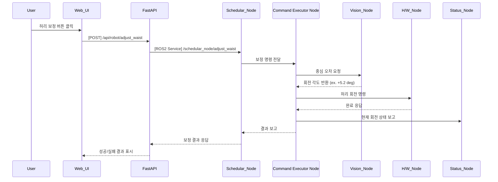

---

### 6. REST API 명세

| 항목 | 내용 |
|------|------|
| Endpoint | `/api/robot/adjust_waist` |
| Method | POST |
| Request Body | 없음 |
| Response | 성공 여부 및 메시지 |
| FastAPI 핸들러 | `adjust_waist_handler(request)` |

#### Response 예시

```json
{
  "success": true,
  "message": "허리 보정 완료: +5.2도 회전"
}
```

---

### 7. ROS2 서비스 정의

| 항목 | 내용 |
|------|------|
| 서비스명 | `/schedular_node/adjust_waist` |
| 서비스 타입 | `std_srvs/srv/Trigger` |
| 호출 주체 | FastAPI |
| 실행 주체 | schedular_node → Command Executor Node 연계 |

---

### 8. 메시지 흐름 예시

| 노드 간 | 타입 | 내용 |
|---------|------|------|
| vision_node → Command Executor Node | `custom_interfaces/msg/WaistOffset` | 보정 각도(deg) |
| Command Executor Node → h/w_node | 내부 제어 신호 | 허리 모터 회전 명령 |

---

### 9. 추가 고려 사항

- 회전 보정값은 최대/최소 허용 각도 안에서만 동작
- UC21과 연계해 보정 이후 pose 시각화 업데이트 필요
- 연속 보정 시 진동 방지를 위한 smoothing 또는 dead-zone 설정 가능

---


## UC16 - 이미지 수신 (Receive Image Stream) - 고급 설계

---

### 1. 기능 개요

| 항목 | 내용 |
|------|------|
| 목적 | 카메라에서 실시간으로 이미지 프레임을 수신하여 후속 비전 처리 노드(특징점 추출 등)에 제공 |
| 트리거 | 카메라 노드가 활성화되면 지속적으로 이미지 publish |
| 주요 처리 노드 | `h/w_node`, `vision_node` |
| 출력 | vision_node가 이미지 스트림을 구독하여 처리 시작, 필요 시 FastAPI를 통해 UI 전달 가능 |

---

### 2. 연관 유즈케이스

- UC17~UC19: 이미지 기반 비전 처리
- UC04: pose 계산 참고용
- UC23: 이미지 수신 실패 시 알람 표시

---

### 3. 내부 흐름 요약

1. 카메라가 H/W 노드를 통해 구동되며 실시간 이미지 프레임 publish 시작
2. 이미지 토픽은 `/camera/color/image_raw` 또는 `/vision/image_raw`로 전달됨
3. vision_node는 해당 토픽을 구독하여 이미지 처리 모듈에 전달
4. 필요 시 특정 프레임은 FastAPI를 통해 Web UI에 전송(WebSocket or JPEG Snap 방식)

---

### 4. 상태 및 예외 흐름

| 조건 | 처리 내용 |
|------|-----------|
| 카메라 연결 실패 | h/w_node에서 수신 오류 발생 → 알림 및 로그 출력 |
| 프레임 손실 발생 | vision_node에서 skip 처리, UI에 frame drop 경고 표시 |
| 이미지 포맷 오류 | vision_node에서 discard 후 log 기록 |
| vision_node가 미구동 | 이미지 처리 미수행 상태로 유지

---

### 5. 시퀀스 다이어그램 (Mermaid)

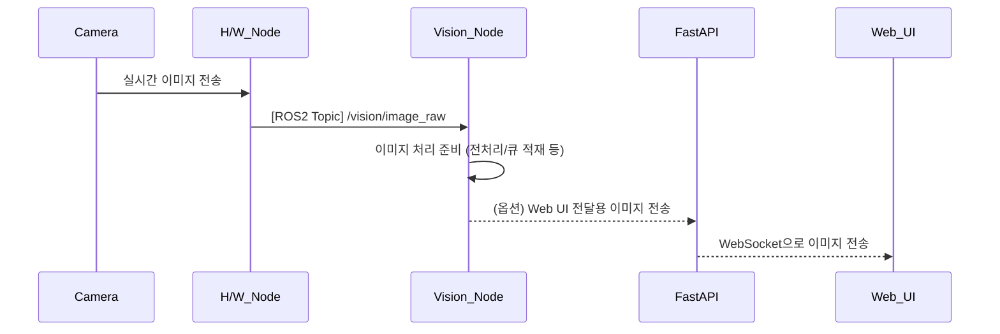

---

### 6. ROS2 토픽 정의

| 항목 | 내용 |
|------|------|
| 토픽명 | `/vision/image_raw` |
| 메시지 타입 | `sensor_msgs/msg/Image` |
| 발행 주체 | `h/w_node` |
| 구독 주체 | `vision_node`, (옵션) fastapi |

---

### 7. WebSocket 전달 명세 (옵션)

| 항목 | 내용 |
|------|------|
| Endpoint | `/ws/robot/image` |
| 전송 포맷 | base64 인코딩된 JPEG 또는 raw bytes |
| FastAPI 함수 | `image_ws_endpoint(websocket)` |

---

### 8. 메시지 필드 및 포맷

| 필드 | 설명 |
|------|------|
| height / width | 해상도 정보 |
| encoding | BGR8, RGB8 등 |
| data | 이미지 바이트 배열 |
| header.stamp | 수신 시각 정보 |

---

### 9. 추가 고려 사항

- 실시간 프레임 처리율 설정 (예: 30fps 제한, 15fps downsample)
- 프레임 큐 용량 초과 시 discard 전략 필요
- 추후 UC17과 연계된 전처리 필터 (blur, crop 등) 통합 가능

---

## UC17 - 특징점 추출 (Extract Feature Points) - 고급 설계

---

### 1. 기능 개요

| 항목 | 내용 |
|------|------|
| 목적 | 수신된 이미지에서 물체 인식 및 파지를 위한 특징점을 검출 |
| 트리거 | vision_node가 새로운 이미지 프레임을 수신했을 때 자동 실행 |
| 주요 처리 노드 | `vision_node` |
| 출력 | 특징점 좌표 리스트 또는 마스크 이미지, 후속 파지점 후보 생성 노드에 전달 |

---

### 2. 연관 유즈케이스

- UC16: 이미지 수신
- UC18: 파지점 후보 생성
- UC19: 최적 파지점 계산
- UC23: 특징점 검출 실패 시 알림

---

### 3. 내부 흐름 요약

1. vision_node는 `/vision/image_raw` 토픽에서 실시간 이미지 수신
2. 이미지가 수신되면 사전 정의된 알고리즘(SIFT, ORB 등) 또는 custom CNN 모델로 특징점 검출 수행
3. 필터링 기준(크기, 경계, 점수 등)을 적용하여 유효한 특징점만 추출
4. 결과를 내부 메시지(`FeaturePoints`) 형태로 다음 단계로 전달
5. 필요 시 검출 결과를 이미지 상에 시각화하여 로그 저장 또는 Web UI 전송 가능

---

### 4. 상태 및 예외 흐름

| 조건 | 처리 내용 |
|------|-----------|
| 특징점 수 < 최소 기준 | 처리 중단, 빈 결과 반환 또는 실패 메시지 publish |
| 이미지 포맷 오류 | 로그 기록 후 discard |
| 알고리즘 내부 오류 | 예외 처리 및 오류 알림 전송 (UC23 연계) |
| 이전 특징점 유지 여부 | 연속 프레임 간 추적 시 이전 frame context 사용 가능

---

### 5. 시퀀스 다이어그램 (Mermaid)

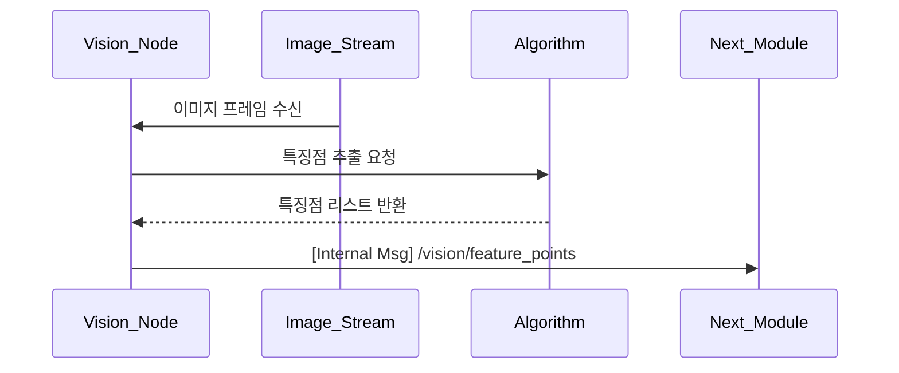

---

### 6. ROS2 메시지 정의

| 항목 | 내용 |
|------|------|
| 토픽명 | `/vision/feature_points` |
| 메시지 타입 | `custom_interfaces/msg/FeaturePoints` |
| 발행 주체 | `vision_node` |
| 구독 주체 | 내부 처리 또는 UC18 |

#### 메시지 필드 예시

| 필드 | 타입 | 설명 |
|------|------|------|
| points | geometry_msgs/Point[] | 특징점 좌표 리스트 |
| confidence | float32[] | 각 점의 신뢰도 |
| count | int | 총 검출 수 |

---

### 7. 시각화 전송 구조 (선택)

| 대상 | 방식 | 설명 |
|-------|-------|------|
| Web_UI | WebSocket or File | 이미지 위에 특징점 시각화 후 base64 전송 |
| 로그 저장 | PNG 파일 | `/log/vision/feat_<timestamp>.png` 형식 저장 가능 |

---

### 8. 알고리즘 구성 예시

| 단계 | 설명 |
|------|------|
| grayscale 변환 | 입력 이미지 전처리 |
| noise filtering | Gaussian blur 등 |
| edge/keypoint 검출 | ORB, FAST, SIFT 또는 딥러닝 기반 |
| thresholding | 낮은 신뢰도 필터링 |
| NMS (optional) | 중복 특징점 제거 |

---

### 9. 추가 고려 사항

- 특징점 수가 지나치게 많을 경우 상한값 제한 필요
- 추후 UC19 연계 시 특징점 분포를 기반으로 파지점 밀도 조절 가능
- 실시간 추적을 위한 프레임 간 대응 전략 포함 가능 (optical flow 등)

---

## UC18 - 파지점 후보 생성 (Generate Grasp Point Candidates) - 고급 설계

---

### 1. 기능 개요

| 항목 | 내용 |
|------|------|
| 목적 | 추출된 특징점을 기반으로 로봇이 물체를 파지할 수 있는 가능한 좌표 후보들을 생성 |
| 트리거 | UC17의 특징점 검출이 완료되면 자동 실행 |
| 주요 처리 노드 | `vision_node` |
| 출력 | 다수의 파지 가능 좌표 리스트, UC19의 최적 파지점 계산 단계로 전달됨 |

---

### 2. 연관 유즈케이스

- UC17: 특징점 추출 결과 입력
- UC19: 최적 파지점 선택
- UC11: 실제 Pick 명령에서 사용

---

### 3. 내부 흐름 요약

1. vision_node는 UC17에서 추출된 특징점 리스트 수신
2. 공간적 분포, 클러스터링, 평면 조건 등을 기준으로 파지 가능 후보 좌표를 생성
3. 각 후보에는 점수(score), 신뢰도, 방향 정보 등이 함께 부여됨
4. 후보 리스트는 내부 메시지(`GraspCandidateList`)로 UC19에 전달
5. 필요 시 디버깅용 후보 시각화 이미지 생성

---

### 4. 상태 및 예외 흐름

| 조건 | 처리 내용 |
|------|-----------|
| 특징점 수 부족 | 후보 생성 생략, 빈 리스트 반환 |
| 후보 수 > 최대 제한 | 상위 N개만 유지, 나머지 discard |
| 파지 기준 충족 실패 | 전체 실패 처리 후 알림 또는 경고 로그 생성 |
| 거리/충돌 조건 위반 | 후보 필터링 단계에서 제거

---

### 5. 시퀀스 다이어그램 (Mermaid)

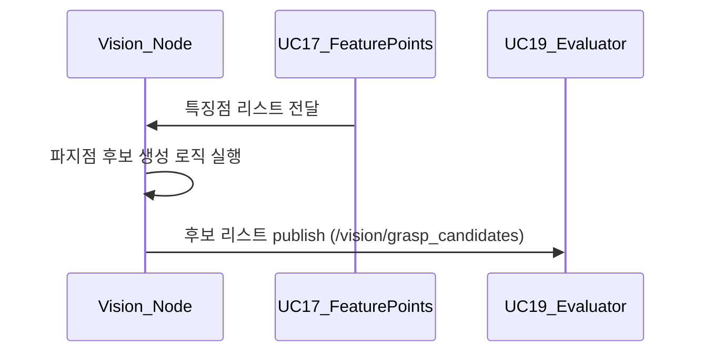

---

### 6. ROS2 메시지 정의

| 항목 | 내용 |
|------|------|
| 토픽명 | `/vision/grasp_candidates` |
| 메시지 타입 | `custom_interfaces/msg/GraspCandidateList` |
| 발행 주체 | `vision_node` |
| 구독 주체 | UC19 or Command Executor Node |

#### 메시지 필드 예시

| 필드 | 타입 | 설명 |
|------|------|------|
| poses | geometry_msgs/Pose[] | 후보 좌표 리스트 |
| score | float32[] | 각 후보의 신뢰도 |
| normal | geometry_msgs/Vector3[] | 파지 방향 벡터 |

---

### 7. 알고리즘 구성 예시

| 단계 | 설명 |
|------|------|
| clustering | 특징점 밀집 영역 중심 추출 |
| normal estimation | surface normal 벡터 계산 |
| score 계산 | 평면 정렬도, 중심성, 접근성 등 고려 |
| collision check | 주변 geometry와 간섭 여부 확인 |

---

### 8. 시각화 및 디버깅

- 후보들을 이미지에 overlay하여 PNG 저장 (e.g., `/log/vision/candidates_001.png`)
- 후보마다 ID/점수를 시각화하여 분석에 활용

---

### 9. 추가 고려 사항

- 카메라 depth 정보 이용 시 3D 후보 생성 가능
- 향후 grasp pose refinement 기능과 연계 가능
- 후보 수 및 score 분포 기준 threshold 조정 가능

---

## UC19 - 최적 파지점 계산 (Select Optimal Grasp Point) - 고급 설계

---

### 1. 기능 개요

| 항목 | 내용 |
|------|------|
| 목적 | 파지점 후보 중에서 가장 안정적이고 효과적인 하나의 최적 좌표를 선택 |
| 트리거 | UC18의 파지점 후보 리스트가 생성되면 자동 실행 |
| 주요 처리 노드 | `vision_node` |
| 출력 | 최종 파지 좌표 1개 (pose), UC11의 Pick 명령에서 사용됨 |

---

### 2. 연관 유즈케이스

- UC18: 파지점 후보 입력
- UC11: Pick 명령 실행 시 최적 좌표 사용
- UC05: 현재 작업 상태와 연계 가능

---

### 3. 내부 흐름 요약

1. UC18에서 전달된 후보 리스트(`/vision/grasp_candidates`) 수신
2. 각 후보에 대해 평가 기준을 적용하여 최종 score 계산
3. 가장 높은 score를 가진 후보를 선택하여 `/vision/optimal_grasp`에 publish
4. 필요 시 후보 리스트 중 상위 N개를 함께 publish
5. Command Executor Node는 해당 최적 좌표를 기반으로 Pick 명령 수행

---

### 4. 상태 및 예외 흐름

| 조건 | 처리 내용 |
|------|-----------|
| 후보 리스트 비어 있음 | 실패 처리 → Pick 명령에 오류 응답 |
| 점수 동률 다수 발생 | 보정 알고리즘 또는 무작위 선택 적용 |
| 선택된 후보가 충돌 예상 | 차순위 후보로 재선택 또는 실패 처리 |
| 정상 완료 후 Pick 진행 | UC11로 좌표 전달 후 시퀀스 진행

---

### 5. 시퀀스 다이어그램 (Mermaid)

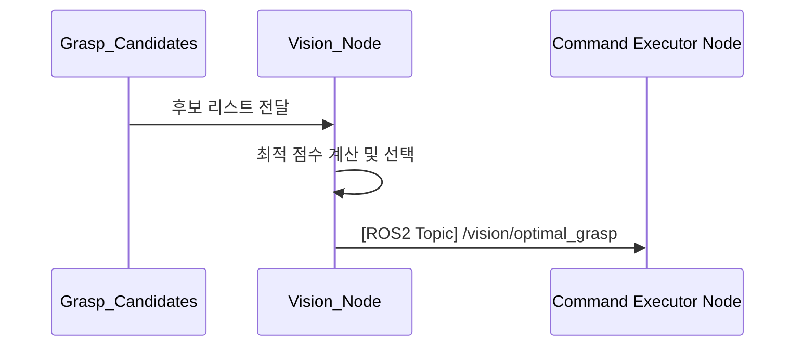

---

### 6. ROS2 메시지 정의

| 항목 | 내용 |
|------|------|
| 토픽명 | `/vision/optimal_grasp` |
| 메시지 타입 | `geometry_msgs/msg/PoseStamped` |
| 발행 주체 | `vision_node` |
| 구독 주체 | `Command Executor Node` |

#### 메시지 필드

| 필드 | 설명 |
|------|------|
| pose.position | 파지할 위치 (x, y, z) |
| pose.orientation | 파지 방향 (quaternion) |
| header.stamp | 계산 시각 |
| header.frame_id | 좌표 기준 프레임 (e.g., camera_link)

---

### 7. 알고리즘 평가 기준 예시

| 기준 항목 | 설명 |
|-----------|------|
| 중심성과 안정성 | 물체 중심에 가까운가? 기울기 적은가? |
| 접근성 | 로봇이 무리 없이 접근 가능한 위치인가? |
| 시야 확실성 | 특징점 밀도가 높은 영역인가? |
| 충돌 회피 | 주변 장애물과 간섭 없는가? |

---

### 8. 후보 비교 및 선택 방식

- 각 후보에 대해 score 계산:
  - `score = α * 중심성 + β * 접근성 + γ * 안정성 - δ * 충돌위험`
- 최고 점수 후보를 1차 선택
- 주변 환경에 따라 동적 조정 (예: 회피 반경 적용)

---

### 9. 추가 고려 사항

- 딥러닝 기반 Grasp Quality Estimation 모델 추가 가능
- 보정값이 큰 경우 UC15 허리 보정 자동 연계 가능
- UC11 수행 시 재사용 가능한 캐시 저장 옵션 고려

---


## UC20 - 웹 UI를 통한 로봇 제어 명령 전송 (Send Robot Commands via Web UI) - 고급 설계

---

### 1. 기능 개요

| 항목 | 내용 |
|------|------|
| 목적 | 사용자가 Web UI를 통해 로봇 제어 명령(Pick, Place, Stop 등)을 선택하여 전송하고, 이를 FastAPI → ROS2로 전달하여 로봇에 실행되도록 함 |
| 트리거 | 사용자가 UI에서 명령 버튼 클릭 |
| 주요 처리 노드 | `web_ui`, `fastapi`, `command_executor_node`, `schedular_node` |
| 출력 | 명령 실행 결과 알림 (성공/실패), UI 상태 반영

---

### 2. 연관 유즈케이스

- UC01~UC15: 각 명령의 실행 단위
- UC25: ACS 명령 수신과 UI 명령의 우선순위 설정
- UC26: 명령 결과 알림

---

### 3. 내부 흐름 요약

1. 사용자가 Web UI에서 버튼(Pick, Place, Stop 등)을 클릭
2. FastAPI는 해당 버튼에 따라 `/api/robot/command`에 대한 POST 요청을 처리
3. 요청된 명령은 schedular_node 또는 command_executor_node에 전달됨
4. 실행 결과(success/fail)는 다시 FastAPI → Web UI로 전송되어 알림 표시

---

### 4. 상태 및 예외 흐름

| 조건 | 처리 내용 |
|------|-----------|
| 명령 전송 성공 | UI에 성공 알림 및 버튼 상태 갱신 |
| 명령 실행 실패 | UI 팝업 또는 경고 표시 |
| 중복 명령 | 무시되거나 대기열에 등록 |
| 연결 실패 | 네트워크 오류 팝업 및 로그 기록

---

### 5. 시퀀스 다이어그램 (Mermaid)

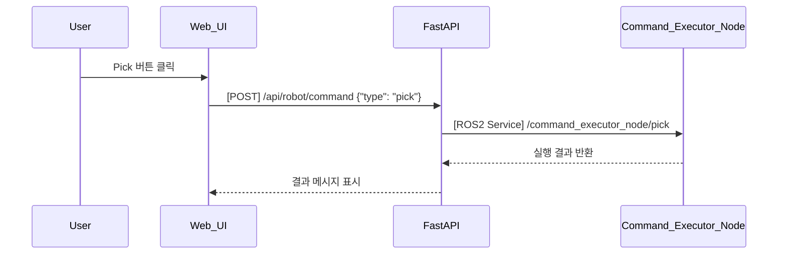

---

### 6. REST API 명세

| 항목 | 내용 |
|------|------|
| Endpoint | `/api/robot/command` |
| Method | POST |
| Request Body | {"type": "pick", "target": "좌표정보"} |
| Response | 성공 여부, 메시지 |
| FastAPI 함수 | `robot_command_handler(request)` |

---

### 7. ROS2 서비스 정의

| Pick 예시 서비스명 | `/command_executor_node/pick` |
| 타입 | `custom_interfaces/srv/ExecuteCommand` |

#### Request

| 필드 | 타입 | 설명 |
|------|------|------|
| command_type | string | "pick", "place", "stop" 등 |
| pose | geometry_msgs/Pose | 대상 좌표 (필요 시) |

#### Response

| 필드 | 타입 | 설명 |
|------|------|------|
| success | bool | 성공 여부 |
| message | string | 상태 메시지 |

---

### 8. 메시지 예시

```json
{
  "type": "place",
  "target": {
    "x": 0.5,
    "y": 0.2,
    "z": 0.0
  }
}
```

---

### 9. 추가 고려 사항

- 버튼 상태 UI와 연동하여 실행 가능/불가능 상태 표시 (UC25 참조)
- 동일 명령 연속 방지: debounce 또는 명령 큐 처리 필요
- 긴급 명령(Stop 등)은 우선순위 분리 처리

## UC21 - 실시간 정보 상태 시각화 (Real-Time Status Visualization) - 고급 설계

---

### 1. 기능 개요

| 항목 | 내용 |
|------|------|
| 목적 | 로봇의 위치, 배터리, 통신 상태 등 핵심 정보를 한 화면에 통합하여 UI에서 실시간 시각적으로 확인할 수 있도록 제공 |
| 트리거 | 상태가 갱신될 때마다 또는 주기적으로 |
| 주요 처리 노드 | `status_node`, `fastapi`, `web_ui` |
| 출력 | Web UI 상에 위치 좌표, 배터리 %, 통신 상태 등의 상태 정보 표시

---

### 2. 연관 유즈케이스

- UC04: 위치 정보 표시
- UC06: 배터리 상태
- UC07: 통신 상태
- UC23: 알람과 함께 표시될 수 있음

---

### 3. 내부 흐름 요약

1. `status_node`는 `/status/pose`, `/status/battery`, `/status/comm` 등의 상태를 publish
2. `fastapi`는 해당 토픽들을 구독하고 WebSocket으로 Web UI에 통합 전달
3. Web UI는 “상태 보드” 화면 또는 컴포넌트를 통해 실시간 상태를 시각적으로 보여줌
4. 각 정보는 숫자, 아이콘, 색상 등으로 표현됨

---

### 4. 상태 및 예외 흐름

| 조건 | 처리 내용 |
|------|-----------|
| 값 미수신 > 2초 | “연결 끊김” 또는 회색 표시로 상태 전환 |
| 값 범위 이상 | 배터리 5% 이하 → 경고 색상으로 강조 |
| 다중 상태 오류 | 복합 알람 생성 또는 통합 경고창 표출

---

### 5. 시퀀스 다이어그램 (Mermaid)

```mermaid
sequenceDiagram
    participant Status_Node
    participant FastAPI
    participant Web_UI
    participant User

    Status_Node->>FastAPI: [ROS2 Topics] /status/pose, /status/battery, /status/comm
    FastAPI->>Web_UI: [WebSocket] 실시간 상태 정보 전송
    Web_UI->>User: 위치, 배터리, 통신 상태 통합 UI 표시
```

---

### 6. ROS2 메시지 정의

| 항목 | 토픽명 | 메시지 타입 |
|------|--------|--------------|
| 위치 | `/status/pose` | `geometry_msgs/msg/PoseStamped` |
| 배터리 | `/status/battery` | `std_msgs/msg/Float32` |
| 통신 | `/status/comm` | `std_msgs/msg/String` |

---

### 7. WebSocket 구조

| 항목 | 내용 |
|------|------|
| Endpoint | `/ws/robot/status_dashboard` |
| FastAPI 함수 | `status_dashboard_ws(websocket)` |
| 메시지 포맷 | JSON (통합 상태) |

#### 예시 메시지

```json
{
  "pose": {"x": 1.0, "y": -0.5, "z": 0.0},
  "battery": 42.3,
  "comm": "OK",
  "timestamp": "2025-04-15T12:00:01Z"
}
```

---

### 8. UI 시각화 구성

| 항목 | 표현 방식 |
|------|------------|
| 위치 좌표 | 숫자 텍스트 + 단위 (m) |
| 배터리 | 막대 그래프 + % 수치 + 색상 |
| 통신 상태 | 아이콘 + 상태 텍스트 (OK/LOST 등) |
| 상태 색상 | OK: 녹색, 경고: 주황, 위험: 빨강 |

---

### 9. 추가 고려 사항

- 모바일 대응 UI 또는 요약 버전 위젯 형태 제공 가능
- 이전 상태와 변화 시점 기록하여 히스토리 보드 연계 가능
- UC23과 연계해 알람 발생 시 UI에서 강조 가능

## UC22 - 시나리오 흐름 시각화 (Visualize Scenario Flow) - 고급 설계

---

### 1. 기능 개요

| 항목 | 내용 |
|------|------|
| 목적 | 등록된 시나리오의 전체 작업 단계와 현재 진행 위치를 UI 상에서 시각적으로 표현 |
| 트리거 | 시나리오 등록, 작업 흐름 시작/변경, 작업 상태 변경 시 |
| 주요 처리 노드 | `schedular_node`, `status_node`, `fastapi`, `web_ui` |
| 출력 | 전체 작업 단계 리스트, 현재 진행 단계 강조, 진행률 표시 등 UI 업데이트

---

### 2. 연관 유즈케이스

- UC08~10: 작업 흐름 설정/변경/전환 시 자동 갱신
- UC20: 현재 작업과 연동
- UC25: 버튼 상태 반영

---

### 3. 내부 흐름 요약

1. schedular_node는 등록된 시나리오 구조(단계 리스트)를 관리
2. status_node는 현재 진행 중인 단계 정보를 `/status/task_flow`로 publish
3. fastapi는 시나리오 구조와 현재 진행 단계를 Web UI로 전달
4. Web UI는 전체 시나리오 흐름 그래프를 구성하고 현재 위치를 강조

---

### 4. 상태 및 예외 흐름

| 조건 | 처리 내용 |
|------|-----------|
| 등록된 시나리오 없음 | “시나리오 없음” 메시지 + 빈 UI 표시 |
| 단계 수 = 0 | 등록 오류 또는 시스템 문제 경고 표시 |
| 현재 단계 인덱스 초과 | 강제 초기화 또는 오류 표시 |
| 흐름 변경됨 | 자동 재요청 후 갱신 수행

---

### 5. 시퀀스 다이어그램 (Mermaid)

```mermaid
sequenceDiagram
    participant Schedular_Node
    participant Status_Node
    participant FastAPI
    participant Web_UI
    participant User

    Schedular_Node->>Status_Node: 현재 시나리오 단계 업데이트
    Status_Node->>FastAPI: [ROS2 Topic] /status/task_flow
    FastAPI->>Web_UI: [WebSocket] 시나리오 흐름 + 현재 위치 전송
    Web_UI->>User: 전체 단계 흐름 UI 표시 + 현재 위치 강조
```

---

### 6. ROS2 메시지 정의

| 항목 | 내용 |
|------|------|
| 토픽명 | `/status/task_flow` |
| 메시지 타입 | `custom_interfaces/msg/TaskFlowStatus` |
| 발행 주체 | `status_node` |
| 구독 주체 | `fastapi` |

#### 주요 필드

| 필드 | 타입 | 설명 |
|------|------|------|
| steps | string[] | 등록된 전체 작업 단계 |
| current_index | int | 현재 진행 중인 단계 번호 |
| status | string | RUNNING, COMPLETED, FAILED 등 |

---

### 7. WebSocket 전송 구조

| 항목 | 내용 |
|------|------|
| Endpoint | `/ws/robot/scenario_flow` |
| FastAPI 함수 | `scenario_flow_ws_endpoint(websocket)` |
| 메시지 포맷 | JSON |

#### 예시 메시지

```json
{
  "steps": ["Pick", "Place", "Inspect", "Return"],
  "current_index": 1,
  "status": "RUNNING"
}
```

---

### 8. UI 시각화 구성 요소

| 요소 | 설명 |
|------|------|
| 단계 리스트 | 모든 작업 순서를 수평 or 수직 UI 블록으로 표시 |
| 강조 표시 | 현재 단계에만 강조 애니메이션 적용 |
| 색상 표시 | 완료: 녹색, 진행중: 파랑, 실패: 빨강 |
| 흐름 방향 | 화살표 또는 라인으로 연결

---

### 9. 추가 고려 사항

- 다중 시나리오 등록 시 드롭다운 또는 탭 UI 제공
- UC10에서 시나리오 전환 시 즉시 흐름 변경 반영
- 향후 시나리오 내 병렬 단계, 조건 분기 표현 확장 가능

---

## UC23 - 알람 및 에러 상태 알림 표시 (Alarm and Error Notification) - 고급 설계

---

### 1. 기능 개요

| 항목 | 내용 |
|------|------|
| 목적 | 로봇 시스템에서 발생하는 비상 정지, 충돌, 센서 오류 등의 상태를 사용자에게 실시간 알림 형태로 전달 |
| 트리거 | 각 노드에서 비정상 상태 발생 시 status_node 또는 schedular_node로 상태 보고 |
| 주요 처리 노드 | `status_node`, `safety_interlock_node`, `collision_detection_node`, `fastapi`, `web_ui` |
| 출력 | UI 알림 팝업, 경고 아이콘, 알람음 등 시각/청각 알림 제공

---

### 2. 연관 유즈케이스

- UC06~07: 배터리/통신 상태 경고
- UC11~15: 동작 실패 시 알림 연계
- UC24: 알람 이력 저장 및 표시

---

### 3. 내부 흐름 요약

1. safety_interlock_node, collision_detection_node, Command Executor Node 등에서 상태 이상 발생
2. status_node로 알람 정보 `/status/alert` 토픽으로 전달
3. FastAPI는 해당 알람 정보를 WebSocket으로 Web UI에 전송
4. Web UI는 알림 팝업, 아이콘 강조, 로그 저장 등을 수행

---

### 4. 상태 및 예외 흐름

| 조건 | 처리 내용 |
|------|-----------|
| 알람 수신 시 | UI에 실시간 팝업 표시 및 상단 경고 바 활성화 |
| 동일 알람 반복 발생 | 기존 항목에 중첩 카운트 표시 |
| 알람 해제됨 | UI에서 항목 제거 또는 상태 복귀 처리 |
| 알람 수신 실패 | FastAPI가 fallback 로그 저장 또는 UI 경고 표시

---

### 5. 시퀀스 다이어그램 (Mermaid)

```mermaid
sequenceDiagram
    participant Safety_Node
    participant Collision_Node
    participant Status_Node
    participant FastAPI
    participant Web_UI
    participant User

    Safety_Node->>Status_Node: 알람 발생 (emergency stop)
    Collision_Node->>Status_Node: 충돌 예측 경고
    Status_Node->>FastAPI: [ROS2 Topic] /status/alert
    FastAPI->>Web_UI: [WebSocket] 알람 메시지 전송
    Web_UI->>User: 알람 팝업 및 상태 표시
```

---

### 6. ROS2 메시지 정의

| 항목 | 내용 |
|------|------|
| 토픽명 | `/status/alert` |
| 메시지 타입 | `custom_interfaces/msg/AlertStatus` |
| 발행 주체 | `status_node` |
| 구독 주체 | `fastapi` |

#### 메시지 필드 예시

| 필드 | 타입 | 설명 |
|------|------|------|
| code | string | 오류 코드 (e.g., "COLLISION_DETECTED") |
| message | string | 사용자 표시용 메시지 |
| level | string | INFO, WARNING, ERROR, CRITICAL |
| timestamp | string | 발생 시각 |

---

### 7. WebSocket 전송 구조

| 항목 | 내용 |
|------|------|
| Endpoint | `/ws/robot/alert` |
| FastAPI 함수 | `alert_ws_endpoint(websocket)` |
| 메시지 포맷 | JSON |

#### 예시 메시지

```json
{
  "code": "COLLISION_WARNING",
  "message": "로봇 경로 상 충돌 예상",
  "level": "WARNING",
  "timestamp": "2025-04-14T16:33:12Z"
}
```

---

### 8. UI 구성 요소 예시

| 요소 | 설명 |
|------|------|
| 팝업 메시지 | 화면 오른쪽 상단 알림 카드 표시 |
| 경고 배너 | 상단에 전체 경고 표시 (CRITICAL일 경우) |
| 색상 표시 | INFO: 회색, WARNING: 노랑, ERROR: 주황, CRITICAL: 빨강 |
| 알람음 (옵션) | CRITICAL 등급 발생 시 시스템 경고음 재생

---

### 9. 추가 고려 사항

- 동일 코드 중복 알람의 처리 방식 정의 필요 (덮어쓰기 or 누적)
- UC24와 연계하여 알람 수신 → 저장 → 히스토리화 가능
- Web UI 사용자 설정으로 알람 표시 방식 커스터마이징 가능

---

## UC24 - 시나리오 선택 및 적용 (Select and Apply Scenario) - 고급 설계

---

### 1. 기능 개요

| 항목 | 내용 |
|------|------|
| 목적 | 사용자가 UI를 통해 실행할 시나리오를 선택하고 이를 시스템에 적용하여 실행 준비 |
| 트리거 | 사용자가 Web UI에서 시나리오를 선택하고 “적용” 버튼을 클릭할 때 |
| 주요 처리 노드 | `schedular_node`, `fastapi`, `web_ui` |
| 출력 | 선택된 시나리오 ID가 schedular_node에 적용되고 실행 준비 상태로 전환

---

### 2. 연관 유즈케이스

- UC10: 시나리오 전환
- UC22: 시나리오 흐름 시각화 갱신
- UC20: 작업 상태 UI 초기화

---

### 3. 내부 흐름 요약

1. 사용자가 Web UI에서 실행할 시나리오를 선택
2. FastAPI는 `/api/scenario/select`로 REST 요청을 수신
3. schedular_node는 `/schedular_node/select_scenario` ROS2 서비스를 통해 시나리오 ID를 수신
4. 내부적으로 해당 시나리오 정의 파일을 불러오고 실행 가능한 상태로 준비
5. 성공 응답을 FastAPI → Web UI로 반환하고 UC22를 통해 흐름 시각화 갱신

---

### 4. 상태 및 예외 흐름

| 조건 | 처리 내용 |
|------|-----------|
| 유효하지 않은 시나리오 ID | 실패 처리, 오류 메시지 반환 |
| 이미 실행 중인 시나리오 선택 | “이미 실행 중입니다” 메시지 표시 |
| 로딩 실패 | 설정 파일 누락 또는 파싱 오류 → 알람 전송 (UC23)

---

### 5. 시퀀스 다이어그램 (Mermaid)

```mermaid
sequenceDiagram
    participant User
    participant Web_UI
    participant FastAPI
    participant Schedular_Node

    User->>Web_UI: 시나리오 선택 및 적용 클릭
    Web_UI->>FastAPI: [POST] /api/scenario/select
    FastAPI->>Schedular_Node: [ROS2 Service] /schedular_node/select_scenario
    Schedular_Node-->>FastAPI: 성공/실패 응답
    FastAPI-->>Web_UI: 적용 결과 표시
```

---

### 6. REST API 명세

| Endpoint | `/api/scenario/select` |
|----------|-------------------------|
| Method | POST |
| Request Body | 시나리오 ID |
| Response | 성공 여부, 메시지 |
| FastAPI 함수 | `select_scenario_handler(request)` |

---

### 7. ROS2 서비스 정의

| 서비스명 | `/schedular_node/select_scenario` |
| 서비스 타입 | `custom_interfaces/srv/SelectScenario` |

---

## UC25 - ACS로부터 작업 명령 수신 (Receive Task Command from ACS) - 고급 설계

---

### 1. 기능 개요

| 항목 | 내용 |
|------|------|
| 목적 | 외부 ACS(상위 시스템)로부터 작업 명령을 수신하고 이를 ROS2 시스템 내부로 전달 |
| 트리거 | ACS가 소켓 또는 REST 방식으로 명령을 전송할 때 |
| 주요 처리 노드 | `fastapi` 또는 `acs_adapter_node`, `schedular_node` |
| 출력 | 명령이 ROS2 서비스 또는 토픽 형태로 schedular_node에 전달되고 실행됨

---

### 2. 연관 유즈케이스

- UC24: 선택된 시나리오에 명령이 적용됨
- UC10: 시나리오 전환 가능
- UC20/22: 실행 상태 시각화

---

### 3. 내부 흐름 요약

1. ACS는 로봇에게 JSON 형식의 명령을 전송
2. FastAPI 또는 acs_adapter_node가 명령을 수신하여 유효성 검증
3. 유효한 명령이면 `/schedular_node/set_task` ROS2 서비스 호출
4. schedular_node는 명령을 내부 작업 흐름에 적용하거나 바로 실행
5. 결과를 ACS에 응답 또는 ACK로 전달

---

### 4. 상태 및 예외 흐름

| 조건 | 처리 내용 |
|------|-----------|
| 명령 포맷 오류 | 명령 무시, “Invalid command format” 반환 |
| 잘못된 시나리오 상태 | 현재 상태에서 실행 불가 시 “Busy” 응답 |
| schedular_node 비응답 | FastAPI timeout → ACS에 실패 응답 전송 |

---

### 5. 시퀀스 다이어그램 (Mermaid)

```mermaid
sequenceDiagram
    participant ACS
    participant FastAPI
    participant Schedular_Node

    ACS->>FastAPI: [Socket/REST] 작업 명령 전송
    FastAPI->>Schedular_Node: [ROS2 Service] /schedular_node/set_task
    Schedular_Node-->>FastAPI: 실행 응답
    FastAPI-->>ACS: 처리 결과 응답
```

---

### 6. 외부 통신 명세

| 항목 | 내용 |
|------|------|
| 방식 | TCP 소켓 또는 REST POST |
| 포맷 | JSON |
| 예시 | `{"command": "start", "scenario_id": "scenario_01"}` |

---

### 7. ROS2 서비스 정의

| 서비스명 | `/schedular_node/set_task` |
| 타입 | `custom_interfaces/srv/SetTaskCommand` |

#### Request

| 필드 | 타입 | 설명 |
|------|------|------|
| command | string | 명령어 (start, stop 등) |
| scenario_id | string | 선택된 시나리오 ID |

#### Response

| 필드 | 타입 | 설명 |
|------|------|------|
| success | bool | 실행 성공 여부 |
| message | string | 상태 메시지 |

---

### 8. 메시지 예시

```json
{
  "command": "start",
  "scenario_id": "scenario_02"
}
```

---

### 9. 추가 고려 사항

- 메시지 인증 토큰 또는 IP 화이트리스트 적용 고려
- ROS2 서비스 실패 시 재시도 전략 포함 가능
- ACS 시스템과의 연결 상태 모니터링 및 알람 연계 가능

---

# UC26 – 로봇 상태를 ACS에 보고 (Report Robot Status to ACS)

## 개요

| 항목 | 내용 |
|------|------|
| **유즈케이스 ID** | UC26 |
| **유즈케이스 명** | 로봇 상태를 ACS에 보고 |
| **관련 기능 요구사항** | SR7. 외부 시스템 연동 (ACS) |
| **주 액터** | ACS 시스템 |
| **보조 액터** | FastAPI 백엔드 |
| **목적** | 로봇의 현재 상태(위치, 동작 상태, 배터리 등)를 ACS에 주기적으로 전송하거나 요청에 응답한다. |

---

## 사전 조건

- ACS와 네트워크 연결이 유지되어 있어야 한다.
- 보고할 상태 항목(위치, 작업 상태, 배터리, 알람 등)이 정의되어 있어야 한다.
- FastAPI는 상태 수집 및 전송 역할을 수행해야 한다.

## 후 조건

- ACS는 로봇의 현재 상태를 실시간 또는 주기적으로 수신하게 된다.
- 보고 데이터는 전송 이력에 기록되며, 오류 발생 시 재시도 또는 경고 발생 가능하다.

---

## 기본 흐름

1. Status Node는 로봇 상태 정보를 `/robot/status` 토픽으로 주기적으로 발행한다.
2. AMR Apdater Node는 해당 상태 정보를 구독하여 가공한다.
3. 가공된 상태 메시지를 TCP 소켓 또는 HTTP POST 방식으로 ACS에 전송한다.
4. ACS는 해당 상태를 바탕으로 다음 작업을 준비하거나 모니터링한다.

---

## 예외 흐름

- **E1: 상태 수신 지연**  
  FastAPI가 ROS2로부터 일정 시간 이상 상태를 받지 못함  
  → “상태 갱신 지연” 로그 기록 및 ACS에 fallback 메시지 전송

- **E2: ACS 통신 실패**  
  전송 중 네트워크 오류 발생  
  → 로그 저장 및 재시도 수행

---

## 통신 흐름

| 송신자 | 수신자 | 방식 | 메시지 |
|--------|--------|------|--------|
| Status Node | ROS2 Topic | `/robot/status` |
| AMR Apdater Node | ACS | TCP Socket or HTTP POST | 로봇 상태 메시지 (json 등) |

---

## 비고

- 보고 주기 설정 (예: 1초, 5초 등)은 config로 조정 가능
- 상태 항목에는 타임스탬프 포함 권장
- 향후 MQTT 등 메시지 기반 통신 방식으로 전환 고려 가능
- 전송 성공/실패 여부는 이력 관리 및 모니터링 대시보드에 활용 가능


# UC27 - 실시간 로봇 조인트 예측 요청 (Real-Time Joint Prediction)

---

### 1. 기능 개요

| 항목 | 내용 |
|------|------|
| 목적 | 실시간 이미지와 현재 조인트 상태를 AI PC로 전송하여 다음 조인트 상태를 예측 받고, 이후 제어 판단 또는 상태 표시 등에 활용 |
| 트리거 | Vision_Node 및 Status_Node의 데이터 주기적 수신 (30Hz) |
| 주요 처리 노드 | `vision_node`, `status_node`, `ai_node`, `command_executor_node`, `status_node` |
| 출력 | 예측된 조인트 상태가 `/predicted_joint` 토픽으로 publish |

---

### 2. 연관 유즈케이스

- UC28: 예측 결과를 이용한 실행 판단
- UC04: 현재 위치 표시와 병렬 상태로 표시 가능
- UC17: 특징점 추출 결과와 병렬 처리 가능

---

### 3. 내부 흐름 요약

1. `vision_node`가 `/image_raw` 토픽으로 실시간 이미지 퍼블리시
2. `status_node`가 `/joint_states` 토픽으로 현재 로봇 상태 퍼블리시
3. `ai_node`는 두 토픽을 구독하여 실시간 추론 수행
4. 예측된 조인트 벡터를 `/predicted_joint` 토픽에 publish
5. `command_executor_node` 또는 `status_node`가 해당 예측값을 구독
6. 시스템 판단 또는 시각화에 사용됨

---

### 4. 상태 및 예외 흐름

| 조건 | 처리 내용 |
|------|-----------|
| AI 노드 미작동 | 예측값 미도착 → fallback 또는 이전 조인트 유지 |
| 이미지 또는 조인트 상태 누락 | 예측 skip 또는 예외 로그 기록 |
| 예측 지연 | timeout 이상 시 해당 예측 무시 |
| confidence 수치 기준 이하 | 시스템 반영 제외, 내부 기록 또는 “예측 불확실”로 표시 |

---

### 5. 시퀀스 다이어그램 (Mermaid)

```mermaid
sequenceDiagram
    participant Vision_Node
    participant Status_Node
    participant AI_Node
    participant Command_Executor_Node
    participant Status_Node_UI

    loop 매 프레임 (30Hz)
        Vision_Node-->>AI_Node: 이미지 publish (/image_raw)
        Status_Node-->>AI_Node: 조인트 상태 publish (/joint_states)
        AI_Node->>AI_Node: 이미지 + 조인트로 추론 수행
        AI_Node-->>Command_Executor_Node: 예측된 조인트 publish (/predicted_joint)
        AI_Node-->>Status_Node_UI: 예측된 조인트 publish (/predicted_joint)
    end
```

---

### 6. ROS2 인터페이스 정의

| 항목 | 내용 |
|------|------|
| 입력 토픽 | `/image_raw`, `/joint_states` |
| 출력 토픽 | `/predicted_joint` |
| 출력 메시지 타입 | `sensor_msgs/msg/JointState` 또는 커스텀 메시지 |
| QoS 고려사항 | 이미지: sensor_data / 조인트: default / 예측: reliable, queue=10 |

---

### 7. 메시지 흐름 예시

| 노드 간 | 내용 |
|---------|------|
| vision_node → ai_node | 이미지 프레임 (sensor_msgs/Image 또는 CompressedImage) |
| status_node → ai_node | 현재 조인트 상태 (sensor_msgs/JointState) |
| ai_node → command_executor_node | 예측된 조인트 상태 (JointState 또는 예측 벡터) |

---

### 8. FastAPI 및 UI 연계 여부

- 기본적으로 ROS2 내부 데이터 흐름에서 완결
- 필요 시 FastAPI에서 `/predicted_joint`를 구독하여 WebSocket 전송 가능
- Web UI는 상태 시각화 목적일 경우에만 사용

---

### 9. 추가 고려 사항

- 실시간 추론 30Hz 유지를 위한 스레드 처리 및 이미지 버퍼 관리 필요
- AI PC와 ROS2 통신을 위한 네트워크 QoS 및 latency 설정 필수
- 추후 `/predicted_joint`를 이용한 실제 동작 제어로 확장 시 안전성 로직 필요
- ROS2 Foxy 이상, CompressedImage QoS 정책 설정 권장